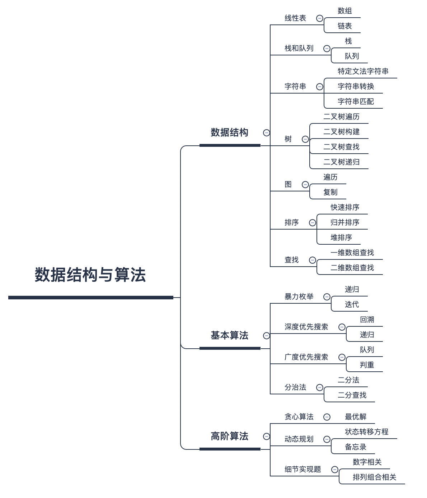

## 每天完成一个ARTS任务

ARTS 高效学习是耗子叔发起的一个高效学习方法，一个需要持续坚持的方法。ARTS 包含四块的内容：

- Algorithm。主要是为了编程训练和学习。每天至少做一个 leetcode 的算法题（先从Easy开始，然后再Medium，最后才Hard）。进行编程训练，如果不训练你看再多的算法书，你依然不会做算法题，看完书后，你需要训练。

- Review：主要是为了学习英文，如果你的英文不行，你基本上无缘技术高手。所以，需要你阅读并点评至少一篇英文技术文章，我个人最喜欢去的地方是 Medium （30min）；

- Tip：主要是为了总结和归纳你在是常工作中所遇到的知识点。学习至少一个技术技巧。你在工作中遇到的问题，踩过的坑，学习的点滴知识；

- Share：主要是为了建立你的影响力，能够输出价值观。分享一篇有观点和思考的技术文章，也可以是技术总结的文章；

只有你开始自己思考，开始自己总结和归纳，开始找人交流讨论，开始践行，并开始对外输出，你才会掌握到真正的学习能力

所以，学习不是努力读更多的书，盲目追求阅读的速度和数量，这会让人产生低层次的勤奋和成长的感觉，这只是在使蛮力。要思辨，要践行，要总结和归纳，否则，你只是在机械地重复某件事（记忆知识），而不会有质的成长的。

重点是如何才能让自己拥有举一反三的能力，在这方面，耗子叔对自己训练如下：

对于一个场景，制造出各种不同的问题或难题；
对于一个问题，努力寻找尽可能多的解，并比较这些解的优劣；
对于一个解，努力寻找各种不同的测试案例，以图让其健壮。
举一反三的能力，可以分解为：

- 联想能力：这种能力的锻炼需要你平时就在不停地思考同一个事物的不同的用法，或是联想与之有关的别的事物。对于软件开发和技术学习也一样；

- 抽象能力：抽象能力是举一反三的基本技能。平时你解决问题的时候，如果你能对这个问题进行抽象，你就可以获得更多的表现形式。抽象能力需要找到解决问题的通用模型，比如数学就是对现实世界的一种抽象。只要我们能把现实世界的各种问题建立成数据模型（如，建立各种维度的向量），我们就可以用数学来求解，这也是机器学习的本质；

- 自省能力：所谓自省能力就是自己找自己的难看。当你得到一个解的时候，要站在自己的对立面来找这个解的漏洞。有点像左右手互博。这种自己和自己辩论的能力又叫思辨能力。将自己分裂成正反方，左右方，甚至多方，站在不同的立场上来和自己辩论，从而做到不漏过一个case，从而获得完整全面的问题分析能力。

如果要获得这三种能力，除了你要很喜欢思考和找其它人来辩论或讨论以外，还要看你自己是否真的善于思考，是否有好奇心，是否喜欢打破沙锅问到底，是否喜欢关注细节，做事是否认真，是否严谨……

～～欢迎跟我一起share，一起up，通过主页邮件联系，知道的越多，不知道的越多～～

## ARTS

[MySelf](./guangxu/README.md)

## 算法分享

### 数和字符串

| 参考解答 | 原题地址 |
| :---- | :-----|
| [20220830](./guangxu/202208/20220830.md) |[58. Length of Last Word(最后一个单词的长度)](https://leetcode.com/problems/length-of-last-word/)|
| [20220829](./guangxu/202208/20220829.md) |[71. Simplify Path(简化路径)](https://leetcode.com/problems/simplify-path/)|
| [20220828](./guangxu/202208/20220828.md) |[49. Group Anagrams(回文构词法)](https://leetcode.com/problems/group-anagrams/)|
| [20220827](./guangxu/202208/20220827.md) |[38. Count and Say(数和说)](https://leetcode.com/problems/count-and-say/)|
| [20220826](./guangxu/202208/20220826.md) |[13. Roman to Integer(罗马转整数)](https://leetcode.com/problems/roman-to-integer/)|
| [20220825](./guangxu/202208/20220825.md) |[12. Integer to Roman(整数转罗马)](https://leetcode.com/problems/integer-to-roman/)|
| [20220824](./guangxu/202208/20220824.md) |[65. Valid Number(有效数字)](https://leetcode.com/problems/valid-number/)|
| [20220823](./guangxu/202208/20220823.md) |[14. Longest Common Prefix(最长公共前缀)](https://leetcode.com/problems/longest-common-prefix/)|
| [20220822](./guangxu/202208/20220822.md) |[44. Wildcard Matching(广义单词匹配)](https://leetcode.com/problems/wildcard-matching/)|
| [20220821](./guangxu/202208/20220821.md) |[10. Regular Expression Matching(正则匹配)](https://leetcode.com/problems/regular-expression-matching/)|
| [20220820](./guangxu/202208/20220820.md) |[5. Longest Palindromic Substring(最长回文子串)](https://leetcode.com/problems/longest-palindromic-substring/)|
| [20220819](./guangxu/202208/20220819.md) |[67. Add Binary(二进制数字相加)](https://leetcode.com/problems/add-binary/)|
| [20220818](./guangxu/202208/20220818.md) |[8. String to Integer (atoi)(字符串转整数)](https://leetcode.com/problems/string-to-integer-atoi/)|
| [20220817](./guangxu/202208/20220817.md) |[28. Implement strStr()(实现Str)](https://leetcode.com/problems/implement-strstr/)|
| [20220816](./guangxu/202208/20220816.md) |[125. Valid Palindrome(有效回文串)](https://leetcode.com/problems/valid-palindrome/)|
| [20220627](./guangxu/202206/20220627.md) |[1002. Find Common Characters(发现公共单词)](https://leetcode.com/problems/find-common-characters/)|
| [20220626](./guangxu/202206/20220626.md) |[819. Most Common Word(最多公共单词)](https://leetcode.com/problems/most-common-word/)|
| [20220521](./guangxu/202205/20220521.md) |[3. Longest Substring Without Repeating Characters(无重复最大子串)](https://leetcode.com/problems/longest-substring-without-repeating-characters/)|
| [20220520](./guangxu/202205/20220520.md) |[76. Minimum Window Substring(滑动最小子串)](https://leetcode.com/problems/minimum-window-substring/)|
| [20220427](./guangxu/202204/20220427.md) |[27. Remove Element(移除重复元素)](https://leetcode.com/problems/remove-element/)|
| [20220426](./guangxu/202204/20220426.md) |[409. Longest Palindrome(最长回文串)](https://leetcode.com/problems/longest-palindrome/)|
| [20220118](./guangxu/202201/20220118.md) |[32. Longest Valid Parentheses(最长回文串)](https://leetcode.com/problems/longest-valid-parentheses/)|
| [20220117](./guangxu/202201/20220117.md) |[20. Valid Parentheses(有效回文串)](https://leetcode.com/problems/valid-parentheses/)|
| [20220116](./guangxu/202201/20220116.md) |[58. Length of Last Word(最后一个单词长度)](https://leetcode.com/problems/length-of-last-word/)|
| [20220115](./guangxu/202201/20220115.md) |[71. Simplify Path(最短路径)](https://leetcode.com/problems/simplify-path/)|
| [20220114](./guangxu/202201/20220114.md) |[49. Group Anagrams(回文构词法)](https://leetcode.com/problems/group-anagrams/)|
| [20220113](./guangxu/202201/20220113.md) |[38. Count and Say(数数)](https://leetcode.com/problems/count-and-say/)|
| [20220112](./guangxu/202201/20220112.md) |[13. Roman to Integer(Roman转Integer)](https://leetcode.com/problems/roman-to-integer/)|
| [20220111](./guangxu/202201/20220111.md) |[12. Integer to Roman(Integer转Roman)](https://leetcode.com/problems/integer-to-roman/)|
| [20220110](./guangxu/202201/20220110.md) |[65. Valid Number(有效数字)](https://leetcode.com/problems/valid-number/)|
| [20220109](./guangxu/202201/20220109.md) |[14. Longest Common Prefix(最长公共前缀)](https://leetcode.com/problems/longest-common-prefix/)|
| [20220108](./guangxu/202201/20220108.md) |[44. Wildcard Matching(外卡匹配DP)](https://leetcode.com/problems/wildcard-matching/)|
| [20220107](./guangxu/202201/20220107.md) |[10. Regular Expression Matching(正则表达式匹配DP)](https://leetcode.com/problems/regular-expression-matching/)|
| [20220106](./guangxu/202201/20220106.md) |[5. Longest Palindromic Substring(最长回文串DP)](https://leetcode.com/problems/longest-palindromic-substring/)|
| [20220105](./guangxu/202201/20220105.md) |[67. Add Binary(二进制相加)](https://leetcode.com/problems/add-binary/)|
| [20220104](./guangxu/202201/20220104.md) |[8. String to Integer (atoi)（字符串类型转整数）](https://leetcode.com/problems/string-to-integer-atoi/)|
| [20220103](./guangxu/202201/20220103.md) |[28. Implement strStr(实现str)](https://leetcode.com/problems/implement-strstr/)|
| [20220102](./guangxu/202201/20220102.md) |[125. Valid Palindrome(有效回文串)](https://leetcode.com/problems/valid-palindrome/)|
| [20211115](./guangxu/202111/20211115.md) |[137. Single Number II(只出现一次的数字 II)](https://leetcode.com/problems/single-number-ii/)|
| [20211111](./guangxu/202111/20211111.md) |[528. Random Pick with Weight(随机选择权重)](https://leetcode.com/problems/random-pick-with-weight/)|
| [20211110](./guangxu/202111/20211110.md) |[287. Find the Duplicate Number(发现重复的数字)](https://leetcode.com/problems/find-the-duplicate-number/)|
| [20211116](./guangxu/202111/20211116.md) |[3. Longest Substring Without Repeating Characters(无重复字符的最长子串)](https://leetcode.com/problems/longest-substring-without-repeating-characters/)|
| [20211101](./guangxu/202111/20211101.md) |[459. Repeated Substring Pattern(重复的子字符串)](https://leetcode.com/problems/repeated-substring-pattern/)|
| [20211028](./guangxu/202110/2021028.md) |[202. Happy Number(快乐数)](https://leetcode.com/problems/happy-number/)|
| [20211027](./guangxu/202110/2021027.md) |[204. Count Primes(计数质数)](https://leetcode.com/problems/count-primes/)|
| [20211022](./guangxu/202110/2021022.md) |[321. Create Maximum Number(拼接最大数)](https://leetcode.com/problems/create-maximum-number/)|
| [20211015](./guangxu/202110/2021015.md) |[51. N-Queens(N皇后问题)](https://leetcode.com/problems/n-queens/)|
| [20211012](./guangxu/202110/2021012.md) |[403. Frog Jump(青蛙跳)](https://leetcode.com/problems/frog-jump/)|
| [20211011](./guangxu/202110/2021011.md) |[41. First Missing Positive(缺失的第一个正数)](https://leetcode.com/problems/first-missing-positive/)|
| [20210926](./guangxu/202109/20210926.md) |[224. Basic Calculator(基本计算器)](https://leetcode.com/problems/basic-calculator/)|
| [20210922](./guangxu/202109/20210922.md) |[78. Subsets(子集)](https://leetcode.com/problems/subsets/)|
| [20210917](./guangxu/202109/20210917.md) |[22. Generate Parentheses(生成括号)](https://leetcode.com/problems/generate-parentheses/)|
| [20210915](./guangxu/202109/20210915.md) |[79. Word Search(单词搜索)](https://leetcode.com/problems/word-search/)|
| [20210828](./guangxu/202108/20210828.md) |[415. Add Strings(字符串相加)](https://leetcode.com/problems/add-strings/)|
| [20210827](./guangxu/202108/20210827.md) |[20. Valid Parentheses(有效的括号)](https://leetcode.com/problems/valid-parentheses/)|
| [20210818](./guangxu/202108/20210818.md) |[41. First Missing Positive(缺失的第一个正数)](https://leetcode.com/problems/first-missing-positive/)|
| [20210815](./guangxu/202108/20210815.md) |[1. Two Sum(两数之和)](https://leetcode-cn.com/problems/two-sum)|
| [20210810](./guangxu/202108/20210810.md) |[69. Sqrt(x)](https://leetcode.com/problems/sqrtx/)|
| [20210720](./guangxu/202107/20210720.md) |[3. Longest Substring Without Repeating Characters(无重复的最长子串)](https://leetcode.com/problems/longest-substring-without-repeating-characters/)|
| [20210710](./guangxu/202107/20210710.md) |[1047. Remove All Adjacent Duplicates In String(删除字符串中的所有相邻重复项)](https://leetcode.com/problems/remove-all-adjacent-duplicates-in-string/)|
| [20210702](./guangxu/202107/20210702.md) |[287. Find the Duplicate Number(发现数组中重复的数字)](https://leetcode.com/problems/find-the-duplicate-number/)|
| [20210704](./guangxu/202107/20210704.md) |[91. Decode Ways(解码方法)](https://leetcode.com/problems/decode-ways/)|
| [20210701](./guangxu/202107/20210701.md) |[151. Reverse Words in a String(翻转字符串里的单词)](https://leetcode.com/problems/reverse-words-in-a-string/)|
| [20210615](./guangxu/202106/20210615.md) |[224. Basic Calculator(基本计算器)](https://leetcode.com/problems/basic-calculator/)|
| [20210608](./guangxu/202106/20210608.md) |[78. Subsets(子集)](https://leetcode.com/problems/subsets/)|
| [20210604](./guangxu/202106/20210604.md) |[8. String to Integer (atoi)(字符串转整数)](https://leetcode.com/problems/string-to-integer-atoi/)|
| [20210531](./guangxu/202105/20210531.md) |[22. Generate Parentheses(生成括号)](https://leetcode.com/problems/generate-parentheses/)|
| [20210519](./guangxu/202105/20210519.md) |[415. Add Strings(字符串相加)](https://leetcode.com/problems/add-strings/)|
| [20210515](./guangxu/202105/20210515.md) |[470. Implement Rand10 Using Rand7(使用随机数7实现随机数10)](https://leetcode.com/problems/implement-rand10-using-rand7/)|
| [20201010](./guangxu/202010/20201010.md) |[剑指offer-反转单词顺序](https://www.nowcoder.com/practice/3194a4f4cf814f63919d0790578d51f3?tpId=13&tags=&title=&diffculty=0&judgeStatus=0&rp=1)|
| [20201003](./guangxu/202010/20201003.md) |[剑指offer-左旋转字符串](https://www.nowcoder.com/practice/12d959b108cb42b1ab72cef4d36af5ec?tpId=13&tags=&title=&diffculty=0&judgeStatus=0&rp=1)|
| [20200924](./guangxu/202009/20200924.md) |[剑指offer-第一个只出现一次的字符](https://www.nowcoder.com/practice/1c82e8cf713b4bbeb2a5b31cf5b0417c?tpId=13&tags=&title=&diffculty=0&judgeStatus=0&rp=1)|
| [20200923](./guangxu/202009/20200923.md) |[剑指offer-丑数](https://www.nowcoder.com/practice/6aa9e04fc3794f68acf8778237ba065b?tpId=13&tags=&title=&diffculty=0&judgeStatus=0&rp=1)|
| [20200823](./guangxu/202008/20200823.md) |[剑指offer-替换空格](https://www.nowcoder.com/practice/4060ac7e3e404ad1a894ef3e17650423?tpId=13&&tqId=11155&rp=1&ru=/ta/coding-interviews&qru=/ta/coding-interviews/question-ranking)|
| [20200819](./guangxu/202008/20200819.md) |[268. Missing Number（丢失的数字）](https://leetcode.com/problems/missing-number/)|
| [20200813](./guangxu/202008/20200813.md) | [330. Patching Array（添加数字）](https://leetcode.com/problems/patching-array/) |
| [20201022](./guangxu/202010/20201022.md) |[剑指offer-字符流中第一个不重复出现的字符](https://www.nowcoder.com/practice/00de97733b8e4f97a3fb5c680ee10720?tpId=13&tags=&title=&diffculty=0&judgeStatus=0&rp=1)|
| [20201021](./guangxu/202010/20201021.md) |[剑指offer-表示数值的字符串](https://www.nowcoder.com/practice/6f8c901d091949a5837e24bb82a731f2?tpId=13&tags=&title=&diffculty=0&judgeStatus=0&rp=1)|
| [20201020](./guangxu/202010/20201020.md) |[剑指offer-正则表达式匹配](https://www.nowcoder.com/practice/45327ae22b7b413ea21df13ee7d6429c?tpId=13&tags=&title=&diffculty=0&judgeStatus=0&rp=1)|
| [20201018](./guangxu/202010/20201018.md) |[剑指offer-把字符串转换成整数](https://www.nowcoder.com/practice/1277c681251b4372bdef344468e4f26e?tpId=13&tags=&title=&diffculty=0&judgeStatus=0&rp=1)|
| [20201208](./guangxu/202012/20201208.md) |[268. Missing Number(丢失的数字)](https://leetcode.com/problems/missing-number/)|
| [20201207](./guangxu/202012/20201207.md) |[287. Find the Duplicate Number(发现重复的数字)](https://leetcode.com/problems/find-the-duplicate-number/)|
| [20201223](./guangxu/202012/20201223.md) |[443. String Compression(字符串压缩)](https://leetcode.com/problems/string-compression/)|
| [20201224](./guangxu/202012/20201224.md) |[191. Number of 1 Bits(数字1的个数)](https://leetcode.com/problems/number-of-1-bits/)|
| [20201226](./guangxu/202012/20201226.md) |[3. Longest Substring Without Repeating Characters（最长不重复的字符串）](https://leetcode.com/problems/longest-substring-without-repeating-characters/)|
| [20201230](./guangxu/202012/20201230.md) |[93. Restore IP Addresses（构造IP地址）](https://leetcode.com/problems/restore-ip-addresses/)|
| [20210103](./guangxu/202101/20210103.md) |[3. Longest Substring Without Repeating Characters(最长不重复字符串)](https://leetcode.com/problems/longest-substring-without-repeating-characters/)|
| [20210106](./guangxu/202101/20210106.md) |[468. Validate IP Address(验证是否是IP地址)](https://leetcode.com/problems/validate-ip-address/)|
| [20210111](./guangxu/202101/20210111.md) |[151. Reverse Words in a String（反转字符串）](https://leetcode.com/problems/reverse-words-in-a-string/)|
| [20210112](./guangxu/202101/20210112.md) |[557. Reverse Words in a String III（反转字符串3）](https://leetcode.com/problems/reverse-words-in-a-string-iii/)|
| [20210113](./guangxu/202101/20210113.md) |[541. Reverse String II（反转k个字符串）](https://leetcode.com/problems/reverse-string-ii/)|
| [20210114](./guangxu/202101/20210114.md) |[344. Reverse String（反转字符串）](https://leetcode.com/problems/reverse-string/)|
| [20210115](./guangxu/202101/20210115.md) |[345. Reverse Vowels of a String(元音字母反转)](https://leetcode.com/problems/reverse-vowels-of-a-string/)|
| [20210220](./guangxu/202102/20210220.md) |[151. Reverse Words in a String(单词字符串反转)](https://leetcode.com/problems/reverse-words-in-a-string/)|
| [20210219](./guangxu/202102/20210219.md) |[415. Add Strings(字符串求和)](https://leetcode.com/problems/add-strings/)|
| [20210215](./guangxu/202102/20210215.md) |[22. Generate Parentheses(生成匹配的括号)](https://leetcode.com/problems/generate-parentheses/)|
| [20210314](./guangxu/202103/20210314.md) |[3. Longest Substring Without Repeating Characters(无重复字符的最长子串)](https://leetcode.com/problems/longest-substring-without-repeating-characters/)|
| [20210429](./guangxu/202104/20210429.md) |[415. Add Strings(字符串相加)](https://leetcode.com/problems/add-strings/)|
| [20210413](./guangxu/202104/20210413.md) |[1. Two Sum(两数之和)](https://leetcode.com/problems/two-sum/)|
| [20210421](./guangxu/202104/20210421.md) |[2. Add Two Numbers(两数相加)](https://leetcode.com/problems/add-two-numbers/)|
| [20210412](./guangxu/202104/20210412.md) |[69. Sqrt(x)(求根号X)](https://leetcode.com/problems/sqrtx/)|

### 动态规划

| 参考解答 | 原题地址 |
| :---- | :-----|
| [20220707](./guangxu/202207/20220707.md) |[53. Maximum Subarray(最大子段和)](https://leetcode.com/problems/maximum-subarray/)|
| [20220706](./guangxu/202207/20220706.md) |[72. Edit Distance(编辑距离)](https://leetcode.com/problems/edit-distance/)|
| [20220704](./guangxu/202207/20220704.md) |[674. Longest Continuous Increasing Subsequence(最长连续递增子序列-动态规划)](https://leetcode.com/problems/longest-continuous-increasing-subsequence/)|
| [20220703](./guangxu/202207/20220703.md) |[300. Longest Increasing Subsequence(最长递增子序列-动态规划)](https://leetcode.com/problems/longest-increasing-subsequence/)|
| [20220702](./guangxu/202207/20220702.md) |[1143. Longest Common Subsequence(最长公共子序列-动态规划)](https://leetcode.com/problems/longest-common-subsequence/)|
| [20220701](./guangxu/202207/20220701.md) |[5. Longest Palindromic Substring(最长回文子串-动态规划)](https://leetcode.com/problems/longest-palindromic-substring/)|
| [20220630](./guangxu/202206/20220630.md) |[409. Longest Palindrome(可构造的最长回文串)](https://leetcode.com/problems/longest-palindrome/)|
| [20220609](./guangxu/202206/20220609.md) |[312. Burst Balloons(戳气球-动态规划)](https://leetcode.com/problems/burst-balloons/)|
| [20220602](./guangxu/202206/20220602.md) |[518. Coin Change 2(换零钱问题2-DP)](https://leetcode.com/problems/coin-change-2/)|
| [20220601](./guangxu/202206/20220601.md) |[416. Partition Equal Subset Sum(分割等和子集-DP)](https://leetcode.com/problems/partition-equal-subset-sum/)|
| [20220629](./guangxu/202206/20220629.md) |[1143. Longest Common Subsequence(最长公共子序列)](https://leetcode.com/problems/longest-common-subsequence/)|
| [20220628](./guangxu/202206/20220628.md) |[14. Longest Common Prefix(最长公共前缀)](https://leetcode.com/problems/longest-common-prefix/)|
| [20220530](./guangxu/202205/20220530.md) |[213. House Robber II(打家劫舍2)](https://leetcode.com/problems/house-robber-ii/)|
| [20220531](./guangxu/202205/20220531.md) |[198. House Robber(打家劫舍)](https://leetcode.com/problems/house-robber/)|
| [20220529](./guangxu/202205/20220529.md) |[718. Maximum Length of Repeated Subarray(最长重复子数组)](https://leetcode.com/problems/maximum-length-of-repeated-subarray/)|
| [20220528](./guangxu/202205/20220528.md) |[72. Edit Distance(编辑距离)](https://leetcode.com/problems/edit-distance/)|
| [20220527](./guangxu/202205/20220527.md) |[5. Longest Palindromic Substring(最长回文子串)](https://leetcode.com/problems/longest-palindromic-substring/)|
| [20220526](./guangxu/202205/20220526.md) |[300. Longest Increasing Subsequence(最长递增子序列)](https://leetcode.com/problems/longest-increasing-subsequence/)|
| [20220525](./guangxu/202205/20220525.md) |[53. Maximum Subarray(最大子段和-动态规划)](https://leetcode.com/problems/maximum-subarray/)|
| [20220513](./guangxu/202205/20220513.md) |[322. Coin Change(兑换硬币-动态规划)](https://leetcode.com/problems/coin-change/)|
| [20220512](./guangxu/202205/20220512.md) |[887. Super Egg Drop(扔鸡蛋问题-动态规划)](https://leetcode.com/problems/super-egg-drop/)|
| [20220314](./guangxu/202203/20220314.md) |[140. Word Break II(单词切分2)](https://leetcode.com/problems/word-break-ii/)|
| [20220313](./guangxu/202203/20220313.md) |[139. Word Break(单词切分)](https://leetcode.com/problems/word-break/)|
| [20220312](./guangxu/202203/20220312.md) |[115. Distinct Subsequences(不同的子序列)](https://leetcode.com/problems/distinct-subsequences/)|
| [20220311](./guangxu/202203/20220311.md) |[91. Decode Ways(解码方式)](https://leetcode.com/problems/decode-ways/)|
| [20220310](./guangxu/202203/20220310.md) |[72. Edit Distance(编辑距离)](https://leetcode.com/problems/edit-distance/)|
| [20220309](./guangxu/202203/20220309.md) |[64. Minimum Path Sum(最短路径和)](https://leetcode.com/problems/minimum-path-sum/)|
| [20220308](./guangxu/202203/20220308.md) |[87. Scramble String(搅乱字符串)](https://leetcode.com/problems/scramble-string/)|
| [20220307](./guangxu/202203/20220307.md) |[97. Interleaving String(交织相错的字符串)](https://leetcode.com/problems/interleaving-string/)|
| [20220306](./guangxu/202203/20220306.md) |[123. Best Time to Buy and Sell Stock III(买卖股票的最佳时间3)](https://leetcode.com/problems/best-time-to-buy-and-sell-stock-iii/)|
| [20220305](./guangxu/202203/20220305.md) |[85. Maximal Rectangle(最大矩形)](https://leetcode.com/problems/maximal-rectangle/)|
| [20220304](./guangxu/202203/20220304.md) |[132. Palindrome Partitioning II(拆分回文串2)](https://leetcode.com/problems/palindrome-partitioning-ii/)|
| [20220303](./guangxu/202203/20220303.md) |[131. Palindrome Partitioning(拆分回文串)](https://leetcode.com/problems/palindrome-partitioning/)|
| [20220302](./guangxu/202203/20220302.md) |[53. Maximum Subarray(最大字段和)](https://leetcode.com/problems/maximum-subarray/)|
| [20220301](./guangxu/202203/20220301.md) |[120. Triangle(三角形)](https://leetcode.com/problems/triangle/)|
| [20211112](./guangxu/202111/20211112.md) |[718. Maximum Length of Repeated Subarray(最长公共子序列)](https://leetcode.com/problems/maximum-length-of-repeated-subarray/)|
| [20211105](./guangxu/202111/20211105.md) |[1143. Longest Common Subsequence(最长公共子序列)](https://leetcode.com/problems/longest-common-subsequence/)|
| [20211026](./guangxu/202110/2021026.md) |[97. Interleaving String(DP交错字符串)](https://leetcode.com/problems/interleaving-string/)|
| [20210928](./guangxu/202109/20210928.md) |[334. Increasing Triplet Subsequence(递增的三元子序列)](https://leetcode.com/problems/increasing-triplet-subsequence/)|
| [20210916](./guangxu/202109/20210916.md) |[128. Longest Consecutive Sequence(最长连续序列)](https://leetcode.com/problems/longest-consecutive-sequence/)|
| [20210914](./guangxu/202109/20210914.md) |[5. Longest Palindromic Substring(最长回文子串)](https://leetcode.com/problems/longest-palindromic-substring/)|
| [20210908](./guangxu/202109/20210908.md) |[162. Find Peak Element(发现山峰元素)](https://leetcode.com/problems/find-peak-element/)|
| [20210628](./guangxu/202106/20210628.md) |[670. Maximum Swap(数组中两个数的最大异或值)](https://leetcode.com/problems/maximum-swap/)|
| [20210624](./guangxu/202106/20210624.md) |[1143. Longest Common Subsequence(最长公共子序列)](https://leetcode.com/problems/longest-common-subsequence/)|
| [20210626](./guangxu/202106/20210626.md) |[695. Max Area of Island(岛屿的最大面积)](https://leetcode.com/problems/max-area-of-island/)|
| [20210513](./guangxu/202105/20210513.md) |[32. Longest Valid Parentheses(最长有效括号)](https://leetcode.com/problems/longest-valid-parentheses/)|
| [20210524](./guangxu/202105/20210524.md) |[53. Maximum Subarray(最大字段和)](https://leetcode.com/problems/maximum-subarray/)|
| [20210521](./guangxu/202105/20210521.md) |[32. Longest Valid Parentheses(最长有效括号)](https://leetcode.com/problems/longest-valid-parentheses/)|
| [20210516](./guangxu/202105/20210516.md) |[198. House Robber(打家劫舍)](https://leetcode.com/problems/house-robber/)|
| [20210512](./guangxu/202105/20210512.md) |[322. Coin Change(零钱兑换-动态规划)](https://leetcode.com/problems/coin-change/)|
| [20210510](./guangxu/202105/20210510.md) |[300. Longest Increasing Subsequence(最长上升子序列)](https://leetcode.com/problems/longest-increasing-subsequence/)|
| [20210523](./guangxu/202105/20210523.md) |[5. Longest Palindromic Substring(最长回文子串)](https://leetcode.com/problems/longest-palindromic-substring/)|
| [20210128](./guangxu/202101/20210128.md) |[91. Decode Ways(动态规划解码方法)](https://leetcode.com/problems/decode-ways/)|
| [20210125](./guangxu/202101/20210125.md) |[887. Super Egg Drop（扔鸡蛋）](https://leetcode.com/problems/super-egg-drop/)|
| [20200821](./guangxu/202008/20200821.md) |[剑指offer-机器人的运动范围](https://www.nowcoder.com/practice/6e5207314b5241fb83f2329e89fdecc8?tpId=13&rp=1&ru=%2Fta%2Fcoding-interviews&qru=%2Fta%2Fcoding-interviews%2Fquestion-ranking)|
| [20200809](./guangxu/202008/20200809.md) | [72. Edit Distance（编辑距离）](https://leetcode.com/problems/edit-distance/) |
| [20201101](./guangxu/202011/20201101.md) |[46. Permutations(全排列)](https://leetcode.com/problems/permutations/)|
| [20201031](./guangxu/202010/20201031.md) |[53. Maximum Subarray(最大子序和)](https://leetcode.com/problems/maximum-subarray/)|
| [20201109](./guangxu/202011/20201109.md) |[239. Sliding Window Maximum（滑动窗口最大值）](https://leetcode.com/problems/sliding-window-maximum/)|
| [20201108](./guangxu/202011/20201108.md) |[72. Edit Distance（编辑距离）](https://leetcode.com/problems/edit-distance/)|
| [20201107](./guangxu/202011/20201107.md) |[5. Longest Palindromic Substring(最长回文串)](https://leetcode.com/problems/longest-palindromic-substring/)|
| [20210105](./guangxu/202101/20210105.md) |[5. Longest Palindromic Substring（动态规划解决最长回文子串）](https://leetcode.com/problems/longest-palindromic-substring/)|
| [20210110](./guangxu/202101/20210110.md) |[209. Minimum Size Subarray Sum(最小子序列和)](https://leetcode.com/problems/minimum-size-subarray-sum/)|
| [20210109](./guangxu/202101/20210109.md) |[1143. Longest Common Subsequence(最长公共子序列)](https://leetcode.com/problems/longest-common-subsequence/)|
| [20210107](./guangxu/202101/20210107.md) |[46. Permutations(全排列)](https://leetcode.com/problems/permutations/)|
| [20201211](./guangxu/202012/20201211.md) |[62. Unique Paths(不同路径-动态规划)](https://leetcode.com/problems/unique-paths/)|
| [20210213](./guangxu/202102/20210213.md) |[53. Maximum Subarray(最大子段和)](https://leetcode.com/problems/maximum-subarray/)|
| [20210221](./guangxu/202102/20210221.md) |[62. Unique Paths(动态规划求不同路径数)](https://leetcode.com/problems/unique-paths/)|
| [20210227](./guangxu/202102/20210227.md) |[300. Longest Increasing Subsequence(最长递增序列)](https://leetcode.com/problems/longest-increasing-subsequence/)|
| [20210212](./guangxu/202102/20210212.md) |[123. Best Time to Buy and Sell Stock III(买股票的最佳时机3)](https://leetcode.com/problems/best-time-to-buy-and-sell-stock-iii/)|
| [20210211](./guangxu/202102/20210211.md) |[122. Best Time to Buy and Sell Stock II(买股票的最佳时机2)](https://leetcode.com/problems/best-time-to-buy-and-sell-stock-ii/)|
| [20210210](./guangxu/202102/20210210.md) |[121. Best Time to Buy and Sell Stock(买股票的最佳时机)](https://leetcode.com/problems/best-time-to-buy-and-sell-stock/)|
| [20210330](./guangxu/202103/20210330.md) |[198. House Robber(打家劫舍)](https://leetcode.com/problems/house-robber/)|
| [20210324](./guangxu/202103/20210324.md) |[121. Best Time to Buy and Sell Stock(买卖股票的最佳时间)](https://leetcode.com/problems/best-time-to-buy-and-sell-stock/)|
| [20210319](./guangxu/202103/20210319.md) |[44. Wildcard Matching(通配符匹配)](https://leetcode.com/problems/wildcard-matching/)|
| [20210304](./guangxu/202103/20210304.md) |[72. Edit Distance(编辑距离)](https://leetcode.com/problems/edit-distance/)|
| [20210311](./guangxu/202103/20210311.md) |[1155. Number of Dice Rolls With Target Sum(掷骰子的N种方法-DP)](https://leetcode.com/problems/number-of-dice-rolls-with-target-sum/)|
| [20210320](./guangxu/202103/20210320.md) |[713. Subarray Product Less Than K(乘积小于K的子数组)](https://leetcode.com/problems/subarray-product-less-than-k/)|
| [20210321](./guangxu/202103/20210321.md) |[5. Longest Palindromic Substring(最长回文数)](https://leetcode.com/problems/longest-palindromic-substring/)|
| [20210317](./guangxu/202103/20210317.md) |[394. Decode String(字符串解码)](https://leetcode.com/problems/decode-string/)|
| [20210419](./guangxu/202104/20210419.md) |[300. Longest Increasing Subsequence(最长递增子序列)](https://leetcode.com/problems/longest-increasing-subsequence/)|
| [20210709](./guangxu/202107/20210709.md) |[40. Combination Sum II(组合总和)](https://leetcode.com/problems/combination-sum-ii/)|
| [20210705](./guangxu/202107/20210705.md) |[718. Maximum Length of Repeated Subarray(最长公共子序列)](https://leetcode.com/problems/maximum-length-of-repeated-subarray/)|

### 暴力枚举

| 参考解答 | 原题地址 |
| :---- | :-----|
| [20220319](./guangxu/202203/20220319.md) |[17. Letter Combinations of a Phone Number(电话号码组合-暴力枚举)](https://leetcode.com/problems/letter-combinations-of-a-phone-number/)|
| [20220318](./guangxu/202203/20220318.md) |[77. Combinations(组合-暴力枚举)](https://leetcode.com/problems/combinations/)|
| [20220317](./guangxu/202203/20220317.md) |[46. Permutations(排列-暴力枚举)](https://leetcode.com/problems/permutations/)|
| [20220316](./guangxu/202203/20220316.md) |[90. Subsets II(子集2-暴力枚举)](https://leetcode.com/problems/subsets-ii/)|
| [20220315](./guangxu/202203/20220315.md) |[78. Subsets(子集-暴力枚举)](https://leetcode.com/problems/subsets/)|

### 贪心算法

| 参考解答 | 原题地址 |
| :---- | :-----|
| [20220622](./guangxu/202206/20220622.md) |[45. Jump Game II(跳跃游戏2-贪心算法)](https://leetcode.com/problems/jump-game-ii/)|
| [20220621](./guangxu/202206/20220621.md) |[55. Jump Game(跳跃游戏-贪心算法)](https://leetcode.com/problems/jump-game/)|
| [20220510](./guangxu/202205/20220510.md) |[986. Interval List Intersections(区间交集-贪心)](https://leetcode.com/problems/interval-list-intersections/)|
| [20220509](./guangxu/202205/20220509.md) |[56. Merge Intervals(合并区间-贪心)](https://leetcode.com/problems/merge-intervals/)|
| [20220429](./guangxu/202204/20220429.md) |[877. Stone Game(石头游戏)](https://leetcode.com/problems/stone-game/)|
| [20220410](./guangxu/202204/20220410.md) |[11. Container With Most Water(最大蓄水量)](https://leetcode.com/problems/container-with-most-water/)|
| [20220409](./guangxu/202204/20220409.md) |[3. Longest Substring Without Repeating Characters(最长无重复字符串)](https://leetcode.com/problems/longest-substring-without-repeating-characters/)|
| [20220408](./guangxu/202204/20220408.md) |[122. Best Time to Buy and Sell Stock II(买卖股票最佳时间2)](https://leetcode.com/problems/best-time-to-buy-and-sell-stock-ii/)|
| [20220407](./guangxu/202204/20220407.md) |[121. Best Time to Buy and Sell Stock(买卖股票最佳时间)](https://leetcode.com/problems/best-time-to-buy-and-sell-stock/)|
| [20220406](./guangxu/202204/20220406.md) |[45. Jump Game II(跳跃游戏2)](https://leetcode.com/problems/jump-game-ii/)|
| [20220405](./guangxu/202204/20220405.md) |[55. Jump Game(跳跃游戏)](https://leetcode.com/problems/jump-game/)|
| [20211109](./guangxu/202111/20211109.md) |[135. Candy(分发糖果)](https://leetcode.com/problems/candy/)|
| [20210907](./guangxu/202109/20210907.md) |[322. Coin Change(零钱兑换)](https://leetcode.com/problems/coin-change/)|
| [20210906](./guangxu/202109/20210906.md) |[39. Combination Sum(组合总和)](https://leetcode.com/problems/combination-sum/)|
| [20210809](./guangxu/202108/20210809.md) |[300. Longest Increasing Subsequence](https://leetcode.com/problems/longest-increasing-subsequence/)|
| [20210831](./guangxu/202108/20210831.md) |[221. Maximal Square(最大正方形)](https://leetcode.com/problems/maximal-square/)|
| [20210808](./guangxu/202108/20210808.md) |[31. Next Permutation(下一个排列)](https://leetcode.com/problems/next-permutation/)|
| [20210802](./guangxu/202108/20210802.md) |[42. Trapping Rain Water(接雨水)](https://leetcode.com/problems/trapping-rain-water/)|
| [20210830](./guangxu/202108/20210830.md) |[46. Permutations(全排列)](https://leetcode.com/problems/permutations/)|
| [20210829](./guangxu/202108/20210829.md) |[155. Min Stack(最小栈)](https://leetcode.com/problems/min-stack/)|
| [20210728](./guangxu/202107/20210728.md) |[121. Best Time to Buy and Sell Stock(最佳买卖股票的时间)](https://leetcode.com/problems/best-time-to-buy-and-sell-stock/)|
| [20210723](./guangxu/202107/20210723.md) |[146. LRU Cache(LRU缓存机制)](https://leetcode.com/problems/lru-cache/)|
| [20210715](./guangxu/202107/20210715.md) |[239. Sliding Window Maximum(滑动窗口最大值)](https://leetcode.com/problems/sliding-window-maximum/)|
| [20210714](./guangxu/202107/20210714.md) |[528. Random Pick with Weight(按权重随机选择)](https://leetcode.com/problems/random-pick-with-weight/)|
| [20210630](./guangxu/202106/20210630.md) |[135. Candy(分发糖果)](https://leetcode.com/problems/candy/)|
| [20210618](./guangxu/202106/20210618.md) |[112. Path Sum(路径和)](https://leetcode.com/problems/path-sum/)|
| [20210617](./guangxu/202106/20210617.md) |[11. Container With Most Water(盛最多水的容器)](https://leetcode.com/problems/container-with-most-water/)|
| [20210613](./guangxu/202106/20210613.md) |[64. Minimum Path Sum(最短路径和)](https://leetcode.com/problems/minimum-path-sum/)|
| [20210612](./guangxu/202106/20210612.md) |[221. Maximal Square(最大正方形)](https://leetcode.com/problems/maximal-square/)|
| [20210603](./guangxu/202106/20210603.md) |[70. Climbing Stairs(爬梯子)](https://leetcode.com/problems/climbing-stairs/)|
| [20210530](./guangxu/202105/20210530.md) |[128. Longest Consecutive Sequence(最长连续序列)](https://leetcode.com/problems/longest-consecutive-sequence/)|
| [20210602](./guangxu/202106/20210602.md) |[739. Daily Temperatures(每日温度)](https://leetcode.com/problems/daily-temperatures/)|
| [20200830](./guangxu/202008/20200830.md) | [剑指offer-变态跳台阶](https://www.nowcoder.com/practice/22243d016f6b47f2a6928b4313c85387?tpId=13&tags=&title=&diffculty=0&judgeStatus=0&rp=1)|
| [20200829](./guangxu/202008/20200829.md) | [剑指offer-跳台阶](https://www.nowcoder.com/practice/8c82a5b80378478f9484d87d1c5f12a4?tpId=13&&tqId=11161&rp=1&ru=/ta/coding-interviews&qru=/ta/coding-interviews/question-ranking)|
| [20201016](./guangxu/202010/20201016.md) |[剑指offer滑动窗口的最大值](https://www.nowcoder.com/practice/1624bc35a45c42c0bc17d17fa0cba788?tpId=13&tags=&title=&diffculty=0&judgeStatus=0&rp=1)|
| [20201209](./guangxu/202012/20201209.md) |[121. Best Time to Buy and Sell Stock(买股票最大收益)](https://leetcode.com/problems/best-time-to-buy-and-sell-stock/)|
| [20201229](./guangxu/202012/20201229.md) |[121. Best Time to Buy and Sell Stock(股票最大收益1)](https://leetcode.com/problems/best-time-to-buy-and-sell-stock/)|
| [20201228](./guangxu/202012/20201228.md) |[122. Best Time to Buy and Sell Stock II(股票最大收益2)](https://leetcode.com/problems/best-time-to-buy-and-sell-stock-ii/)|
| [20201227](./guangxu/202012/20201227.md) |[123. Best Time to Buy and Sell Stock III(股票最大收益3)](https://leetcode.com/problems/best-time-to-buy-and-sell-stock-iii/)|
| [20210310](./guangxu/202103/20210310.md) |[739. Daily Temperatures(每日温度)](https://leetcode.com/problems/daily-temperatures/)|
| [20210306](./guangxu/202103/20210306.md) |[877. Stone Game(拿石头)](https://leetcode.com/problems/stone-game/)|
| [20210415](./guangxu/202104/20210415.md) |[31. Next Permutation(下一个排列)](https://leetcode.com/problems/next-permutation/)|
| [20210414](./guangxu/202104/20210414.md) |[46. Permutations(全排列)](https://leetcode.com/problems/permutations/)|
| [20210507](./guangxu/202105/20210507.md) |[122. Best Time to Buy and Sell Stock II(买卖股票的最佳时间2)](https://leetcode.com/problems/best-time-to-buy-and-sell-stock-ii/)|
| [20210506](./guangxu/202105/20210506.md) |[121. Best Time to Buy and Sell Stock(买卖股票的最佳时间)](https://leetcode.com/problems/best-time-to-buy-and-sell-stock/)|
| [20210505](./guangxu/202105/20210505.md) |[123. Best Time to Buy and Sell Stock III(买卖股票的最佳时间3)](https://leetcode.com/problems/best-time-to-buy-and-sell-stock-iii/)|

### 查找

| 参考解答 | 原题地址 |
| :---- | :-----|
| [20220519](./guangxu/202205/20220519.md) |[33. Search in Rotated Sorted Array(旋转数组查找)](https://leetcode.com/problems/search-in-rotated-sorted-array/)|
| [20220518](./guangxu/202205/20220518.md) |[35. Search Insert Position(查找插入的位置)](https://leetcode.com/problems/search-insert-position/)|
| [20220517](./guangxu/202205/20220517.md) |[704. Binary Search(二分查找框架)](https://leetcode.com/problems/binary-search/)|
| [20220228](./guangxu/202202/20220228.md) |[35. Search Insert Position(寻找插入位置)](https://leetcode.com/problems/search-insert-position/)|
| [20220227](./guangxu/202202/20220227.md) |[240. Search a 2D Matrix II(二维数组查找2)](https://leetcode.com/problems/search-a-2d-matrix-ii/)|
| [20220226](./guangxu/202202/20220226.md) |[74. Search a 2D Matrix(二维数组查找)](https://leetcode.com/problems/search-a-2d-matrix/)|
| [20220225](./guangxu/202202/20220225.md) |[704. Binary Search(二分查找)](https://leetcode.com/problems/binary-search/)|

### 分治法

| 参考解答 | 原题地址 |
| :---- | :-----|
| [20220404](./guangxu/202204/20220404.md) |[69. Sqrt(x)(分治法求根号)](https://leetcode.com/problems/sqrtx/)|
| [20220403](./guangxu/202204/20220403.md) |[50. Pow(x, n)(分治法求次方)](https://leetcode.com/problems/powx-n/)|

### 深度优先搜索

| 参考解答 | 原题地址 |
| :---- | :-----|
| [20220615](./guangxu/202206/20220615.md) |[36. Valid Sudoku(有效数独-回溯)](https://leetcode.com/problems/valid-sudoku/)|
| [20220613](./guangxu/202206/20220613.md) |[22. Generate Parentheses(生成括号-回溯)](https://leetcode.com/problems/generate-parentheses/)|
| [20220428](./guangxu/202204/20220428.md) |[47. Permutations II(组合2)](https://leetcode.com/problems/permutations-ii/)|
| [20220515](./guangxu/202205/20220515.md) |[51. N-Queens(N皇后问题)](https://leetcode.com/problems/n-queens/)|
| [20220514](./guangxu/202205/20220514.md) |[46. Permutations(全排列-回溯算法)](https://leetcode.com/problems/permutations/)|
| [20220507](./guangxu/202205/20220507.md) |[78. Subsets(子集-深度优先遍历)](https://leetcode.com/problems/subsets/)|
| [20220506](./guangxu/202205/20220506.md) |[77. Combinations(组合-深度优先遍历)](https://leetcode.com/problems/combinations/)|
| [20220505](./guangxu/202205/20220505.md) |[46. Permutations(排列-深度优先遍历)](https://leetcode.com/problems/permutations/)|
| [20220504](./guangxu/202205/20220504.md) |[22. Generate Parentheses(生成括号--深度优先遍历)](https://leetcode.com/problems/generate-parentheses/)|
| [20220402](./guangxu/202204/20220402.md) |[79. Word Search(单词查找)](https://leetcode.com/problems/word-search/)|
| [20220401](./guangxu/202204/20220401.md) |[37. Sudoku Solver(数独)](https://leetcode.com/problems/sudoku-solver/)|
| [20220331](./guangxu/202203/20220331.md) |[22. Generate Parentheses(生成括号)](https://leetcode.com/problems/generate-parentheses/)|
| [20220330](./guangxu/202203/20220330.md) |[40. Combination Sum II(组合总和2)](https://leetcode.com/problems/combination-sum-ii/)|
| [20220329](./guangxu/202203/20220329.md) |[39. Combination Sum(组合总和)](https://leetcode.com/problems/combination-sum/)|
| [20220328](./guangxu/202203/20220328.md) |[52. N-Queens II(N皇后问题2)](https://leetcode.com/problems/n-queens-ii/)|
| [20220327](./guangxu/202203/20220327.md) |[51. N-Queens(N皇后问题)](https://leetcode.com/problems/n-queens/)|
| [20220326](./guangxu/202203/20220326.md) |[63. Unique Paths II(不同的路径2)](https://leetcode.com/problems/unique-paths-ii/)|
| [20220325](./guangxu/202203/20220325.md) |[62. Unique Paths(不同的路径)](https://leetcode.com/problems/unique-paths/)|
| [20220324](./guangxu/202203/20220324.md) |[132. Palindrome Partitioning II(回文串拆分2)](https://leetcode.com/problems/palindrome-partitioning-ii)|
| [20220323](./guangxu/202203/20220323.md) |[131. Palindrome Partitioning(回文串拆分)](https://leetcode.com/problems/palindrome-partitioning/)|

### 广度优先搜索

| 参考解答 | 原题地址 |
| :---- | :-----|
| [20220516](./guangxu/202205/20220516.md) |[111. Minimum Depth of Binary Tree(求二叉树最小深度-DFS/BFS)](https://leetcode.com/problems/minimum-depth-of-binary-tree/)|
| [20220511](./guangxu/202205/20220511.md) |[773. Sliding Puzzle(滑动窗格-广度优先搜索)](https://leetcode.com/problems/sliding-puzzle/)|
| [20220322](./guangxu/202203/20220322.md) |[130. Surrounded Regions(环绕区域-BFS)](https://leetcode.com/problems/surrounded-regions/)|
| [20220321](./guangxu/202203/20220321.md) |[126. Word Ladder II(词语阶梯2-BFS)](https://leetcode.com/problems/word-ladder-ii/)|
| [20220320](./guangxu/202203/20220320.md) |[127. Word Ladder(词语阶梯-BFS)](https://leetcode.com/problems/word-ladder/)|

### 排序

| 参考解答 | 原题地址 |
| :---- | :-----|
| [20220224](./guangxu/202202/20220224.md) |[75. Sort Colors(颜色排序-快速排序)](https://leetcode.com/problems/sort-colors/)|
| [20220223](./guangxu/202202/20220223.md) |[41. First Missing Positive(发现缺失的正数-桶排序)](https://leetcode.com/problems/first-missing-positive/)|
| [20220222](./guangxu/202202/20220222.md) |[148. Sort List(链表排序)](https://leetcode.com/problems/sort-list/)|
| [20220221](./guangxu/202202/20220221.md) |[147. Insertion Sort List(链表插入排序)](https://leetcode.com/problems/insertion-sort-list/)|
| [20220220](./guangxu/202202/20220220.md) |[23. Merge k Sorted Lists(合并K个排序链表)](https://leetcode.com/problems/merge-k-sorted-lists/)|
| [20220219](./guangxu/202202/20220219.md) |[21. Merge Two Sorted Lists(合并两个排序链表)](https://leetcode.com/problems/merge-two-sorted-lists/)|
| [20220218](./guangxu/202202/20220218.md) |[88. Merge Sorted Array(合并两个排序数组)](https://leetcode.com/problems/merge-sorted-array/)|
| [20210120](./guangxu/202101/20210120.md) |[912. Sort an Array(数组排序)](https://leetcode.com/problems/sort-an-array/)|
| [20210504](./guangxu/202105/20210504.md) |[912. Sort an Array(归并排序)](https://leetcode.com/problems/sort-an-array/)|
| [20201107](./guangxu/202011/20201107.md) |希尔排序|
| [20201106](./guangxu/202011/20201106.md) |选择排序|
| [20201105](./guangxu/202011/20201105.md) |插入排序|
| [20201104](./guangxu/202011/20201104.md) |堆排序|
| [20201103](./guangxu/202011/20201103.md) |归并排序|
| [20201102](./guangxu/202011/20201102.md) |快速排序|
| [20201101](./guangxu/202011/20201101.md) |冒泡排序|

### 树

| 参考解答 | 原题地址 |
| :---- | :-----|
| [20220625](./guangxu/202206/20220625.md) |[235. Lowest Common Ancestor of a Binary Search Tree(二叉搜索树公共祖先)](https://leetcode.com/problems/lowest-common-ancestor-of-a-binary-search-tree/)|
| [20220624](./guangxu/202206/20220624.md) |[236. Lowest Common Ancestor of a Binary Tree(公共祖先)](https://leetcode.com/problems/lowest-common-ancestor-of-a-binary-tree/)|
| [20220623](./guangxu/202206/20220623.md) |[1123. Lowest Common Ancestor of Deepest Leaves(最深公共祖先)](https://leetcode.com/problems/lowest-common-ancestor-of-deepest-leaves/)|
| [20220430](./guangxu/202204/20220430.md) |[98. Validate Binary Search Tree(有效的二叉搜索树)](https://leetcode.com/problems/validate-binary-search-tree/)|
| [20220217](./guangxu/202202/20220217.md) |[129. Sum Root to Leaf Numbers(根到叶子节点之和)](https://leetcode.com/problems/sum-root-to-leaf-numbers/)|
| [20220216](./guangxu/202202/20220216.md) |[116. Populating Next Right Pointers in Each Node(每个节点增加右指针)](https://leetcode.com/problems/populating-next-right-pointers-in-each-node/)|
| [20220215](./guangxu/202202/20220215.md) |[124. Binary Tree Maximum Path Sum(二叉树最大路径和)](https://leetcode.com/problems/binary-tree-maximum-path-sum/)|
| [20220214](./guangxu/202202/20220214.md) |[113. Path Sum II(路径和2)](https://leetcode.com/problems/path-sum-ii/)|
| [20220213](./guangxu/202202/20220213.md) |[112. Path Sum(路径和)](https://leetcode.com/problems/path-sum/)|
| [20220212](./guangxu/202202/20220212.md) |[104. Maximum Depth of Binary Tree(最大深度二叉树)](https://leetcode.com/problems/maximum-depth-of-binary-tree/)|
| [20220211](./guangxu/202202/20220211.md) |[111. Minimum Depth of Binary Tree(最小深度二叉树)](https://leetcode.com/problems/minimum-depth-of-binary-tree/)|
| [20220210](./guangxu/202202/20220210.md) |[109. Convert Sorted List to Binary Search Tree(排序链表转二叉搜索树)](https://leetcode.com/problems/convert-sorted-list-to-binary-search-tree/)|
| [20220209](./guangxu/202202/20220209.md) |[108. Convert Sorted Array to Binary Search Tree(排序数组转二叉搜索树)](https://leetcode.com/problems/convert-sorted-array-to-binary-search-tree/)|
| [20220208](./guangxu/202202/20220208.md) |[98. Validate Binary Search Tree(有效的二叉搜索树)](https://leetcode.com/problems/validate-binary-search-tree/)|
| [20220207](./guangxu/202202/20220207.md) |[95. Unique Binary Search Trees II(不同的二叉搜索树2)](https://leetcode.com/problems/unique-binary-search-trees-ii/)|
| [20220206](./guangxu/202202/20220206.md) |[96. Unique Binary Search Trees(不同的二叉搜索树)](https://leetcode.com/problems/unique-binary-search-trees/)|
| [20220205](./guangxu/202202/20220205.md) |[889. Construct Binary Tree from Preorder and Postorder Traversal(前序和后序构造二叉树)](https://leetcode.com/problems/construct-binary-tree-from-preorder-and-postorder-traversal/)|
| [20220204](./guangxu/202202/20220204.md) |[106. Construct Binary Tree from Inorder and Postorder Traversal(中序和后序构造二叉树)](https://leetcode.com/problems/construct-binary-tree-from-inorder-and-postorder-traversal/)|
| [20220203](./guangxu/202202/20220203.md) |[105. Construct Binary Tree from Preorder and Inorder Traversal(前序和中序构造二叉树)](https://leetcode.com/problems/construct-binary-tree-from-preorder-and-inorder-traversal/)|
| [20220202](./guangxu/202202/20220202.md) |[117. Populating Next Right Pointers in Each Node II(指向右侧节点)](https://leetcode.com/problems/populating-next-right-pointers-in-each-node-ii/)|
| [20220201](./guangxu/202202/20220201.md) |[114. Flatten Binary Tree to Linked List(二叉树转单链表)](https://leetcode.com/problems/flatten-binary-tree-to-linked-list/)|
| [20220131](./guangxu/202201/20220131.md) |[110. Balanced Binary Tree(平衡二叉树)](https://leetcode.com/problems/balanced-binary-tree/)|
| [20220130](./guangxu/202201/20220130.md) |[101. Symmetric Tree(对称树)](https://leetcode.com/problems/symmetric-tree/)|
| [20220129](./guangxu/202201/20220129.md) |[100. Same Tree(相似的树)](https://leetcode.com/problems/same-tree/)|
| [20220128](./guangxu/202201/20220128.md) |[99. Recover Binary Search Tree(复原二叉搜索树)](https://leetcode.com/problems/recover-binary-search-tree/)|
| [20220127](./guangxu/202201/20220127.md) |[103. Binary Tree Zigzag Level Order Traversal(之子形遍历)](https://leetcode.com/problems/binary-tree-zigzag-level-order-traversal/)|
| [20220126](./guangxu/202201/20220126.md) |[107. Binary Tree Level Order Traversal II(层次遍历2)](https://leetcode.com/problems/binary-tree-level-order-traversal-ii/)|
| [20220125](./guangxu/202201/20220125.md) |[102. Binary Tree Level Order Traversal(层次遍历)](https://leetcode.com/problems/binary-tree-level-order-traversal/)|
| [20220124](./guangxu/202201/20220124.md) |[145. Binary Tree Postorder Traversal(后序遍历)](https://leetcode.com/problems/binary-tree-postorder-traversal/)|
| [20220123](./guangxu/202201/20220123.md) |[94. Binary Tree Inorder Traversal(中序遍历)](https://leetcode.com/problems/binary-tree-inorder-traversal/)|
| [20220122](./guangxu/202201/20220122.md) |[144. Binary Tree Preorder Traversal(前序遍历)](https://leetcode.com/problems/binary-tree-preorder-traversal/)|
| [20211124](./guangxu/202111/20211124.md) |[700. Search in a Binary Search Tree(二叉树的二分查找)](https://leetcode.com/problems/search-in-a-binary-search-tree/)|
| [20211108](./guangxu/202111/20211108.md) |[104. Maximum Depth of Binary Tree(二叉树最大深度)](https://leetcode.com/problems/maximum-depth-of-binary-tree/)|
| [20211104](./guangxu/202111/20211104.md) |[108. Convert Sorted Array to Binary Search Tree(将有序数组转换为二叉搜索树)](https://leetcode.com/problems/convert-sorted-array-to-binary-search-tree/)|
| [20211021](./guangxu/202110/2021021.md) |[637. Average of Levels in Binary Tree(二叉树的层平均值)](https://leetcode.com/problems/average-of-levels-in-binary-tree/)|
| [20211020](./guangxu/202110/2021020.md) |[107. Binary Tree Level Order Traversal II(二叉树层次遍历2)](https://leetcode.com/problems/binary-tree-level-order-traversal-ii/)|
| [20211019](./guangxu/202110/2021019.md) |[951. Flip Equivalent Binary Trees(等价二叉树)](https://leetcode.com/problems/flip-equivalent-binary-trees/)|
| [20211009](./guangxu/202110/2021009.md) |[96. Unique Binary Search Trees(不同的二叉搜索树)](https://leetcode.com/problems/unique-binary-search-trees/)|
| [20210927](./guangxu/202109/20210927.md) |[226. Invert Binary Tree(二叉树反转)](https://leetcode.com/problems/invert-binary-tree/)|
| [20210925](./guangxu/202109/20210925.md) |[114. Flatten Binary Tree to Linked List(二叉树展开为链表)](https://leetcode.com/problems/flatten-binary-tree-to-linked-list/)|
| [20210913](./guangxu/202109/20210913.md) |[958. Check Completeness of a Binary Tree(二叉树的完全性检验)](https://leetcode.com/problems/check-completeness-of-a-binary-tree/)|
| [20210905](./guangxu/202109/20210905.md) |[98. Validate Binary Search Tree(验证二叉搜索树)](https://leetcode.com/problems/validate-binary-search-tree/)|
| [20210819](./guangxu/202108/20210819.md) |[101. Symmetric Tree(对称二叉树)](https://leetcode.com/problems/symmetric-tree/)|
| [20210816](./guangxu/202108/20210816.md) |[124. Binary Tree Maximum Path Sum(二叉树最大路径和)](https://leetcode.com/problems/binary-tree-maximum-path-sum/)|
| [20210812](./guangxu/202108/20210812.md) |[105. Construct Binary Tree from Preorder and Inorder Traversal(从前序与中序遍历序列构造二叉树)](https://leetcode.com/problems/construct-binary-tree-from-preorder-and-inorder-traversal/)|
| [20210804](./guangxu/202108/20210804.md) |[199. Binary Tree Right Side View(二叉树的右视图)](https://leetcode.com/problems/binary-tree-right-side-view/)|
| [20210722](./guangxu/202107/20210722.md) |[103. Binary Tree Zigzag Level Order Traversal(二叉树的锯齿形层次遍历)](https://leetcode.com/problems/binary-tree-zigzag-level-order-traversal/)|
| [20210629](./guangxu/202106/20210629.md) |[129. Sum Root to Leaf Numbers(求根到叶子节点数字之和)](https://leetcode.com/problems/sum-root-to-leaf-numbers/)|
| [20210623](./guangxu/202106/20210623.md) |[108. Convert Sorted Array to Binary Search Tree(将有序数组转换为二叉搜索树)](https://leetcode.com/problems/convert-sorted-array-to-binary-search-tree/)|
| [20210621](./guangxu/202106/20210621.md) |[226. Invert Binary Tree(翻转二叉树)](https://leetcode.com/problems/invert-binary-tree/)|
| [20210620](./guangxu/202106/20210620.md) |[662. Maximum Width of Binary Tree(二叉树最大宽度)](https://leetcode.com/problems/maximum-width-of-binary-tree/)|
| [20210619](./guangxu/202106/20210619.md) |[297. Serialize and Deserialize Binary Tree(二叉树的序列化与反序列化)](https://leetcode.com/problems/serialize-and-deserialize-binary-tree/)|
| [20210611](./guangxu/202106/20210611.md) |[110. Balanced Binary Tree(平衡二叉树)](https://leetcode.com/problems/balanced-binary-tree/)|
| [20210610](./guangxu/202106/20210610.md) |[230. Kth Smallest Element in a BST(二叉搜索树中第K小的元素)](https://leetcode.com/problems/kth-smallest-element-in-a-bst/)|
| [20210607](./guangxu/202106/20210607.md) |[240. Search a 2D Matrix II(搜索二维矩阵 II)](https://leetcode.com/problems/search-a-2d-matrix-ii/)|
| [20210529](./guangxu/202105/20210529.md) |[94. Binary Tree Inorder Traversal(二叉树中序遍历)](https://leetcode.com/problems/binary-tree-inorder-traversal/)|
| [20210528](./guangxu/202105/20210528.md) |[113. Path Sum II(路径和2)](https://leetcode.com/problems/path-sum-ii/)|
| [20210527](./guangxu/202105/20210527.md) |[543. Diameter of Binary Tree(二叉树的直径)](https://leetcode.com/problems/diameter-of-binary-tree/)|
| [20210501](./guangxu/202105/20210501.md) |[102. Binary Tree Level Order Traversal(二叉树层次遍历)](https://leetcode.com/problems/binary-tree-level-order-traversal/)|
| [20210131](./guangxu/202101/20210131.md) |[145. Binary Tree Postorder Traversal(二叉树后序遍历)](https://leetcode.com/problems/binary-tree-postorder-traversal/)|
| [20210130](./guangxu/202101/20210130.md) |[144. Binary Tree Preorder Traversal(二叉树前序遍历)](https://leetcode.com/problems/binary-tree-preorder-traversal/)|
| [20210129](./guangxu/202101/20210129.md) |[94. Binary Tree Inorder Traversal(二叉树中序遍历)](https://leetcode.com/problems/binary-tree-inorder-traversal/)|
| [20200814](./guangxu/202008/20200814.md) | [94. Binary Tree Inorder Traversal（二叉树中序遍历）](https://leetcode.com/problems/binary-tree-inorder-traversal/)|
| [20201014](./guangxu/202010/20201014.md) |[剑指offer-二叉搜索树的第k个节点](https://www.nowcoder.com/practice/ef068f602dde4d28aab2b210e859150a?tpId=13&tags=&title=&diffculty=0&judgeStatus=0&rp=1)|
| [20201013](./guangxu/202010/20201013.md) |[剑指offer-序列化二叉树](https://www.nowcoder.com/practice/cf7e25aa97c04cc1a68c8f040e71fb84?tpId=13&tags=&title=&diffculty=0&judgeStatus=0&rp=1)|
| [20201012](./guangxu/202010/20201012.md) |[剑指offer-把二叉树打印成多行](https://www.nowcoder.com/practice/445c44d982d04483b04a54f298796288?tpId=13&tags=&title=&diffculty=0&judgeStatus=0&rp=1)|
| [20201011](./guangxu/202010/20201011.md) |[剑指offer-按之字形打印二叉树](https://www.nowcoder.com/practice/91b69814117f4e8097390d107d2efbe0?tpId=13&tags=&title=&diffculty=0&judgeStatus=0&rp=1)|
| [20201009](./guangxu/202010/20201009.md) |[剑指offer-对称的二叉树](https://www.nowcoder.com/practice/ff05d44dfdb04e1d83bdbdab320efbcb?tpId=13&tags=&title=&diffculty=0&judgeStatus=0&rp=1)|
| [20200810](./guangxu/202008/20200810.md) | [102. Binary Tree Level Order Traversal（二叉树层次遍历）](https://leetcode.com/problems/binary-tree-level-order-traversal/) |
| [20200816](./guangxu/202008/20200816.md) |[199. Binary Tree Right Side View（二叉树右视图）](https://leetcode.com/problems/binary-tree-right-side-view/)|
| [20200825](./guangxu/202008/20200825.md) | [剑指offer-重建二叉树](https://www.nowcoder.com/practice/8a19cbe657394eeaac2f6ea9b0f6fcf6?tpId=13&tags=&title=&diffculty=0&judgeStatus=0&rp=1) |
| [20200908](./guangxu/202009/20200908.md) |[剑指offer-二叉树的镜像](https://www.nowcoder.com/practice/564f4c26aa584921bc75623e48ca3011?tpId=13&tags=&title=&diffculty=0&judgeStatus=0&rp=1)|
| [20200907](./guangxu/202009/20200907.md) |[剑指offer-树的子结构](https://www.nowcoder.com/practice/6e196c44c7004d15b1610b9afca8bd88?tpId=13&tags=&title=&diffculty=0&judgeStatus=0&rp=1)|
| [20200914](./guangxu/202009/20200914.md) |[剑指offer-二叉树中和为某一路径的值](https://www.nowcoder.com/practice/b736e784e3e34731af99065031301bca?tpId=13&tags=&title=&diffculty=0&judgeStatus=0&rp=1)|
| [20200913](./guangxu/202009/20200913.md) |[剑指offer-二叉树的后序遍历](https://www.nowcoder.com/practice/a861533d45854474ac791d90e447bafd?tpId=13&tags=&title=&diffculty=0&judgeStatus=0&rp=1)|
| [20200912](./guangxu/202009/20200912.md) |[剑指offer-从上往下打印二叉树](https://www.nowcoder.com/practice/7fe2212963db4790b57431d9ed259701?tpId=13&tags=&title=&diffculty=0&judgeStatus=0&rp=1)|
| [20200916](./guangxu/202009/20200916.md) |[剑指offer-二叉搜索树与双向链表](https://www.nowcoder.com/practice/947f6eb80d944a84850b0538bf0ec3a5?tpId=13&tags=&title=&diffculty=0&judgeStatus=0&rp=1)|
| [20200929](./guangxu/202009/20200929.md) |[剑指offer-平衡二叉树](https://www.nowcoder.com/practice/8b3b95850edb4115918ecebdf1b4d222?tpId=13&tags=&title=&diffculty=0&judgeStatus=0&rp=1)|
| [20200928](./guangxu/202009/20200928.md) |[剑指offer-二叉树的深度](https://www.nowcoder.com/practice/435fb86331474282a3499955f0a41e8b?tpId=13&tags=&title=&diffculty=0&judgeStatus=0&rp=1)|
| [20200808](./guangxu/202008/20200808.md) | [230. Kth Smallest Element in a BST（二叉搜索树第K个元素）](https://leetcode.com/problems/kth-smallest-element-in-a-bst/) |
| [20201024](./guangxu/202010/20201024.md) |[剑指offer-二叉树的下一个节点](https://www.nowcoder.com/practice/9023a0c988684a53960365b889ceaf5e?tpId=13&tags=&title=&diffculty=0&judgeStatus=0&rp=1)|
| [20201102](./guangxu/202011/20201102.md) |[208. Implement Trie (Prefix Tree)前缀树](https://leetcode.com/problems/implement-trie-prefix-tree/)|
| [20201030](./guangxu/202010/20201030.md) |[101. Symmetric Tree(对称二叉树)](https://leetcode.com/problems/symmetric-tree/)|
| [20201028](./guangxu/202010/20201028.md) |[103. Binary Tree Zigzag Level Order Traversal(二叉树的锯齿形层次遍历-百度)](https://leetcode.com/problems/binary-tree-zigzag-level-order-traversal/)|
| [20201104](./guangxu/202011/20201104.md) |[98. Validate Binary Search Tree(验证二叉搜索树)](https://leetcode.com/problems/validate-binary-search-tree/)|
| [20201112](./guangxu/202011/20201112.md) |[404. Sum of Left Leaves（左侧节点之和）](https://leetcode.com/problems/sum-of-left-leaves/)|
| [20201111](./guangxu/202011/20201111.md) |[103. Binary Tree Zigzag Level Order Traversal（之字形打印二叉树）](https://leetcode.com/problems/binary-tree-zigzag-level-order-traversal/)|
| [20201110](./guangxu/202011/20201110.md) |[102. Binary Tree Level Order Traversal（二叉树层次遍历）](https://leetcode.com/problems/binary-tree-level-order-traversal/)|
| [20201128](./guangxu/202011/20201128.md) |[199. Binary Tree Right Side View (二叉树右视图)](https://leetcode.com/problems/binary-tree-right-side-view/)|
| [20201127](./guangxu/202011/20201127.md) |[889. Construct Binary Tree from Preorder and Postorder Traversal(根据前序和和后序遍历构造二叉树)](https://leetcode.com/problems/construct-binary-tree-from-preorder-and-postorder-traversal/)|
| [20201126](./guangxu/202011/20201126.md) |[617. Merge Two Binary Trees(两个二叉树合并)](https://leetcode.com/problems/merge-two-binary-trees/)|
| [20201125](./guangxu/202011/20201125.md) |[889. Construct Binary Tree from Preorder and Postorder Traversal(根据前序和和后序遍历构造二叉树)](https://leetcode.com/problems/construct-binary-tree-from-preorder-and-postorder-traversal/)|
| [20201124](./guangxu/202011/20201124.md) |[104. Maximum Depth of Binary Tree(二叉树最大深度)](https://leetcode.com/problems/maximum-depth-of-binary-tree/)|
| [20201123](./guangxu/202011/20201123.md) |[257. Binary Tree Paths（深度优先遍历求二叉树深度）](https://leetcode.com/problems/binary-tree-paths/)|
| [20201122](./guangxu/202011/20201122.md) |[889. Construct Binary Tree from Preorder and Postorder Traversal(根据前序和和后序遍历构造二叉树)](https://leetcode.com/problems/construct-binary-tree-from-preorder-and-postorder-traversal/)|
| [20201121](./guangxu/202011/20201121.md) |[106. Construct Binary Tree from Inorder and Postorder Traversal(根据前后序和中序构造二叉树)](https://leetcode.com/problems/construct-binary-tree-from-inorder-and-postorder-traversal/)|
| [20201120](./guangxu/202011/20201120.md) |[105. Construct Binary Tree from Preorder and Inorder Traversal（根据前序和中序构造二叉树）](https://leetcode.com/problems/construct-binary-tree-from-preorder-and-inorder-traversal/)|
| [20201119](./guangxu/202011/20201119.md) |[1008. Construct Binary Search Tree from Preorder Traversal（构造一个二叉搜索树）](https://leetcode.com/problems/construct-binary-search-tree-from-preorder-traversal/)|
| [20201118](./guangxu/202011/20201118.md) |[145. Binary Tree Postorder Traversal(二叉树后序遍历)](https://leetcode.com/problems/binary-tree-postorder-traversal/)|
| [20201117](./guangxu/202011/20201117.md) |[144. Binary Tree Preorder Traversal(二叉树前序遍历)](https://leetcode.com/problems/binary-tree-preorder-traversal/)|
| [20201116](./guangxu/202011/20201116.md) |[94. Binary Tree Inorder Traversal(二叉树中序遍历)](https://leetcode.com/problems/binary-tree-inorder-traversal/)|
| [20201115](./guangxu/202011/20201115.md) |[637. Average of Levels in Binary Tree（二叉树每一层求平均）](https://leetcode.com/problems/average-of-levels-in-binary-tree/)|
| [20201114](./guangxu/202011/20201114.md) |[107. Binary Tree Level Order Traversal II（二叉树层次遍历二）](https://leetcode.com/problems/binary-tree-level-order-traversal-ii/)|
| [20201215](./guangxu/202012/20201215.md) |[449. Serialize and Deserialize BST(序列化和反序列化二叉树)](https://leetcode.com/problems/serialize-and-deserialize-bst/)|
| [20201213](./guangxu/202012/20201213.md) |[104. Maximum Depth of Binary Tree（树的最大深度）](https://leetcode.com/problems/maximum-depth-of-binary-tree/)|
| [20201222](./guangxu/202012/20201222.md) |[105. Construct Binary Tree from Preorder and Inorder Traversal(根据前序和中序遍历构造二叉树)](https://leetcode.com/problems/construct-binary-tree-from-preorder-and-inorder-traversal/)|
| [20201221](./guangxu/202012/20201221.md) |[938. Range Sum of BST（BST范围内的和）](https://leetcode.com/problems/range-sum-of-bst/)|
| [20201220](./guangxu/202012/20201220.md) |[230. Kth Smallest Element in a BST(第k个最小的元素)](https://leetcode.com/problems/kth-smallest-element-in-a-bst/)|
| [20201219](./guangxu/202012/20201219.md) |[653. Two Sum IV - Input is a BST(求节点之和)](https://leetcode.com/problems/two-sum-iv-input-is-a-bst/)|
| [20201218](./guangxu/202012/20201218.md) |[783. Minimum Distance Between BST Nodes(所有节点最小绝对值)](https://leetcode.com/problems/minimum-distance-between-bst-nodes/)|
| [20201217](./guangxu/202012/20201217.md) |[530. Minimum Absolute Difference in BST(父子节点最小绝对值)](https://leetcode.com/problems/minimum-absolute-difference-in-bst/)|
| [20210101](./guangxu/202101/20210101.md) |[110. Balanced Binary Tree(平衡二叉树的判断)](https://leetcode.com/problems/balanced-binary-tree/)|
| [20201231](./guangxu/202012/20201231.md) |[236. Lowest Common Ancestor of a Binary Tree(二叉树最近的公共祖先)](https://leetcode.com/problems/lowest-common-ancestor-of-a-binary-tree/)|
| [20210108](./guangxu/202101/20210108.md) |[222. Count Complete Tree Nodes(求二叉树节点的总数量:深度/广度)](https://leetcode.com/problems/count-complete-tree-nodes/)|
| [20210226](./guangxu/202102/20210226.md) |[103. Binary Tree Zigzag Level Order Traversal(之字形打印二叉树)](https://leetcode.com/problems/binary-tree-zigzag-level-order-traversal/)|
| [20210223](./guangxu/202102/20210223.md) |[110. Balanced Binary Tree(验证是否是平衡二叉树)](https://leetcode.com/problems/balanced-binary-tree/)|
| [20210217](./guangxu/202102/20210217.md) |[98. Validate Binary Search Tree(验证是否是二叉搜索树)](https://leetcode.com/problems/validate-binary-search-tree/)|
| [20210216](./guangxu/202102/20210216.md) |[543. Diameter of Binary Tree(二叉树的直径)](https://leetcode.com/problems/diameter-of-binary-tree/)|
| [20210214](./guangxu/202102/20210214.md) |[450. Delete Node in a BST(删除二叉树的某一个节点)](https://leetcode.com/problems/delete-node-in-a-bst/)|
| [20210205](./guangxu/202102/20210205.md) |[236. Lowest Common Ancestor of a Binary Tree(左右节点最近公共祖先)](https://leetcode.com/problems/lowest-common-ancestor-of-a-binary-tree/)|
| [20210204](./guangxu/202102/20210204.md) |[124. Binary Tree Maximum Path Sum(二叉树最大路径)](https://leetcode.com/problems/binary-tree-maximum-path-sum/)|
| [20210203](./guangxu/202102/20210203.md) |[889. Construct Binary Tree from Preorder and Postorder Traversal(前序和后序遍历构造二叉树)](https://leetcode.com/problems/construct-binary-tree-from-preorder-and-postorder-traversal/)|
| [20210202](./guangxu/202102/20210202.md) |[106. Construct Binary Tree from Inorder and Postorder Traversal(中序和后序构造二叉树)](https://leetcode.com/problems/construct-binary-tree-from-inorder-and-postorder-traversal/)|
| [20210201](./guangxu/202102/20210201.md) |[105. Construct Binary Tree from Preorder and Inorder Traversal(前序和中序构造二叉树)](https://leetcode.com/problems/construct-binary-tree-from-preorder-and-inorder-traversal/)|
| [20210328](./guangxu/202103/20210328.md) |[103. Binary Tree Zigzag Level Order Traversal(二叉树之字形遍历)](https://leetcode.com/problems/binary-tree-zigzag-level-order-traversal/)|
| [20210327](./guangxu/202103/20210327.md) |[700. Search in a Binary Search Tree(二叉树查询)](https://leetcode.com/problems/search-in-a-binary-search-tree/)|
| [20210315](./guangxu/202103/20210315.md) |[449. Serialize and Deserialize BST(二叉树的序列化与反序列化)](https://leetcode.com/problems/serialize-and-deserialize-bst/)|
| [20210312](./guangxu/202103/20210312.md) |[701. Insert into a Binary Search Tree(二叉搜索树的插入)](https://leetcode.com/problems/insert-into-a-binary-search-tree/)|
| [20210303](./guangxu/202103/20210303.md) |[102. Binary Tree Level Order Traversal(二叉树层次遍历)](https://leetcode.com/problems/binary-tree-level-order-traversal/)|
| [20210430](./guangxu/202104/20210430.md) |[958. Check Completeness of a Binary Tree(二叉树的完全性检验)](https://leetcode.com/problems/check-completeness-of-a-binary-tree/)|
| [20210425](./guangxu/202104/20210425.md) |[101. Symmetric Tree(对称二叉树)](https://leetcode.com/problems/symmetric-tree/)|
| [20210420](./guangxu/202104/20210420.md) |[102. Binary Tree Level Order Traversal(二叉树层次遍历)](https://leetcode.com/problems/binary-tree-level-order-traversal/)|
| [20210408](./guangxu/202104/20210408.md) |[124. Binary Tree Maximum Path Sum(二叉树中的最大路径和)](https://leetcode.com/problems/binary-tree-maximum-path-sum/)|
| [20210402](./guangxu/202104/20210402.md) |[199. Binary Tree Right Side View(二叉树的右视图)](https://leetcode.com/problems/binary-tree-right-side-view/)|
| [20210401](./guangxu/202104/20210401.md) |[105. Construct Binary Tree from Preorder and Inorder Traversal(根据前序和中序遍历构造二叉树)](https://leetcode.com/problems/construct-binary-tree-from-preorder-and-inorder-traversal/)|

### 栈和队列

| 参考解答 | 原题地址 |
| :---- | :-----|
| [20220831](./guangxu/202208/20220831.md) |[20. Valid Parentheses(有效括号)](https://leetcode.com/problems/valid-parentheses/)|
| [20220614](./guangxu/202206/20220614.md) |[32. Longest Valid Parentheses](最长有效匹配括号-栈)(https://leetcode.com/problems/longest-valid-parentheses/)|
| [20220612](./guangxu/202206/20220612.md) |[20. Valid Parentheses(有效括号-栈)](https://leetcode.com/problems/valid-parentheses/)|
| [20220610](./guangxu/202206/20220610.md) |[316. Remove Duplicate Letters(移除重复元素-单调栈)](https://leetcode.com/problems/remove-duplicate-letters/)|
| [20220603](./guangxu/202206/20220603.md) |[224. Basic Calculator(基本计算器-栈)](https://leetcode.com/problems/basic-calculator/)|
| [20220502](./guangxu/202205/20220502.md) |[239. Sliding Window Maximum(滑动窗口的最大值-单调队列)](https://leetcode.com/problems/sliding-window-maximum/)|
| [20220501](./guangxu/202205/20220501.md) |[739. Daily Temperatures(每日温度-单调栈)](https://leetcode.com/problems/daily-temperatures/)|
| [20220121](./guangxu/202201/20220121.md) |[150. Evaluate Reverse Polish Notation(计算逆波兰表达式)](https://leetcode.com/problems/evaluate-reverse-polish-notation/)|
| [20220120](./guangxu/202201/20220120.md) |[42. Trapping Rain Water(接雨水)](https://leetcode.com/problems/trapping-rain-water/)|
| [20220119](./guangxu/202201/20220119.md) |[84. Largest Rectangle in Histogram(直方图最大矩形)](https://leetcode.com/problems/largest-rectangle-in-histogram/)|
| [20211129](./guangxu/202111/20211129.md) |用一个栈实现另一个栈的排序|
| [20211125](./guangxu/202111/20211125.md) |使用递归函数和栈操作一个逆序栈|
| [20211124](./guangxu/202111/20211124.md) |[225. Implement Stack using Queues(用队列实现栈)](https://leetcode.com/problems/implement-stack-using-queues/)|
| [20211123](./guangxu/202111/20211123.md) |[155. Min Stack(最小栈)](https://leetcode.com/problems/min-stack/)|
| [20211122](./guangxu/202111/20211122.md) |[232. Implement Queue using Stacks(用栈实现队列)](https://leetcode.com/problems/implement-queue-using-stacks/)|
| [20210912](./guangxu/202109/20210912.md) |[32. Longest Valid Parentheses(最长有效括号)](https://leetcode.com/problems/longest-valid-parentheses/)|
| [20210518](./guangxu/202105/20210518.md) |[232. Implement Queue using Stacks(用栈实现队列)](https://leetcode.com/problems/implement-queue-using-stacks/)|
| [20210517](./guangxu/202105/20210517.md) |[225. Implement Stack using Queues(用队列实现栈)](https://leetcode.com/problems/implement-stack-using-queues/)|
| [20200826](./guangxu/202008/20200826.md) | [剑指offer-用两个栈实现队列](https://www.nowcoder.com/practice/54275ddae22f475981afa2244dd448c6?tpId=13&tags=&title=&diffculty=0&judgeStatus=0&rp=1)|
| [20200911](./guangxu/202009/20200911.md) |[剑指offer-栈的压入弹出序列](https://www.nowcoder.com/practice/d77d11405cc7470d82554cb392585106?tpId=13&tags=&title=&diffculty=0&judgeStatus=0&rp=1)|
| [20200910](./guangxu/202009/20200910.md) |[剑指offer-包含min函数的栈](https://www.nowcoder.com/practice/4c776177d2c04c2494f2555c9fcc1e49?tpId=13&tags=&title=&diffculty=0&judgeStatus=0&rp=1)|
| [20201216](./guangxu/202012/20201216.md) |[32. Longest Valid Parentheses(最长有效匹配括号)](https://leetcode.com/problems/longest-valid-parentheses/)|
| [20201214](./guangxu/202012/20201214.md) |[20. Valid Parentheses（有效的括号）](https://leetcode.com/problems/valid-parentheses/)|
| [20210308](./guangxu/202103/20210308.md) |[150. Evaluate Reverse Polish Notation(逆波兰表达式求值)](https://leetcode.com/problems/evaluate-reverse-polish-notation/)|
| [20210426](./guangxu/202104/20210426.md) |[20. Valid Parentheses(有效的括号)](https://leetcode.com/problems/valid-parentheses/)|
| [20210411](./guangxu/202104/20210411.md) |[155. Min Stack(最小栈)](https://leetcode.com/problems/min-stack/)|

### 链表

| 参考解答 | 原题地址 |
| :---- | :-----|
| [20220815](./guangxu/202208/20220815.md) |[146. LRU Cache(LRU缓存)](https://leetcode.com/problems/lru-cache/)|
| [20220814](./guangxu/202208/20220814.md) |[143. Reorder List(链表重排序)](https://leetcode.com/problems/reorder-list/)|
| [20220813](./guangxu/202208/20220813.md) |[142. Linked List Cycle II(环形链表2)](https://leetcode.com/problems/linked-list-cycle-ii)|
| [20220812](./guangxu/202208/20220812.md) |[141. Linked List Cycle(环形链表)](https://leetcode.com/problems/linked-list-cycle/)|
| [20220811](./guangxu/202208/20220811.md) |[138. Copy List with Random Pointer(随机指针)](https://leetcode.com/problems/copy-list-with-random-pointer/)|
| [20220810](./guangxu/202208/20220810.md) |[25. Reverse Nodes in k-Group(K组链表反转)](https://leetcode.com/problems/reverse-nodes-in-k-group/)|
| [20220809](./guangxu/202208/20220809.md) |[24. Swap Nodes in Pairs(成对交换节点)](https://leetcode.com/problems/swap-nodes-in-pairs/)|
| [20220808](./guangxu/202208/20220808.md) |[19. Remove Nth Node From End of List(移除链表倒数第N个元素)](https://leetcode.com/problems/remove-nth-node-from-end-of-list/)|
| [20220807](./guangxu/202208/20220807.md) |[61. Rotate List(旋转链表)](https://leetcode.com/problems/rotate-list/)|
| [20220806](./guangxu/202208/20220806.md) |[82. Remove Duplicates from Sorted List II(移除链表中的重复元素2)](https://leetcode.com/problems/remove-duplicates-from-sorted-list-ii/)|
| [20220805](./guangxu/202208/20220805.md) |[83. Remove Duplicates from Sorted List(移除链表中的重复元素)](https://leetcode.com/problems/remove-duplicates-from-sorted-list/)|
| [20220804](./guangxu/202208/20220804.md) |[86. Partition List(分割链表)](https://leetcode.com/problems/partition-list/)|
| [20220803](./guangxu/202208/20220803.md) |[92. Reverse Linked List II(反转链表2)](https://leetcode.com/problems/reverse-linked-list-ii/)|
| [20220802](./guangxu/202208/20220802.md) |[206. Reverse Linked List(反转链表)](https://leetcode.com/problems/reverse-linked-list/)|
| [20220801](./guangxu/202208/20220801.md) |[2. Add Two Numbers(两个数字相加)](https://leetcode.com/problems/add-two-numbers/)|
| [20220606](./guangxu/202206/20220606.md) |[234. Palindrome Linked List(回文链表)](https://leetcode.com/problems/palindrome-linked-list/)|
| [20220605](./guangxu/202206/20220605.md) |[92. Reverse Linked List II(部分链表反转)](https://leetcode.com/problems/reverse-linked-list-ii/)|
| [20220604](./guangxu/202206/20220604.md) |[206. Reverse Linked List(链表反转)](https://leetcode.com/problems/reverse-linked-list/)|
| [20220524](./guangxu/202205/20220524.md) |[25. Reverse Nodes in k-Group(K个一组的链表反转)](https://leetcode.com/problems/reverse-nodes-in-k-group/)|
| [20220523](./guangxu/202205/20220523.md) |[92. Reverse Linked List II(部分链表反转)](https://leetcode.com/problems/reverse-linked-list-ii/)|
| [20220522](./guangxu/202205/20220522.md) |[206. Reverse Linked List(链表反转-递归和非递归)](https://leetcode.com/problems/reverse-linked-list/)|
| [20220503](./guangxu/202205/20220503.md) |[206. Reverse Linked List(反转链表-递归)](https://leetcode.com/problems/reverse-linked-list/)|
| [20220101](./guangxu/202201/20220101.md) |[146. LRU Cache(LRU缓存)](https://leetcode.com/problems/lru-cache/)|
| [20211231](./guangxu/202112/20211231.md) |[143. Reorder List(链表重新排序)](https://leetcode.com/problems/reorder-list/)|
| [20211230](./guangxu/202112/20211230.md) |[142. Linked List Cycle II(环形链表2)](https://leetcode.com/problems/linked-list-cycle-ii/)|
| [20211229](./guangxu/202112/20211229.md) |[141. Linked List Cycle(环形链表)](https://leetcode.com/problems/linked-list-cycle/)|
| [20211228](./guangxu/202112/20211228.md) |[138. Copy List with Random Pointer(复制链表随机指针)](https://leetcode.com/problems/copy-list-with-random-pointer/)|
| [20211227](./guangxu/202112/20211227.md) |[25. Reverse Nodes in k-Group(按照分组反转链表)](https://leetcode.com/problems/reverse-nodes-in-k-group/)|
| [20211226](./guangxu/202112/20211226.md) |[24. Swap Nodes in Pairs(交换成对链表)](https://leetcode.com/problems/swap-nodes-in-pairs/)|
| [20211225](./guangxu/202112/20211225.md) |[19. Remove Nth Node From End of List(移除链表第N个节点)](https://leetcode.com/problems/remove-nth-node-from-end-of-list/)|
| [20211224](./guangxu/202112/20211224.md) |[61. Rotate List(旋转链表)](https://leetcode.com/problems/rotate-list/)|
| [20211223](./guangxu/202112/20211223.md) |[82. Remove Duplicates from Sorted List II(移除链表相同的元素2)](https://leetcode.com/problems/remove-duplicates-from-sorted-list-ii/)|
| [20211222](./guangxu/202112/20211222.md) |[83. Remove Duplicates from Sorted List(移除链表相同的元素)](https://leetcode.com/problems/remove-duplicates-from-sorted-list/)|
| [20211221](./guangxu/202112/20211221.md) |[86. Partition List(链表分区)](https://leetcode.com/problems/partition-list/)|
| [20211220](./guangxu/202112/20211220.md) |[92. Reverse Linked List II(链表反转2)](https://leetcode.com/problems/reverse-linked-list-ii/)|
| [20211103](./guangxu/202111/20211103.md) |[21. Merge Two Sorted Lists(合并两个有序链表)](https://leetcode.com/problems/merge-two-sorted-lists/)|
| [20211102](./guangxu/202111/20211102.md) |[1669. Merge In Between Linked Lists(合并两个链表)](https://leetcode.com/problems/merge-in-between-linked-lists/)|
| [20210910](./guangxu/202109/20210910.md) |[234. Palindrome Linked List(回文链表)](https://leetcode.com/problems/palindrome-linked-list/)|
| [20210923](./guangxu/202109/20210923.md) |[24. Swap Nodes in Pairs(两两交换链表中的节点)](https://leetcode.com/problems/swap-nodes-in-pairs/)|
| [20210811](./guangxu/202108/20210811.md) |[92. Reverse Linked List II](https://leetcode.com/problems/reverse-linked-list-ii/)|
| [20210805](./guangxu/202108/20210805.md) |[23. Merge k Sorted Lists(合并K个排序链表)](https://leetcode.com/problems/merge-k-sorted-lists/)|
| [20210729](./guangxu/202107/20210729.md) |[160. Intersection of Two Linked Lists(两个相交链表)](https://leetcode.com/problems/intersection-of-two-linked-lists/)|
| [20210726](./guangxu/202107/20210726.md) |[206. Reverse Linked List(反转链表)](https://leetcode.com/problems/reverse-linked-list/)|
| [20210719](./guangxu/202107/20210719.md) |[25. Reverse Nodes in k-Group(K个一组的链表反转)](https://leetcode-cn.com/problems/reverse-nodes-in-k-group)|
| [20210708](./guangxu/202107/20210708.md) |[61. Rotate List(旋转链表)](https://leetcode.com/problems/rotate-list/)|
| [20210706](./guangxu/202107/20210706.md) |[328. Odd Even Linked List(奇偶链表)](https://leetcode.com/problems/odd-even-linked-list/)|
| [20210614](./guangxu/202106/20210614.md) |[138. Copy List with Random Pointer(复制带随机指针的链表)](https://leetcode.com/problems/copy-list-with-random-pointer/)|
| [20210609](./guangxu/202106/20210609.md) |[82. Remove Duplicates from Sorted List II(删除排序链表中的重复元素 II)](https://leetcode.com/problems/remove-duplicates-from-sorted-list-ii/)|
| [20210606](./guangxu/202106/20210606.md) |[114. Flatten Binary Tree to Linked List(二叉树展开为链表)](https://leetcode.com/problems/flatten-binary-tree-to-linked-list/)|
| [20210605](./guangxu/202106/20210605.md) |[19. Remove Nth Node From End of List(移除链表第n个节点)](https://leetcode.com/problems/remove-nth-node-from-end-of-list/)|
| [20210601](./guangxu/202106/20210601.md) |[24. Swap Nodes in Pairs(两两交换链表中的节点)](https://leetcode.com/problems/swap-nodes-in-pairs/)|
| [20210522](./guangxu/202105/20210522.md) |[142. Linked List Cycle II(环形链表2)](https://leetcode.com/problems/linked-list-cycle-ii/)|
| [20210514](./guangxu/202105/20210514.md) |[24. Swap Nodes in Pairs(两两交换链表中的节点)](https://leetcode.com/problems/swap-nodes-in-pairs/)|
| [20210509](./guangxu/202105/20210509.md) |[142. Linked List Cycle II(循环链表2)](https://leetcode.com/problems/linked-list-cycle-ii/)|
| [20210508](./guangxu/202105/20210508.md) |[21. Merge Two Sorted Lists(合并两个有序链表)](https://leetcode.com/problems/merge-two-sorted-lists/)|
| [20200917](./guangxu/202009/20200917.md) |[剑指offer-字符串的排列](https://www.nowcoder.com/practice/fe6b651b66ae47d7acce78ffdd9a96c7?tpId=13&tags=&title=&diffculty=0&judgeStatus=0&rp=1)|
| [20200824](./guangxu/202008/20200824.md) | [剑指offer-从尾到头打印单链表](https://www.nowcoder.com/practice/d0267f7f55b3412ba93bd35cfa8e8035?tpId=13&&tqId=11156&rp=1&ru=/ta/coding-interviews&qru=/ta/coding-interviews/question-ranking)|
| [20200811](./guangxu/202008/20200811.md) | [206. Reverse Linked List（链表反转）](https://leetcode.com/problems/reverse-linked-list/) |
| [20200818](./guangxu/202008/20200818.md) |[142. Linked List Cycle II（循环链表2）](https://leetcode.com/problems/linked-list-cycle-ii/)|
| [20200817](./guangxu/202008/20200817.md) |[141. Linked List Cycle（循环链表1）](https://leetcode.com/problems/linked-list-cycle/)|
| [20201008](./guangxu/202010/20201008.md) |[剑指offer-链表中的环节点入口](https://www.nowcoder.com/practice/253d2c59ec3e4bc68da16833f79a38e4?tpId=13&tags=&title=&diffculty=0&judgeStatus=0&rp=1)|
| [20200926](./guangxu/202009/20200926.md) |[剑指offer-两个链表的第一个公共节点](https://www.nowcoder.com/practice/6ab1d9a29e88450685099d45c9e31e46?tpId=13&tags=&title=&diffculty=0&judgeStatus=0&rp=1)|
| [20200915](./guangxu/202009/20200915.md) |[剑指offer-复杂链表的复制](https://www.nowcoder.com/practice/f836b2c43afc4b35ad6adc41ec941dba?tpId=13&tags=&title=&diffculty=0&judgeStatus=0&rp=1)|
| [20200906](./guangxu/202009/20200906.md) |[剑指offer-合并两个排序的列表](https://www.nowcoder.com/practice/d8b6b4358f774294a89de2a6ac4d9337?tpId=13&tags=&title=&diffculty=0&judgeStatus=0&rp=1)|
| [20200905](./guangxu/202009/20200905.md) |[反转链表](https://www.nowcoder.com/practice/75e878df47f24fdc9dc3e400ec6058ca?tpId=13&tags=&title=&diffculty=0&judgeStatus=0&rp=1)|
| [20200904](./guangxu/202009/20200904.md) | [剑指offer-链表中倒数第k个节点](https://www.nowcoder.com/practice/529d3ae5a407492994ad2a246518148a?tpId=13&tags=&title=&diffculty=0&judgeStatus=0&rp=1)|
| [20201023](./guangxu/202010/20201023.md) |[剑指offer-删除链表中的重复节点](https://www.nowcoder.com/practice/fc533c45b73a41b0b44ccba763f866ef?tpId=13&tags=&title=&diffculty=0&judgeStatus=0&rp=1)|
| [20201103](./guangxu/202011/20201103.md) |[234. Palindrome Linked List（验证回文链表）](https://leetcode.com/problems/palindrome-linked-list/)|
| [20201029](./guangxu/202010/20201029.md) |[142. Linked List Cycle II(环形链表节点)](https://leetcode.com/problems/linked-list-cycle-ii/)|
| [20201206](./guangxu/202012/20201206.md) |[21. Merge Two Sorted Lists（合并两个有序的单链表）](https://leetcode.com/problems/merge-two-sorted-lists/)|
| [20201205](./guangxu/202012/20201205.md) |[876. Middle of the Linked List（寻找链表的中点）](https://leetcode.com/problems/middle-of-the-linked-list/)|
| [20201204](./guangxu/202012/20201204.md) |[237. Delete Node in a Linked List(删除链表中的一个节点)](https://leetcode.com/problems/delete-node-in-a-linked-list/)|
| [20201203](./guangxu/202012/20201203.md) |[234. Palindrome Linked List(回文链表)](https://leetcode.com/problems/palindrome-linked-list/)|
| [20201202](./guangxu/202012/20201202.md) |[206. Reverse Linked List（链表反转）](https://leetcode.com/problems/reverse-linked-list/)|
| [20201201](./guangxu/202012/20201201.md) |[141. Linked List Cycle（判断链表中是否有环）](https://leetcode.com/problems/linked-list-cycle/)|
| [20201130](./guangxu/202011/20201130.md) |[142. Linked List Cycle II(找链表环的交点)](https://leetcode.com/problems/linked-list-cycle-ii/)|
| [20201212](./guangxu/202012/20201212.md) |[19. Remove Nth Node From End of List(删除倒数第N个节点)](https://leetcode.com/problems/remove-nth-node-from-end-of-list/)|
| [20201210](./guangxu/202012/20201210.md) |[349. Intersection of Two Arrays（两个List重复的元素）](https://leetcode.com/problems/intersection-of-two-arrays/)|
| [20210124](./guangxu/202101/20210124.md) |[206. Reverse Linked List（链表反转）](https://leetcode.com/problems/reverse-linked-list/)|
| [20210121](./guangxu/202101/20210121.md) |[148. Sort List（链表排序）](https://leetcode.com/problems/sort-list/)|
| [20210118](./guangxu/202101/20210118.md) |[141. Linked List Cycle(判断单链表是否有环)](https://leetcode.com/problems/linked-list-cycle/)|
| [20210117](./guangxu/202101/20210117.md) |[25. Reverse Nodes in k-Group(反转第K组链表)](https://leetcode.com/problems/reverse-nodes-in-k-group/)|
| [20210225](./guangxu/202102/20210225.md) |[138. Copy List with Random Pointer(复杂链表拷贝)](https://leetcode.com/problems/copy-list-with-random-pointer/)|
| [20210309](./guangxu/202103/20210309.md) |[328. Odd Even Linked List(奇偶链表)](https://leetcode.com/problems/odd-even-linked-list/)|
| [20210323](./guangxu/202103/20210323.md) |[25. Reverse Nodes in k-Group(K个一组反转链表)](https://leetcode.com/problems/reverse-nodes-in-k-group/)|
| [20210326](./guangxu/202103/20210326.md) |[206. Reverse Linked List(链表反转)](https://leetcode.com/problems/reverse-linked-list/)|
| [20210325](./guangxu/202103/20210325.md) |[146. LRU Cache(LRU缓存机制)](https://leetcode.com/problems/lru-cache/)|
| [20210428](./guangxu/202104/20210428.md) |[92. Reverse Linked List II(反转链表2)](https://leetcode.com/problems/reverse-linked-list-ii/)|
| [20210423](./guangxu/202104/20210423.md) |[148. Sort List(链表排序)](https://leetcode.com/problems/sort-list/)|
| [20210418](./guangxu/202104/20210418.md) |[234. Palindrome Linked List(回文链表)](https://leetcode.com/problems/palindrome-linked-list/)|
| [20210417](./guangxu/202104/20210417.md) |[141. Linked List Cycle(循环链表)](https://leetcode.com/problems/linked-list-cycle/)|
| [20210409](./guangxu/202104/20210409.md) |[143. Reorder List(重排链表)](https://leetcode.com/problems/reorder-list/)|
| [20210406](./guangxu/202104/20210406.md) |[234. Palindrome Linked List(判断链表是否是回文链表)](https://leetcode.com/problems/palindrome-linked-list/)|
| [20210405](./guangxu/202104/20210405.md) |[21. Merge Two Sorted Lists(相交链表)](https://leetcode.com/problems/merge-two-sorted-lists/)|
| [20210403](./guangxu/202104/20210403.md) |[160. Intersection of Two Linked Lists(相交链表)](https://leetcode.com/problems/intersection-of-two-linked-lists/)|

### 数组

| 参考解答 | 原题地址 |
| :---- | :-----|
| [20220731](./guangxu/202207/20220731.md) |[137. Single Number II(只出现一次的数字2)](https://leetcode.com/problems/single-number-ii/)|
| [20220730](./guangxu/202207/20220730.md) |[136. Single Number(只出现一次的数字)](https://leetcode.com/problems/single-number/)|
| [20220729](./guangxu/202207/20220729.md) |[575. Distribute Candies(分糖果)](https://leetcode.com/problems/distribute-candies/)|
| [20220728](./guangxu/202207/20220728.md) |[135. Candy(分糖果)](https://leetcode.com/problems/candy)|
| [20220727](./guangxu/202207/20220727.md) |[134. Gas Station(加油站)](https://leetcode.com/problems/gas-station/)|
| [20220726](./guangxu/202207/20220726.md) |[73. Set Matrix Zeroes(设置矩阵0)](https://leetcode.com/problems/set-matrix-zeroes/)|
| [20220725](./guangxu/202207/20220725.md) |[89. Gray Code(灰度Code)](https://leetcode.com/problems/gray-code/)|
| [20220724](./guangxu/202207/20220724.md) |[70. Climbing Stairs(爬梯子)](https://leetcode.com/problems/climbing-stairs/)|
| [20220723](./guangxu/202207/20220723.md) |[48. Rotate Image(图像旋转)](https://leetcode.com/problems/rotate-image/)|
| [20220722](./guangxu/202207/20220722.md) |[42. Trapping Rain Water(接雨水)](https://leetcode.com/problems/trapping-rain-water/)|
| [20220721](./guangxu/202207/20220721.md) |[36. Valid Sudoku(有效数独)](https://leetcode.com/problems/valid-sudoku/)|
| [20220720](./guangxu/202207/20220720.md) |[60. Permutation Sequence(排列序列)](https://leetcode.com/problems/permutation-sequence/)|
| [20220719](./guangxu/202207/20220719.md) |[31. Next Permutation(下一个排列)](https://leetcode.com/problems/next-permutation/)|
| [20220718](./guangxu/202207/20220718.md) |[27. Remove Element(移除元素)](https://leetcode.com/problems/remove-element/)|
| [20220717](./guangxu/202207/20220717.md) |[18. 4Sum(四数之和)](https://leetcode.com/problems/4sum/)|
| [20220716](./guangxu/202207/20220716.md) |[16. 3Sum Closest(最接近的三数之和)](https://leetcode.com/problems/3sum-closest/)|
| [20220715](./guangxu/202207/20220715.md) |[15. 3Sum(三数之和)](https://leetcode.com/problems/3sum/)|
| [20220714](./guangxu/202207/20220714.md) |[1. Two Sum(两数之和)](https://leetcode.com/problems/two-sum/)|
| [20220713](./guangxu/202207/20220713.md) |[128. Longest Consecutive Sequence(最长连续序列)](https://leetcode.com/problems/longest-consecutive-sequence/)|
| [20220712](./guangxu/202207/20220712.md) |[4. Median of Two Sorted Arrays(两个排序数组中间数字)](https://leetcode.com/problems/median-of-two-sorted-arrays/)|
| [20220711](./guangxu/202207/20220711.md) |[81. Search in Rotated Sorted Array II(旋转数组中的搜索2)](https://leetcode.com/problems/search-in-rotated-sorted-array-ii/)|
| [20220710](./guangxu/202207/20220710.md) |[33. Search in Rotated Sorted Array(旋转数组中的搜索)](https://leetcode.com/problems/search-in-rotated-sorted-array/)|
| [20220709](./guangxu/202207/20220709.md) |[80. Remove Duplicates from Sorted Array II(移除数组中的重复元素2)](https://leetcode.com/problems/remove-duplicates-from-sorted-array-ii/)|
| [20220708](./guangxu/202207/20220708.md) |[26. Remove Duplicates from Sorted Array(移除数组中的重复元素)](https://leetcode.com/problems/remove-duplicates-from-sorted-array/)|
| [20220705](./guangxu/202207/20220705.md) |[128. Longest Consecutive Sequence(最长连续子序列-双指针)](https://leetcode.com/problems/longest-consecutive-sequence/)|
| [20220617](./guangxu/202206/20220617.md) |[73. Set Matrix Zeroes(设置矩阵0)](https://leetcode.com/problems/set-matrix-zeroes/)|
| [20220616](./guangxu/202206/20220616.md) |[42. Trapping Rain Water(接雨水-双指针)](https://leetcode.com/problems/trapping-rain-water/)|
| [20220611](./guangxu/202206/20220611.md) |[392. Is Subsequence(是否是子串)](https://leetcode.com/problems/is-subsequence/)|
| [20220508](./guangxu/202205/20220508.md) |[560. Subarray Sum Equals K(和等于K的子数组)](https://leetcode.com/problems/subarray-sum-equals-k/)|
| [20211219](./guangxu/202112/20211219.md) |[2. Add Two Numbers(两个数字相加)](https://leetcode.com/problems/add-two-numbers/)|
| [20211218](./guangxu/202112/20211218.md) |[136. Single Number(出现一次的数字-位运算)](https://leetcode.com/problems/single-number/)|
| [20211217](./guangxu/202112/20211217.md) |[135. Candy(糖果-贪心算法)](https://leetcode.com/problems/candy/)|
| [20211216](./guangxu/202112/20211216.md) |[134. Gas Station(加油站)](https://leetcode.com/problems/gas-station/)|
| [20211215](./guangxu/202112/20211215.md) |[36. Valid Sudoku(有效数独)](https://leetcode.com/problems/valid-sudoku/)|
| [20211214](./guangxu/202112/20211214.md) |[42. Trapping Rain Water(接雨水)](https://leetcode.com/problems/trapping-rain-water/)|
| [20211213](./guangxu/202112/20211213.md) |[48. Rotate Image(旋转图像)](https://leetcode.com/problems/rotate-image/)|
| [20211212](./guangxu/202112/20211212.md) |[66. Plus One(数组加一)](https://leetcode.com/problems/plus-one/)|
| [20211211](./guangxu/202112/20211211.md) |[70. Climbing Stairs(爬梯子-动态规划)](https://leetcode.com/problems/climbing-stairs/)|
| [20211210](./guangxu/202112/20211210.md) |[73. Set Matrix Zeroes(设置矩阵零)](https://leetcode.com/problems/set-matrix-zeroes/)|
| [20211209](./guangxu/202112/20211209.md) |[60. Permutation Sequence(序列排序)](https://leetcode.com/problems/permutation-sequence/)|
| [20211208](./guangxu/202112/20211208.md) |[31. Next Permutation(下一个排列)](https://leetcode.com/problems/next-permutation/)|
| [20211207](./guangxu/202112/20211207.md) |[1. Two Sum(两数之和)](https://leetcode.com/problems/two-sum/)|
| [20211206](./guangxu/202112/20211206.md) |[128. Longest Consecutive Sequence(最长递增序列)](https://leetcode.com/problems/longest-consecutive-sequence/)|
| [20211205](./guangxu/202112/20211205.md) |[4. Median of Two Sorted Arrays(两个排序数组的中位数)](https://leetcode.com/problems/median-of-two-sorted-arrays/)|
| [20211204](./guangxu/202112/20211204.md) |[27. Remove Element(移除元素)](https://leetcode.com/problems/remove-element/)|
| [20211203](./guangxu/202112/20211203.md) |[81. Search in Rotated Sorted Array II(旋转数组中的查找2)](https://leetcode.com/problems/search-in-rotated-sorted-array-ii/)|
| [20211202](./guangxu/202112/20211202.md) |[704. Binary Search(二分查找)](https://leetcode.com/problems/binary-search/)|
| [20211201](./guangxu/202112/20211201.md) |[33. Search in Rotated Sorted Array(旋转数组中的查找)](https://leetcode.com/problems/search-in-rotated-sorted-array/)|
| [20211130](./guangxu/202111/20211130.md) |[26. Remove Duplicates from Sorted Array(删除数组中的重复项)](https://leetcode.com/problems/remove-duplicates-from-sorted-array/)|
| [20211118](./guangxu/202111/20211118.md) |[80. Remove Duplicates from Sorted Array II(删除排序数组中的重复项)](https://leetcode.com/problems/remove-duplicates-from-sorted-array-ii/)|
| [20211117](./guangxu/202111/20211117.md) |[215. Kth Largest Element in an Array(数组中第K个最大元素)](https://leetcode.com/problems/kth-largest-element-in-an-array/)|
| [20211014](./guangxu/202110/2021014.md) |[1156. Swap For Longest Repeated Character Substring(单字符重复子串的最大长度)](https://leetcode.com/problems/swap-for-longest-repeated-character-substring/)|
| [20211013](./guangxu/202110/2021013.md) |[349. Intersection of Two Arrays(数组的交集)](https://leetcode.com/problems/intersection-of-two-arrays/)|
| [20211029](./guangxu/202110/2021029.md) |[807. Max Increase to Keep City Skyline(保持城市天际线)](https://leetcode.com/problems/max-increase-to-keep-city-skyline/)|
| [20211025](./guangxu/202110/2021025.md) |[525. Contiguous Array(连续数组)](https://leetcode.com/problems/contiguous-array/)|
| [20211018](./guangxu/202110/2021018.md) |[560. Subarray Sum Equals K(和等于k的数组个数)](https://leetcode.com/problems/subarray-sum-equals-k/)|
| [20210822](./guangxu/202108/20210822.md) |[56. Merge Intervals(合并区间)](https://leetcode.com/problems/merge-intervals/)|
| [20210803](./guangxu/202108/20210803.md) |[33. Search in Rotated Sorted Array(搜索旋转排序数组)](https://leetcode.com/problems/search-in-rotated-sorted-array/)|
| [20210713](./guangxu/202107/20210713.md) |[456. 132 Pattern(132模式)](https://leetcode.com/problems/132-pattern/)|
| [20210712](./guangxu/202107/20210712.md) |[4. Median of Two Sorted Arrays(寻找两个正序数组的中位数)](https://leetcode.com/problems/median-of-two-sorted-arrays/)|
| [20210727](./guangxu/202107/20210727.md) |[15. 3Sum(三数之和)](https://leetcode.com/problems/3sum)|
| [20210721](./guangxu/202107/20210721.md) |[215. Kth Largest Element in an Array(数组中第k个最大的元素)](https://leetcode.com/problems/kth-largest-element-in-an-array/)|
| [20210718](./guangxu/202107/20210718.md) |[977. Squares of a Sorted Array(有序数组的平方)](https://leetcode.com/problems/squares-of-a-sorted-array/)|
| [20210711](./guangxu/202107/20210711.md) |[169. Majority Element(多数元素)](https://leetcode.com/problems/majority-element/)|
| [20210703](./guangxu/202107/20210703.md) |[209. Minimum Size Subarray Sum(长度最小的子数组)](https://leetcode.com/problems/minimum-size-subarray-sum/)|
| [20210707](./guangxu/202107/20210707.md) |[704. Binary Search(二分查找)](https://leetcode.com/problems/binary-search)|
| [20210717](./guangxu/202107/20210717.md) |[54. Spiral Matrix(寻找旋转排序数组中的最小值)](https://leetcode.com/problems/spiral-matrix/)|
| [20210716](./guangxu/202107/20210716.md) |[1095. Find in Mountain Array(寻找山脉数组的峰值)](https://leetcode.com/problems/find-in-mountain-array/)|
| [20210627](./guangxu/202106/20210627.md) |[24. Swap Nodes in Pairs(两两交换节点)](https://leetcode.com/problems/swap-nodes-in-pairs/)|
| [20210622](./guangxu/202106/20210622.md) |[440. K-th Smallest in Lexicographical Order(字典序的第K小数字HARD)](https://leetcode.com/problems/k-th-smallest-in-lexicographical-order/)|
| [20210616](./guangxu/202106/20210616.md) |[862. Shortest Subarray with Sum at Least K(和至少为 K 的最短子数组)](https://leetcode.com/problems/shortest-subarray-with-sum-at-least-k/)|
| [20210625](./guangxu/202106/20210625.md) |[560. Subarray Sum Equals K(和为K的子数组)](https://leetcode.com/problems/subarray-sum-equals-k/)|
| [20210526](./guangxu/202105/20210526.md) |[88. Merge Sorted Array(合并排好序的数组)](https://leetcode.com/problems/merge-sorted-array/)|
| [20210525](./guangxu/202105/20210525.md) |[26. Remove Duplicates from Sorted Array(删除排序数组中的重复元素)](https://leetcode.com/problems/remove-duplicates-from-sorted-array/)|
| [20210520](./guangxu/202105/20210520.md) |[162. Find Peak Element(寻找峰值)](https://leetcode.com/problems/find-peak-element/)|
| [20210511](./guangxu/202105/20210511.md) |[88. Merge Sorted Array(合并两个有序数组)](https://leetcode.com/problems/merge-sorted-array/)|
| [20201002](./guangxu/202010/20201002.md) |[剑指offer-和为S的两个数字](https://www.nowcoder.com/practice/390da4f7a00f44bea7c2f3d19491311b?tpId=13&tags=&title=&diffculty=0&judgeStatus=0&rp=1)|
| [20201001](./guangxu/202010/20201001.md) |[剑指offer-和为S的连续正数序列](https://www.nowcoder.com/practice/c451a3fd84b64cb19485dad758a55ebe?tpId=13&tags=&title=&diffculty=0&judgeStatus=0&rp=1)|
| [20200930](./guangxu/202009/20200930.md) |[剑指offer-数组中只出现一次的数字](https://www.nowcoder.com/practice/e02fdb54d7524710a7d664d082bb7811?tpId=13&tags=&title=&diffculty=0&judgeStatus=0&rp=1)|
| [20200927](./guangxu/202009/20200927.md) |[剑指offer-数字在升序数组中出现的次数](https://www.nowcoder.com/practice/70610bf967994b22bb1c26f9ae901fa2?tpId=13&tags=&title=&diffculty=0&judgeStatus=0&rp=1)|
| [20200925](./guangxu/202009/20200925.md) |[剑指offer-数组中的逆序对](https://www.nowcoder.com/practice/96bd6684e04a44eb80e6a68efc0ec6c5?tpId=13&tags=&title=&diffculty=0&judgeStatus=0&rp=1)|
| [20200909](./guangxu/202009/20200909.md) |[剑指offer-顺时针打印矩阵](https://www.nowcoder.com/practice/9b4c81a02cd34f76be2659fa0d54342a?tpId=13&tags=&title=&diffculty=0&judgeStatus=0&rp=1)|
| [20200903](./guangxu/202009/20200903.md) | [剑指Offer-调整数组顺序使奇数位于偶数前面](https://www.nowcoder.com/practice/beb5aa231adc45b2a5dcc5b62c93f593?tpId=13&tags=&title=&diffculty=0&judgeStatus=0&rp=1)|
| [20200827](./guangxu/202008/20200827.md) | [剑指offer-旋转数组中的最小数字](https://www.nowcoder.com/practice/9f3231a991af4f55b95579b44b7a01ba?tpId=13&tags=&title=&diffculty=0&judgeStatus=0&rp=1)|
| [20200815](./guangxu/202008/20200815.md) |[4. Median of Two Sorted Arrays（两个排序数组的中位数）](https://leetcode.com/problems/median-of-two-sorted-arrays/)|
| [20200812](./guangxu/202008/20200812.md) | [329. Longest Increasing Path in a Matrix（矩阵中最长增序列）](https://leetcode.com/problems/longest-increasing-path-in-a-matrix/) |
| [20201019](./guangxu/202010/20201019.md) |[剑指offer-构建乘积数组](https://www.nowcoder.com/practice/94a4d381a68b47b7a8bed86f2975db46?tpId=13&tags=&title=&diffculty=0&judgeStatus=0&rp=1)|
| [20200822](./guangxu/202008/20200822.md) |[剑指offer-二维数组中的查找](https://www.nowcoder.com/practice/abc3fe2ce8e146608e868a70efebf62e?tpId=13&&tqId=11154&rp=1&ru=/ta/coding-interviews&qru=/ta/coding-interviews/question-ranking)|
| [20201015](./guangxu/202010/20201015.md) |[剑指offer-数据流中的中位数](https://www.nowcoder.com/practice/9be0172896bd43948f8a32fb954e1be1?tpId=13&tags=&title=&diffculty=0&judgeStatus=0&rp=1)|
| [20200807](./guangxu/202008/20200807.md) | [303. Range Sum Query - Immutable（数组范围内求和）](https://leetcode.com/problems/range-sum-query-immutable/) |
| [20200922](./guangxu/202009/20200922.md) |[剑指offer-把数组排成最小的数](https://www.nowcoder.com/practice/8fecd3f8ba334add803bf2a06af1b993?tpId=13&tags=&title=&diffculty=0&judgeStatus=0&rp=1)|
| [20200921](./guangxu/202009/20200921.md) |[剑指offer-数组中1出现的次数](https://www.nowcoder.com/practice/bd7f978302044eee894445e244c7eee6?tpId=13&tags=&title=&diffculty=0&judgeStatus=0&rp=1)|
| [20200920](./guangxu/202009/20200920.md) |[剑指offer-连续子数组的最大和](https://www.nowcoder.com/practice/459bd355da1549fa8a49e350bf3df484?tpId=13&tags=&title=&diffculty=0&judgeStatus=0&rp=1)|
| [20200919](./guangxu/202009/20200919.md) |[剑指offer-最小的K个数](https://www.nowcoder.com/practice/6a296eb82cf844ca8539b57c23e6e9bf?tpId=13&tags=&title=&diffculty=0&judgeStatus=0&rp=1)|
| [20200918](./guangxu/202009/20200918.md) |[剑指offer-数组中超过一半的数字](https://www.nowcoder.com/practice/e8a1b01a2df14cb2b228b30ee6a92163?tpId=13&tags=&title=&diffculty=0&judgeStatus=0&rp=1)|
| [20201017](./guangxu/202010/20201017.md) |[剑指offer-数组中的重复数字](https://www.nowcoder.com/practice/623a5ac0ea5b4e5f95552655361ae0a8?tpId=13&tags=&title=&diffculty=0&judgeStatus=0&rp=1)|
| [20201106](./guangxu/202011/20201106.md) |[69. Sqrt(x)(折半查找求根号)](https://leetcode.com/problems/sqrtx/)|
| [20201113](./guangxu/202011/20201113.md) |[剑指 Offer 21. 调整数组顺序使奇数位于偶数前面](https://leetcode-cn.com/problems/diao-zheng-shu-zu-shun-xu-shi-qi-shu-wei-yu-ou-shu-qian-mian-lcof/)|
| [20201225](./guangxu/202012/20201225.md) |[88. Merge Sorted Array(合并排序的数组)](https://leetcode.com/problems/merge-sorted-array/)|
| [20210102](./guangxu/202101/20210102.md) |[55. Jump Game(跳到最后一格)](https://leetcode.com/problems/jump-game/)|
| [20210104](./guangxu/202101/20210104.md) |[217. Contains Duplicate（数组重复元素）](https://leetcode.com/problems/contains-duplicate/)|
| [20200807](./guangxu/202008/20200807.md) | [303. Range Sum Query - Immutable（数组范围内求和）](https://leetcode.com/problems/range-sum-query-immutable/)|
| [20210127](./guangxu/202101/20210127.md) |[48. Rotate Image(图像旋转)](https://leetcode.com/problems/rotate-image)|
| [20210126](./guangxu/202101/20210126.md) |[215. Kth Largest Element in an Array(数组中第K个最大元素)](https://leetcode.com/problems/kth-largest-element-in-an-array/)|
| [20210123](./guangxu/202101/20210123.md) |[1095. Find in Mountain Array（查找山峰数组中的元素）](https://leetcode.com/problems/find-in-mountain-array/)|
| [20210122](./guangxu/202101/20210122.md) |[287. Find the Duplicate Number（发现重复元素）](https://leetcode.com/problems/find-the-duplicate-number/)|
| [20210119](./guangxu/202101/20210119.md) |[168. Excel Sheet Column Title(Excel转换)](https://leetcode.com/problems/excel-sheet-column-title/)|
| [20210228](./guangxu/202102/20210228.md) |[118. Pascal's Triangle(杨辉三角)](https://leetcode.com/problems/pascals-triangle/)|
| [20210209](./guangxu/202102/20210209.md) |[384. Shuffle an Array(打乱数组)](https://leetcode.com/problems/shuffle-an-array/)|
| [20210208](./guangxu/202102/20210208.md) |[15. 3Sum(三个数字之和)](https://leetcode.com/problems/3sum/)|
| [20210207](./guangxu/202102/20210207.md) |[74. Search a 2D Matrix(寻找二维矩阵中的数字)](https://leetcode.com/problems/search-a-2d-matrix/)|
| [20210206](./guangxu/202102/20210206.md) |[240. Search a 2D Matrix II(寻找二维矩阵中的数字)](https://leetcode.com/problems/search-a-2d-matrix-ii/)|
| [20210329](./guangxu/202103/20210329.md) |[215. Kth Largest Element in an Array(数组中的第K个最大元素)](https://leetcode.com/problems/kth-largest-element-in-an-array/)|
| [20210331](./guangxu/202103/20210331.md) |[39. Combination Sum(组合总和)](https://leetcode.com/problems/combination-sum/)|
| [20210313](./guangxu/202103/20210313.md) |[704. Binary Search(二分查找)](https://leetcode.com/problems/binary-search/)|
| [20210322](./guangxu/202103/20210322.md) |[15. 3Sum(三数之和)](https://leetcode.com/problems/3sum/)|
| [20210318](./guangxu/202103/20210318.md) |[39. Combination Sum(组合总和)](https://leetcode.com/problems/combination-sum/)|
| [20210316](./guangxu/202103/20210316.md) |[88. Merge Sorted Array(合并两个有序数组)](https://leetcode.com/problems/merge-sorted-array/)|
| [20210305](./guangxu/202103/20210305.md) |[46. Permutations(全排列)](https://leetcode.com/problems/permutations/)|
| [20210302](./guangxu/202103/20210302.md) |[1. Two Sum(两数之和)](https://leetcode.com/problems/two-sum/)|
| [20210301](./guangxu/202103/20210301.md) |[119. Pascal's Triangle II(杨辉三角2)](https://leetcode.com/problems/pascals-triangle-ii/)|
| [20210307](./guangxu/202103/20210307.md) |[84. Largest Rectangle in Histogram(柱状图最大矩形面积)](https://leetcode.com/problems/largest-rectangle-in-histogram/)|
| [20210427](./guangxu/202104/20210427.md) |[41. First Missing Positive(缺失的第一个正数)](https://leetcode.com/problems/first-missing-positive/)|
| [20210424](./guangxu/202104/20210424.md) |[200. Number of Islands(岛屿数量)](https://leetcode.com/problems/number-of-islands/)|
| [20210422](./guangxu/202104/20210422.md) |[162. Find Peak Element(寻找峰值)](https://leetcode.com/problems/find-peak-element/)|
| [20210410](./guangxu/202104/20210410.md) |[85. Maximal Rectangle(最大矩阵)](https://leetcode.com/problems/maximal-rectangle/)|
| [20210404](./guangxu/202104/20210404.md) |[54. Spiral Matrix(螺旋矩阵)](https://leetcode.com/problems/spiral-matrix/)|
| [20210416](./guangxu/202104/20210416.md) |[56. Merge Intervals(合并区间)](https://leetcode.com/problems/merge-intervals/)|
| [20210407](./guangxu/202104/20210407.md) |[42. Trapping Rain Water(接雨水)](https://leetcode.com/problems/trapping-rain-water/)|

### 位运算

| 参考解答 | 原题地址 |
| :---- | :-----|
| [20200902](./guangxu/202009/20200902.md) | [剑指offer-数值的整数次方](https://www.nowcoder.com/practice/1a834e5e3e1a4b7ba251417554e07c00?tpId=13&tags=&title=&diffculty=0&judgeStatus=0&rp=1)|
| [20201007](./guangxu/202010/20201007.md) |[剑指offer-不用加减乘除做加法](https://www.nowcoder.com/practice/59ac416b4b944300b617d4f7f111b215?tpId=13&tags=&title=&diffculty=0&judgeStatus=0&rp=1)|
| [20201006](./guangxu/202010/20201006.md) |[剑指offer-求1+2+3+...+n](https://www.nowcoder.com/practice/7a0da8fc483247ff8800059e12d7caf1?tpId=13&tags=&title=&diffculty=0&judgeStatus=0&rp=1)|
| [20200901](./guangxu/202009/20200901.md) | [剑指offer-二进制中1的个数](https://www.nowcoder.com/practice/8ee967e43c2c4ec193b040ea7fbb10b8?tpId=13&tags=&title=&diffculty=0&judgeStatus=0&rp=1)|

### 图

| 参考解答 | 原题地址 |
| :---- | :-----|
| [20220411](./guangxu/202204/20220411.md) |[133. Clone Graph(图复制)](https://leetcode.com/problems/clone-graph/)|
| [20210909](./guangxu/202109/20210909.md) |[48. Rotate Image(旋转图像)](https://leetcode.com/problems/rotate-image/)|
| [20210817](./guangxu/202108/20210817.md) |[200. Number of Islands(岛屿数量)](https://leetcode.com/problems/number-of-islands/)|
| [20201026](./guangxu/202010/20201026.md) |[剑指offer-机器人的运动范围](https://www.nowcoder.com/practice/6e5207314b5241fb83f2329e89fdecc8?tpId=13&tags=&title=&diffculty=0&judgeStatus=0&rp=1)|
| [20201025](./guangxu/202010/20201025.md) |[剑指offer-矩阵中的路径](https://www.nowcoder.com/practice/c61c6999eecb4b8f88a98f66b273a3cc?tpId=13&tags=&title=&diffculty=0&judgeStatus=0&rp=1)|
| [20201105](./guangxu/202011/20201105.md) |[62. Unique Paths（不同路径）](https://leetcode.com/problems/unique-paths/)|
| [20210218](./guangxu/202102/20210218.md) |[200. Number of Islands(查询岛屿的数量-dfs)](https://leetcode.com/problems/number-of-islands/)|
| [20210224](./guangxu/202102/20210224.md) |[79. Word Search(单词查找-dfs)](https://leetcode.com/problems/word-search/)|

### 细节实现题

| 参考解答 | 原题地址 |
| :---- | :-----|
| [20220620](./guangxu/202206/20220620.md) |[50. Pow(x, n)(指数运算)](https://leetcode.com/problems/powx-n/)|
| [20220619](./guangxu/202206/20220619.md) |[372. Super Pow(超级幂运算)](https://leetcode.com/problems/super-pow/)|
| [20220618](./guangxu/202206/20220618.md) |[204. Count Primes(数素数)](https://leetcode.com/problems/count-primes/)|
| [20220608](./guangxu/202206/20220608.md) |[41. First Missing Positive(寻找缺失的第一个正数-数学)](https://leetcode.com/problems/first-missing-positive/)|
| [20220607](./guangxu/202206/20220607.md) |[268. Missing Number(缺失的数字-位运算/数组)](https://leetcode.com/problems/missing-number/)|
| [20220425](./guangxu/202204/20220425.md) |[149. Max Points on a Line(线上最多的点)](https://leetcode.com/problems/max-points-on-a-line/)|
| [20220424](./guangxu/202204/20220424.md) |[68. Text Justification(公平文本)](https://leetcode.com/problems/text-justification/)|
| [20220423](./guangxu/202204/20220423.md) |[29. Divide Two Integers(整数相除)](https://leetcode.com/problems/divide-two-integers/)|
| [20220422](./guangxu/202204/20220422.md) |[6. Zigzag Conversion(之字形文本)](https://leetcode.com/problems/zigzag-conversion/)|
| [20220421](./guangxu/202204/20220421.md) |[59. Spiral Matrix II(环形矩阵2)](https://leetcode.com/problems/spiral-matrix-ii/)|
| [20220420](./guangxu/202204/20220420.md) |[54. Spiral Matrix(环形矩阵)](https://leetcode.com/problems/spiral-matrix/)|
| [20220419](./guangxu/202204/20220419.md) |[119. Pascal's Triangle II(杨辉三角2)](https://leetcode.com/problems/pascals-triangle-ii/)|
| [20220418](./guangxu/202204/20220418.md) |[118. Pascal's Triangle(杨辉三角)](https://leetcode.com/problems/pascals-triangle/)|
| [20220417](./guangxu/202204/20220417.md) |[30. Substring with Concatenation of All Words(子字符串包含所有单词)](https://leetcode.com/problems/substring-with-concatenation-of-all-words/)|
| [20220416](./guangxu/202204/20220416.md) |[43. Multiply Strings(大数乘法)](https://leetcode.com/problems/multiply-strings/)|
| [20220415](./guangxu/202204/20220415.md) |[76. Minimum Window Substring(最小子字符串区间)](https://leetcode.com/problems/minimum-window-substring/)|
| [20220414](./guangxu/202204/20220414.md) |[57. Insert Interval(插入区间)](https://leetcode.com/problems/insert-interval/)|
| [20220413](./guangxu/202204/20220413.md) |[9. Palindrome Number(回文数)](https://leetcode.com/problems/palindrome-number/)|
| [20220412](./guangxu/202204/20220412.md) |[7. Reverse Integer(整数反转)](https://leetcode.com/problems/reverse-integer/)|
| [20200828](./guangxu/202008/20200828.md) | [剑指offer-斐波那契数列](https://www.nowcoder.com/practice/c6c7742f5ba7442aada113136ddea0c3?tpId=13&tags=&title=&diffculty=0&judgeStatus=0&rp=1)|
| [20201005](./guangxu/202010/20201005.md) |[剑指offer-孩子们的游戏-圆圈中剩下的数字](https://www.nowcoder.com/practice/f78a359491e64a50bce2d89cff857eb6?tpId=13&tags=&title=&diffculty=0&judgeStatus=0&rp=1)|
| [20201004](./guangxu/202010/20201004.md) |[剑指offer-扑克牌顺子](https://www.nowcoder.com/practice/762836f4d43d43ca9deb273b3de8e1f4?tpId=13&tags=&title=&diffculty=0&judgeStatus=0&rp=1)|
| [20200831](./guangxu/202008/20200831.md) | [剑指offer-矩形覆盖](https://www.nowcoder.com/practice/72a5a919508a4251859fb2cfb987a0e6?tpId=13&tags=&title=&diffculty=0&judgeStatus=0&rp=1)|
| [20200820](./guangxu/202008/20200820.md) |[剑指offer-剪绳子](https://www.nowcoder.com/practice/57d85990ba5b440ab888fc72b0751bf8?tpId=13&&tqId=33257&rp=1&ru=/ta/coding-interviews&qru=/ta/coding-interviews/question-ranking)|
| [20201129](./guangxu/202011/20201129.md) |[146. LRU Cache](https://leetcode.com/problems/lru-cache/)|
| [20201027](./guangxu/202010/20201027.md) |[剑指offer-剪绳子](https://www.nowcoder.com/practice/57d85990ba5b440ab888fc72b0751bf8?tpId=13&tags=&title=&diffculty=0&judgeStatus=0&rp=1)|
| [20210222](./guangxu/202102/20210222.md) |[89. Gray Code](https://leetcode.com/problems/gray-code/)|
