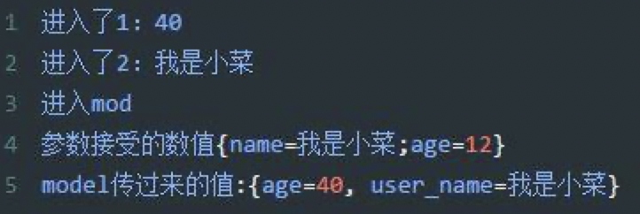
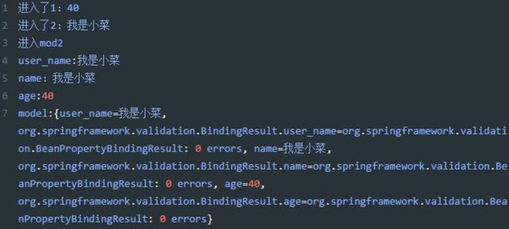

## Algorithm

[230. Kth Smallest Element in a BST](https://leetcode.com/problems/kth-smallest-element-in-a-bst/)

### Description:

Given a binary search tree, write a function kthSmallest to find the kth smallest element in it.


Example 1:

Input: root = [3,1,4,null,2], k = 1
```
   3
  / \
 1   4
  \
   2
```
Output: 1
Example 2:

Input: root = [5,3,6,2,4,null,null,1], k = 3
```
       5
      / \
     3   6
    / \
   2   4
  /
 1
```
Output: 3
Follow up:
What if the BST is modified (insert/delete operations) often and you need to find the kth smallest frequently? How would you optimize the kthSmallest routine?


Constraints:

- The number of elements of the BST is between 1 to 10^4.
- You may assume k is always valid, 1 ≤ k ≤ BST's total elements.


### Solution:

递归实现：
```java
/**
 * Definition for a binary tree node.
 * public class TreeNode {
 *     int val;
 *     TreeNode left;
 *     TreeNode right;
 *     TreeNode() {}
 *     TreeNode(int val) { this.val = val; }
 *     TreeNode(int val, TreeNode left, TreeNode right) {
 *         this.val = val;
 *         this.left = left;
 *         this.right = right;
 *     }
 * }
 */
class Solution {
    private int count = 0;
    private int res = 0;
    public int kthSmallest(TreeNode root, int k) {
        if(root.left!=null){
          kthSmallest(root.left, k);
        }
        if(++count == k){
          res = root.val;
        }
        if(root.right!=null){
          kthSmallest(root.right,k);
        }
        return res;
    }
}
```

非递归实现：
```java
/**
 * Definition for a binary tree node.
 * public class TreeNode {
 *     int val;
 *     TreeNode left;
 *     TreeNode right;
 *     TreeNode() {}
 *     TreeNode(int val) { this.val = val; }
 *     TreeNode(int val, TreeNode left, TreeNode right) {
 *         this.val = val;
 *         this.left = left;
 *         this.right = right;
 *     }
 * }
 */
class Solution {
    public int kthSmallest(TreeNode root, int k) {
        Stack<TreeNode> stack = new Stack<TreeNode>();
        while(true){
          // 把根节点及左节点全部放入栈里面
          while(root!=null){
            stack.push(root);
            root=root.left;
          }
          // 栈里面元素都遍历结束的时候，结束循环
          if(stack.isEmpty()){
            break;
          }
          // 弹出最后一个左节点
          root = stack.pop();
          // 查看是否是第K个
          if(--k==0){
            return root.val;
          }
          // 遍历右侧节点
          root = root.right;
        }
        return 0;
    }
}
```

### 思路：

递归实现


我们知道二分查找数(BST)的性质——任何一个节点的值均大于左子树的任意节点值，而小于右子树的任一节点值。那么这样就可以知道最小值的一个节点在树的最左端，最大值的一个节点在树的最右端。树从小到大顺序刚好满足树的中序遍历。因而，我们可以用中序遍历来处理。

由于 k 是个基本类型的数，我们知道它与应用类型不同，本轮递归的 k 值改变不会引起下一轮的改变，那么我们的处理办法可以增加一个全局变量、增加一个引用变量或增加一个方法形参，用这样的参数记录目前遍历到的是第几小的数，本题采用增加一个局部变量的方法：

非递归实现

非递归实现需要用到一个栈

## Review

Spring注解学习(一)

### @Controller
标识一个该类是Spring MVC controller处理器，用来创建处理http请求的对象.

```java
@Controller
public class TestController{
    @RequestMapping("/test")
    public String test(Map<String, Object> map){
      return "hello";
    }
}
```

### @RequestMapping

类定义处: 提供初步的请求映射信息，相对于 WEB 应用的根目录。
方法处: 提供进一步的细分映射信息，相对于类定义处的 URL。

### @RestController

Spring4之后加入的注解，原来在@Controller中返回json需要@ResponseBody来配合，如果直接用@RestController替代@Controller就不需要再配置@ResponseBody，默认返回json格式。

```java
@RestController
public class TestController{
    @RequestMapping("/test")
    public String test(Map<String, Object> map){
      return "hello";
    }
}
```

### @Service

用于标注业务层组件，说白了就是加入你有一个用注解的方式把这个类注入到spring配置中

### @Autowired

用来装配bean，都可以写在字段上，或者方法上。
默认情况下必须要求依赖对象必须存在，如果要允许null值，可以设置它的required属性为false，例如：@Autowired(required=false)

### @RequestParam

用于将请求参数区数据映射到功能处理方法的参数上

```java
public Resp test(@RequestParam Integer id){
  return resp.success(customerInfoService.fetch(id));
}
```

这个id就是要接收从接口传递过来的参数id的值的，如果接口传递过来的参数名和你接收的不一致，也可以如下

```java
public Resp test(@RequestParam(value="course_id") Integer id){
  return resp.success(customerInfoService.fetch(id));
}
```
其中course_id就是接口传递的参数，id就是映射course_id的参数名。

### @ModelAttribute

使用地方有三种：

1. 标记在方法上。
标记在方法上，会在每一个@RequestMapping标注的方法前执行，如果有返回值，则自动将该返回值加入到ModelMap中。

(1) 在有返回的方法上:
当ModelAttribute设置了value，方法返回的值会以这个value为key，以参数接受到的值作为value，存入到Model中，如下面的方法执行之后，最终相当于 model.addAttribute("user_name", name);假如 @ModelAttribute没有自定义value，则相当于
model.addAttribute("name", name);

```Java
@ModelAttribute(value = "user_name")
public  void before(@RequestParam(required=false)String name, Model model){
  model.addAttribute("age", name);
  System.out.println("进入了2: "+ name);
}```

(2) 在没返回的方法上：
需要手动model.add方法

```Java
@ModelAttribute
public  void before(@RequestParam(required=false)Integer age, Model model){
  model.addAttribute("age", age);
  System.out.println("进入了1: "+ age);
}
```

我们在当前类下建一个请求方法：

```java
@RequestMapping(value="/mod")
public Resp mod(
   @RequestParam(required=false)String name,
   @RequestParam(required=false)Integer age,
   Model model){
     System.out.println("进入mode");
     System.out.println("参数接受的数值(name=" name+",age="+ age")");
     System.out.println("model传过来的值为: "+ model);
     return Resp.success("1");
}
```


在浏览器中输入访问地址并且加上参数：
http://localhost:8081/api/test/mod?name=我是小菜&age=12
最终输出如下：



2. 标记在方法的参数上

标记在方法的参数上，会将客户端传递过来的参数按名称注入到指定对象中，并且会将这个对象自动加入ModelMap中，便于View层使用.
我们在上面的类中加入一个方法如下:

```java
@RequestMapping(value="/mod2")
public Resp mod2(
     @ModelAttribute("user_name") String user_name,
     @ModelAttribute("name") String name,
     @ModelAttribute("age")Integer age,
     Model model){
       System.out.println("进入mod2");
       System.out.println("user_name:" + user_name);
       System.out.println("name:" + name);
       System.out.println("age:" + age);
       System.out.println("model:" + model);
       return Resp.success("1");
}
```

在浏览器中输入访问地址并且加上参数：
http://localhost:8081/api/test/mod2?name=我是小菜&age=12
最终输出：

从结果就能看出，用在方法参数中的@ModelAttribute注解，实际上是一种接受参数并且自动放入Model对象中，便于使用。


## Tip

接上一节内存泄漏

### 不正确的 equals 和 hashCode 实现
又回到了这两个函数上，有很大一部分程序员不会主动重写 equals 和 hashCode，尤其是用 Lombok @Data 注解（该注解默认会帮助重写这两个函数）后，更会忽视这两个方法实现，一不小心的使就可能引起内存泄漏

来看个非常简单的例子：
```Java
public class MemLeakTest {

   public static void main(String[] args) throws InterruptedException {
      Map<Person, String> map = new HashMap<>();
      Person p1 = new Person("zhangsan", 1);
      Person p2 = new Person("zhangsan", 1);
      Person p3 = new Person("zhangsan", 1);

      map.put(p1, "zhangsan");
      map.put(p2, "zhangsan");
      map.put(p3, "zhangsan");

      System.out.println(map.entrySet().size());
      // 运行结果：3
   }
}  
```

```java
@Getter
@Setter
class Person {
 private String name;
 private Integer id;

 public Person(String name, Integer id){
  this.name = name;
  this.id = id;
 }
}
```
Person 类没有重写 hashCode 方法，那 Map 的 put 方法就会调用 Object 默认的 hashCode 方法
```Java
public V put(K key, V value) {
    return putVal(hash(key), key, value, false, true);
}

static final int hash(Object key) {
  int h;
  return (key == null) ? 0 : (h = key.hashCode()) ^ (h >>> 16);
}
```
p1, p2, p3 在【业务】属性上是完全相同的三个对象，由于「对象地址」的不同导致生成的 hashCode 不一样，最终都被放到 Map 中，这就会导致业务重复对象占用空间，所以这也是内存泄漏的一种。

解决办法:

解决办法很简单，在 Person 上加一个 Lombok 的 @Data 注解自动帮你重写 hashCode 方法，或手动在 IDE 中 generate，再次运行，结果就为 1了，符合业务需求

那重写了 hashCode 确实可以避免重复对象的加入，那这就完事大吉了吗, 再来看个例子：

```Java
public static void main(String[] args) throws InterruptedException {
  // 注意: HashSet 的底层也是 Map 结构
  Set<Person> set = new HashSet<Person>();

   Person p1 = new Person("zhangsan", 1);
   Person p2 = new Person("lisi", 2);
   Person p3 = new Person("wanger", 3);

   set.add(p1);
   set.add(p2);
   set.add(p3);

   System.out.println(set.size()); // 运行结果：3
   // 重新命名 hashCode改变
   p3.setName("wangermao");
   set.remove(p3);
   System.out.println(set.size()); // 运行结果：3
   set.add(p3);
   System.out.println(set.size()); // 运行结果：4
}
从运行结果中来看，很显然 set.remove(p3) 没有删除成功，因为 p3.setName("wangermao") 后，重新计算 p3 的 hashCode 会发生变化，所以 remove 的时候会找不到相应的 Node，这就又给了增加相同对象的“机会”，导致业务中无用的对象被引用着，所以可以说这也是内存泄漏的一种。

所以诸如此类操作，最好是先 remove，然后更改属性，最后再重新 add 进去
看到这，你应该发现了，要解决 hashCode 相关的问题，你要充分了解集合的特性，更要留意类是否重写了该方法以及它们的实现方式，避免出现内存泄漏情况

### ThreadLocal

ThreadLocal 是面试多线程的高频考点，它的好处是可以快速方便的做到线程隔离，但大家也都知道他是一把双刃剑，因为使用不好就有可能导致内存泄漏了
实际工作中我们都是使用线程池来管理线程 「具体请参考 我会手动创建线程，为什么要使用线程池」，这种方式可以让线程得到反复利用（故意不让 GC 回收），
现在，如果任何类创建了一个ThreadLocal变量，但没有显式地删除它，那么即使在web应用程序停止之后，该对象的副本仍将保留在工作线程中，从而阻止了该对象被垃圾收集，所以乱用也会导致内存泄漏。

解决办法

解决办法依旧很简单，依旧是遵循标准
  1. 调用 ThreadLocal 的 remove() 方法，移除当前线程变量值
  2. 也可以将它看作一种 resource，使用 try/finally 范式，万一在运行过程中出现异常，还可以在 finally 中 remove 掉
```java
try {
    threadLocal.set(System.nanoTime());
    // business code
}
finally {
    threadLocal.remove();
}
```

总的来说，引起内存泄漏的原因非常多，比如还有引用外部类的内部类等问题，这里不再展开说明，只是说明了几种非常常见的可能引发内存泄漏问题的几种场景
内存泄漏问题不易察觉，所以有时需要借助工具来帮忙

IDEA安装JVisualJVM，然后在IDE的右上角或当前类鼠标右键就可以点击运行查看了

## Share

- 保持强烈的好奇心
- 面对不确定性，选择拥抱而不是怀疑
- 更大的目标和想象力，创造持续价值而不仅是财富
- 延迟满足，极度自律
- 不怕犯错，善于自省

拥有强烈的好奇心，这决定了你会不断拓展自己认知的边界。
敢于拥抱不确定性，这能让你有机会碰到大机会，获得更大的成功。
有更大的目标和想象力，这决定了你在面对短期收益的时候，不会固步自封。
延迟满足和极度自律，这决定了你在日复一日的枯燥中，有耐心走完全程，不至于中途放弃。
不怕犯错和善于自省，这能让你不断升级迭代，你的成长会比别人更快。
