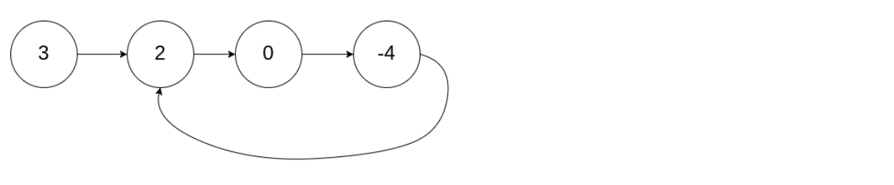
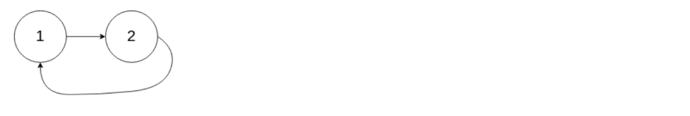
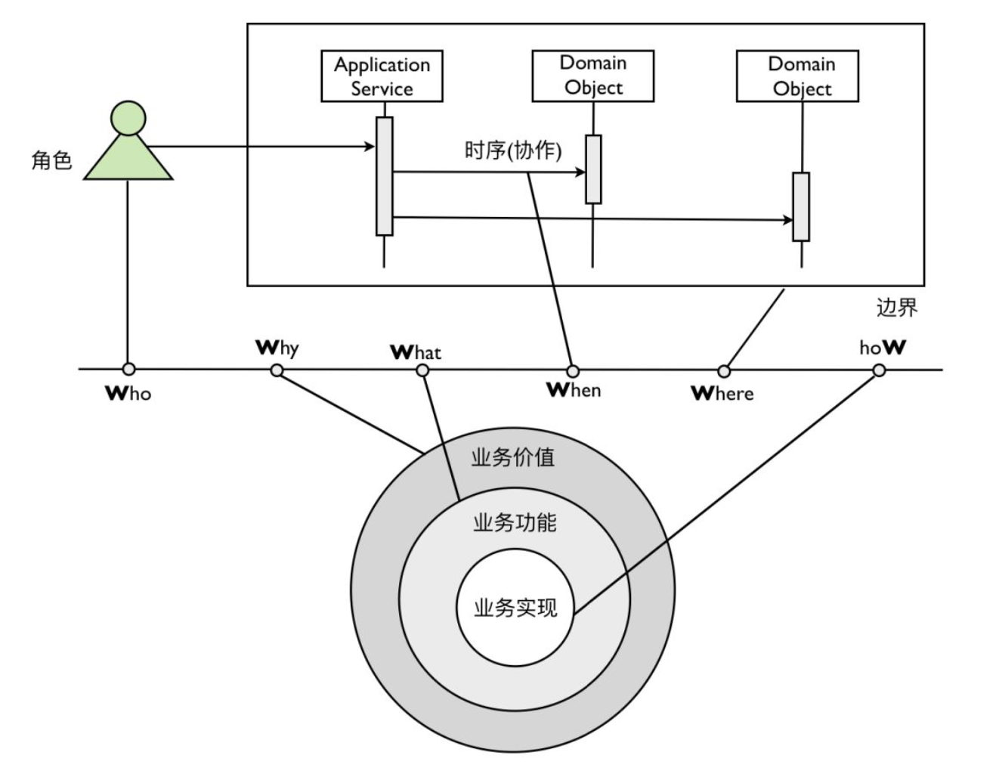

## Algorithm

[141. Linked List Cycle](https://leetcode.com/problems/linked-list-cycle/)

### Description

Given a linked list, determine if it has a cycle in it.

To represent a cycle in the given linked list, we use an integer pos which represents the position (0-indexed) in the linked list where tail connects to. If pos is -1, then there is no cycle in the linked list.


Example 1:
```
Input: head = [3,2,0,-4], pos = 1
Output: true
Explanation: There is a cycle in the linked list, where tail connects to the second node.
```


Example 2:
```
Input: head = [1,2], pos = 0
Output: true
Explanation: There is a cycle in the linked list, where tail connects to the first node.
```


Example 3:

```
Input: head = [1], pos = -1
Output: false
Explanation: There is no cycle in the linked list.
```


Follow up:

Can you solve it using O(1) (i.e. constant) memory?

### Solution

```java
/**
 * Definition for singly-linked list.
 * class ListNode {
 *     int val;
 *     ListNode next;
 *     ListNode(int x) {
 *         val = x;
 *         next = null;
 *     }
 * }
 */
public class Solution {
    public boolean hasCycle(ListNode head) {
       if(head==null||head.next==null){
           return false;
       }
       ListNode fast = head;
       ListNode slow = head;
       while(fast!=null && fast.next!=null){
         fast = fast.next.next;
         slow = slow.next;
         if(fast == slow){
           return true;
         }
       }
       return false;
    }
}
```

### Discuss

使用快慢指针，快指针走两步，慢支针走一步，注意while条件和null判断

## Review


## Tip


## Share

### 什么是结构化思维?
那么到底是什么是结构化思维呢?简单来说，结构化思维的定义就是:逻辑 + 套路。

### 表达要有逻辑

所谓逻辑是指我们的结构之间必须是有逻辑关系的。例如，你说话的时候用“第一、第二、第三”这个逻辑顺序是合理的，但是，用“第一，第二，第四”就会显得 很奇怪。当然，即使你用了”一、二、三”，也不一定就意味着你的内容有逻辑关系。
想让内容有逻辑关系，我们要学会四种组织思想的逻辑关系:
1. 演绎(因果)顺序:“大前提、小前提、结论”的演绎推理方式就是演绎顺序。
比如，经典三段论:所有人都要死，苏格拉底是人，苏格拉底要死。
2. 时间(步骤)顺序:“第一、第二、第三”，“首先、然后、再者”等，很多的时间顺序同时也是因果顺序。
3. 空间(结构)顺序:“前端、后端、数据”，“波士顿、纽约、华盛顿”，化整为零(将整体分解为部分)等都是空间顺序。
4. 程度(重要性)顺序:比如“最重要、次重要、不重要”等。 实际上，所有的逻辑关系都在这四种顺序之内。只要我们的思想和表达在这四种逻辑顺序之内，就是有逻辑的，否则就会显得没有逻辑性。

### 做事要有套路
套路是指我们解决问题的方法论，这个也非常重要。比如，5W2H 分析法就是 一个非常好的，可以帮助我们分析问题的一个”套路”。试想一下，面对任何一个问 题，你都能从 Why、Who、When、Where、What、How 和 How much，七个方面去思考。是不是比不知道这个方法论的人，用点状的思考，5W2H 分析法就全面得多。


例如，我们在对问题域进行分析和领域知识提炼的时候，就可以用上 5W2H。 5W2H 模型给出了具有指导意义的约束，要求我们提炼的领域知识必须具备模型的六个要素。这就好比两位侃侃而谈的交谈者，因为有了确定的主题与话题边界，一场本来是漫无目的野鹤闲云似的闲聊就变成了一次深度交流的专题高端对话。



逻辑是一种能力，而套路是方法论，是经验。逻辑是道的东西，而方法论是术的 东西。二者都很重要，只有熟练的掌握二者我们才能更好的进行结构化思考。
