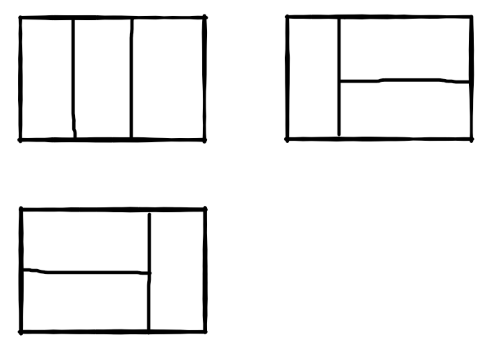

## Algorithm

[剑指offer-矩形覆盖](https://www.nowcoder.com/practice/72a5a919508a4251859fb2cfb987a0e6?tpId=13&tags=&title=&diffculty=0&judgeStatus=0&rp=1)

### Description

我们可以用2*1的小矩形横着或者竖着去覆盖更大的矩形。请问用n个2*1的小矩形无重叠地覆盖一个2*n的大矩形，总共有多少种方法？

比如n=3时，2*3的矩形块有3种覆盖方法：



### Solution

斐波那契数列

```java
public class Solution {
    public int RectCover(int target) {
         if(target<=2){
             return target;
         }else{
             return RectCover(target-1)+RectCover(target-2);
         }
    }
}
```


```java
public class Solution {
    public int RectCover(int target) {
       if(target <= 0){
           return 0;
       }
       if(target == 1){
           return 1;
       }
       if(target == 2){
           return 2;
       }
       int first = 1;
       int second = 2;
       int result = 0;
       for(int i=3;i<=target;i++){
          result = first + second;
          first  = second;
          second = result;
       }
       return result;
    }
}
```

### Discuss

逆向分析

应为可以横着放或竖着放，多以f(n)可以是2*(n-1)的矩形加一个竖着放的2*1的矩形或2*(n-2)的矩形加2横着放的，即f(n)=f(n-1)+f(n-2)

当到了最后，f(1)=1,f(2)=2


## Review


## Tip


## Share
