## Algorithm

[206. Reverse Linked List](https://leetcode.com/problems/reverse-linked-list/)

### Description

Reverse a singly linked list.

Example:

```
Input: 1->2->3->4->5->NULL
Output: 5->4->3->2->1->NULL
```

Follow up:

A linked list can be reversed either iteratively or recursively. Could you implement both?

### Resolution

```Java
/**
 * Definition for singly-linked list.
 * public class ListNode {
 *     int val;
 *     ListNode next;
 *     ListNode() {}
 *     ListNode(int val) { this.val = val; }
 *     ListNode(int val, ListNode next) { this.val = val; this.next = next; }
 * }
 */
class Solution {
    public ListNode reverseList(ListNode head){
      ListNode pre = null;
      ListNode now = head;
      while(now!=null){
        ListNode next = now.next;
        now.next = pre;
        pre = now;
        now = next;
      }
      return pre;
    }
}
```

### Discuss

1. 创建新节点=头节点
2. 创建pre节点
3. 循环以下过程：
4. 存放next节点
5. 当前节点下一个节点=pre
6. pre=当前节点
7. 当前节点=next节点

## Review

### API Gateway(2)
[API Gateway](https://java-design-patterns.com/patterns/api-gateway/)

#### Programmatic Example

This implementation shows what the API Gateway pattern could look like for an e-commerce site. The ApiGateway makes calls to the Image and Price microservices using the ImageClientImpl and PriceClientImpl respectively. Customers viewing the site on a desktop device can see both price information and an image of a product, so the ApiGateway calls both of the microservices and aggregates the data in the DesktopProduct model. However, mobile users only see price information; they do not see a product image. For mobile users, the ApiGateway only retrieves price information, which it uses to populate the MobileProduct.

Here's the Image microservice implementation.

```Java
public interface ImageClient {
  String getImagePath();
}

public class ImageClientImpl implements ImageClient {
  @Override
  public String getImagePath() {
    var httpClient = HttpClient.newHttpClient();
    var httpGet = HttpRequest.newBuilder()
        .GET()
        .uri(URI.create("http://localhost:50005/image-path"))
        .build();

    try {
      var httpResponse = httpClient.send(httpGet, BodyHandlers.ofString());
      return httpResponse.body();
    } catch (IOException | InterruptedException e) {
      e.printStackTrace();
    }

    return null;
  }
}
```

Here's the Price microservice implementation.

```java
public interface PriceClient {
  String getPrice();
}

public class PriceClientImpl implements PriceClient {

  @Override
  public String getPrice() {
    var httpClient = HttpClient.newHttpClient();
    var httpGet = HttpRequest.newBuilder()
        .GET()
        .uri(URI.create("http://localhost:50006/price"))
        .build();

    try {
      var httpResponse = httpClient.send(httpGet, BodyHandlers.ofString());
      return httpResponse.body();
    } catch (IOException | InterruptedException e) {
      e.printStackTrace();
    }

    return null;
  }
}
```

Here we can see how API Gateway maps the requests to the microservices.
```java
public class ApiGateway {

  @Resource
  private ImageClient imageClient;

  @Resource
  private PriceClient priceClient;

  @RequestMapping(path = "/desktop", method = RequestMethod.GET)
  public DesktopProduct getProductDesktop() {
    var desktopProduct = new DesktopProduct();
    desktopProduct.setImagePath(imageClient.getImagePath());
    desktopProduct.setPrice(priceClient.getPrice());
    return desktopProduct;
  }

  @RequestMapping(path = "/mobile", method = RequestMethod.GET)
  public MobileProduct getProductMobile() {
    var mobileProduct = new MobileProduct();
    mobileProduct.setPrice(priceClient.getPrice());
    return mobileProduct;
  }
}
```
#### Class diagram

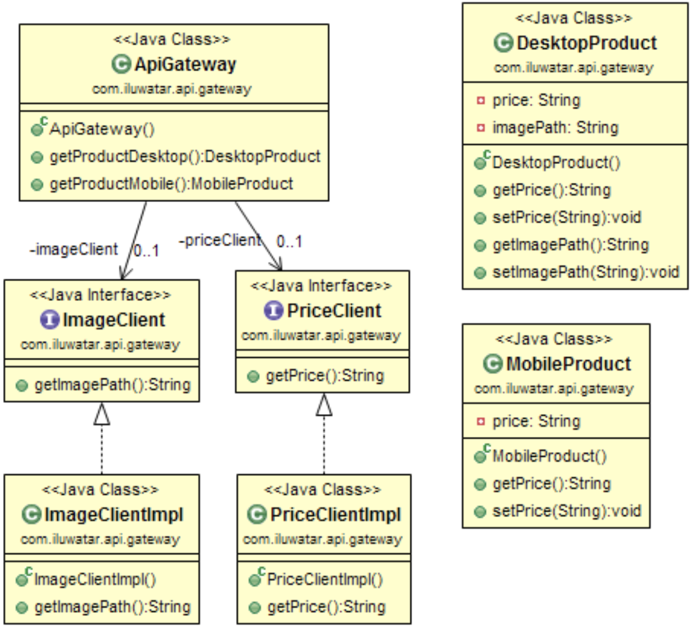

#### Applicability
Use the API Gateway pattern when

- You're using microservices architecture and need a single point of aggregation for your microservice calls.

#### Credits
- [microservices.io - API Gateway](http://microservices.io/patterns/apigateway.html)
- [NGINX - Building Microservices: Using an API Gateway](https://www.nginx.com/blog/building-microservices-using-an-api-gateway/)
- [Microservices Patterns: With examples in Java](https://www.amazon.com/gp/product/1617294543/ref=as_li_qf_asin_il_tl?ie=UTF8&tag=javadesignpat-20&creative=9325&linkCode=as2&creativeASIN=1617294543&linkId=ac7b6a57f866ac006a309d9086e8cfbd)
- [Building Microservices: Designing Fine-Grained Systems](https://www.amazon.com/gp/product/1491950358/ref=as_li_qf_asin_il_tl?ie=UTF8&tag=javadesignpat-20&creative=9325&linkCode=as2&creativeASIN=1491950358&linkId=4c95ca9831e05e3f0dadb08841d77bf1)

## Tip

List遍历删除二：

```Java
public static void main(String[] args) {
    List<String> platformList = new ArrayList<>();
    platformList.add("a");
    platformList.add("b");
    platformList.add("c");

    for (String platform : platformList) {
        if (platform.equals("c")) {
            platformList.remove(platform);
        }
    }

    System.out.println(platformList);
}
```

运行结果：
```text
Exception in thread "main" java.util.ConcurrentModificationException
	at java.util.ArrayList$Itr.checkForComodification(ArrayList.java:909)
	at java.util.ArrayList$Itr.next(ArrayList.java:859)
	at test.TestListIterator.main(TestListIterator.java:17)
```
错误原因分析：

看下生成的字节码：

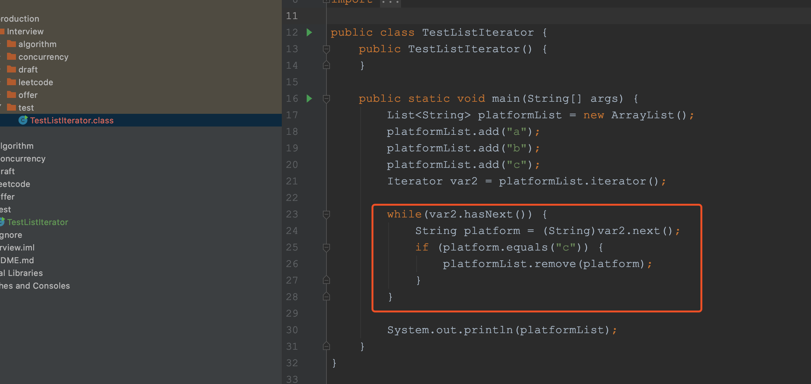

由此可以看出，foreach循环在实际执行时，其实使用的是Iterator，使用的核心方法是hasnext()和next()。
然后再来看下ArrayList类的Iterator是如何实现的呢？

底层源码：

```Java
private class Itr implements Iterator<E> {
    int cursor;       // index of next element to return
    int lastRet = -1; // index of last element returned; -1 if no such
    int expectedModCount = modCount;

    Itr() {}

    public boolean hasNext() {
        return cursor != size;
    }

    @SuppressWarnings("unchecked")
    public E next() {
        checkForComodification();
        int i = cursor;
        if (i >= size)
            throw new NoSuchElementException();
        Object[] elementData = ArrayList.this.elementData;
        if (i >= elementData.length)
            throw new ConcurrentModificationException();
        cursor = i + 1;
        return (E) elementData[lastRet = i];
    }

    public void remove() {
        if (lastRet < 0)
            throw new IllegalStateException();
        checkForComodification();

        try {
            ArrayList.this.remove(lastRet);
            cursor = lastRet;
            lastRet = -1;
            expectedModCount = modCount;
        } catch (IndexOutOfBoundsException ex) {
            throw new ConcurrentModificationException();
        }
    }

    @Override
    @SuppressWarnings("unchecked")
    public void forEachRemaining(Consumer<? super E> consumer) {
        Objects.requireNonNull(consumer);
        final int size = ArrayList.this.size;
        int i = cursor;
        if (i >= size) {
            return;
        }
        final Object[] elementData = ArrayList.this.elementData;
        if (i >= elementData.length) {
            throw new ConcurrentModificationException();
        }
        while (i != size && modCount == expectedModCount) {
            consumer.accept((E) elementData[i++]);
        }
        // update once at end of iteration to reduce heap write traffic
        cursor = i;
        lastRet = i - 1;
        checkForComodification();
    }

    final void checkForComodification() {
        if (modCount != expectedModCount)
            throw new ConcurrentModificationException();
    }
}
```

可以看出，调用next()方法获取下一个元素时，第一行代码就是调用了checkForComodification();，而该方法的核心逻辑就是比较modCount和expectedModCount这2个变量的值。

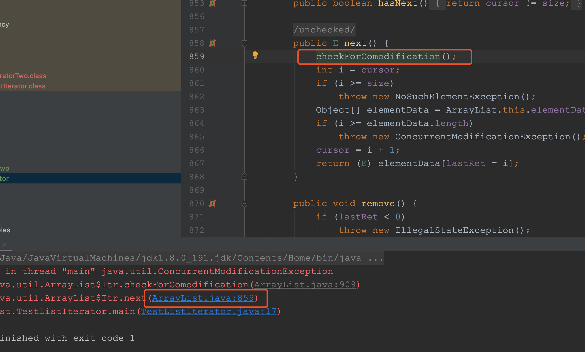

在上面的例子中，刚开始modCount和expectedModCount的值都为3，所以第1次获取元素"a"是没问题的，但是当执行完下面这行代码时：
platformList.remove(platform);
modCount的值就被修改成了4。


modCout表示修改次数：

```Java
/**
 * The number of times this list has been <i>structurally modified</i>.
 * Structural modifications are those that change the size of the
 * list, or otherwise perturb it in such a fashion that iterations in
 * progress may yield incorrect results.
 *
 * <p>This field is used by the iterator and list iterator implementation
 * returned by the {@code iterator} and {@code listIterator} methods.
 * If the value of this field changes unexpectedly, the iterator (or list
 * iterator) will throw a {@code ConcurrentModificationException} in
 * response to the {@code next}, {@code remove}, {@code previous},
 * {@code set} or {@code add} operations.  This provides
 * <i>fail-fast</i> behavior, rather than non-deterministic behavior in
 * the face of concurrent modification during iteration.
 *
 * <p><b>Use of this field by subclasses is optional.</b> If a subclass
 * wishes to provide fail-fast iterators (and list iterators), then it
 * merely has to increment this field in its {@code add(int, E)} and
 * {@code remove(int)} methods (and any other methods that it overrides
 * that result in structural modifications to the list).  A single call to
 * {@code add(int, E)} or {@code remove(int)} must add no more than
 * one to this field, or the iterators (and list iterators) will throw
 * bogus {@code ConcurrentModificationExceptions}.  If an implementation
 * does not wish to provide fail-fast iterators, this field may be
 * ignored.
 */
protected transient int modCount = 0;
```

所以在第2次获取元素时，modCount和expectedModCount的值就不相等了，所以抛出了java.util.ConcurrentModificationException异常。

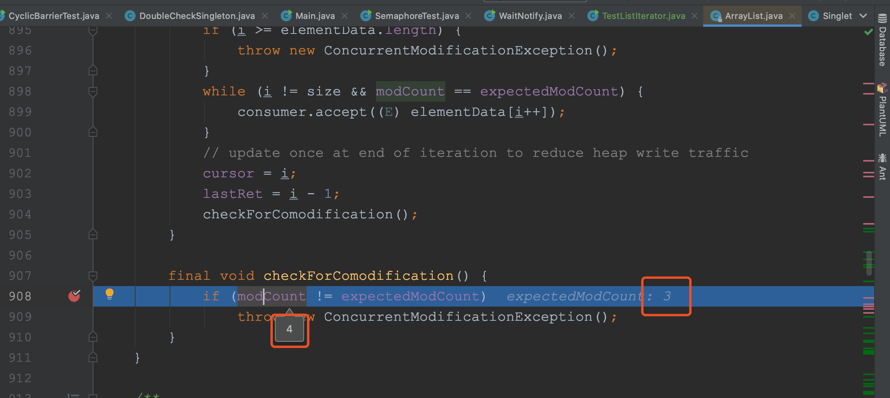

既然不能使用foreach来实现，那么我们该如何实现呢？
主要有以下3种方法：
-  使用Iterator的remove()方法
-  使用for循环正序遍历
-  使用for循环倒序遍历

1. 使用Iterator的remove()方法

使用Iterator的remove()方法的实现方式如下所示：

```Java
public static void main(String[] args) {
    List<String> platformList = new ArrayList<>();
    platformList.add("a");
    platformList.add("b");
    platformList.add("c");

    Iterator<String> iterator = platformList.iterator();
    while (iterator.hasNext()) {
        String platform = iterator.next();
        if (platform.equals("a")) {
            iterator.remove();
        }
    }

    System.out.println(platformList);
}
```
输出结果
```text
[b, c]
```

iterator.remove()源码可以看出，每次删除一个元素，都会将modCount的值重新赋值给expectedModCount，这样2个变量就相等了，不会触发java.util.ConcurrentModificationException异常。

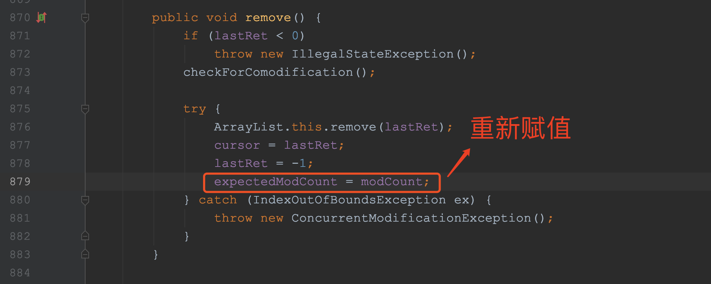

看下底层执行的区别
for循环
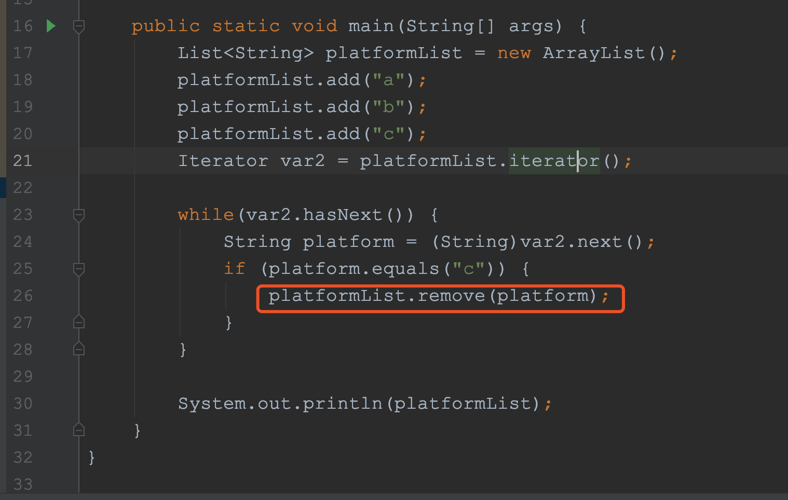

iterator
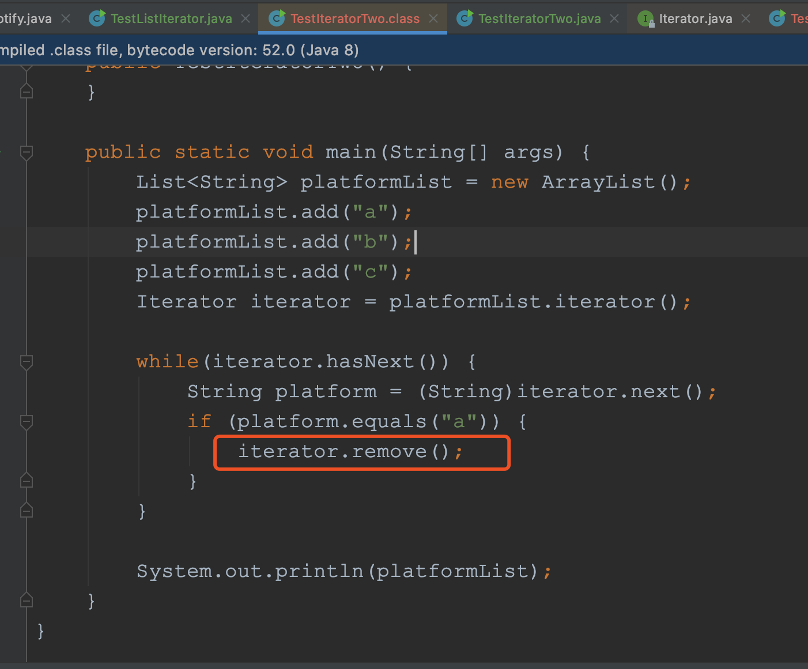


2. 使用for循环正序遍历
使用for循环正序遍历的实现方式如下所示：
```java
public static void main(String[] args) {
    List<String> platformList = new ArrayList<>();
    platformList.add("a");
    platformList.add("b");
    platformList.add("c");

    for (int i = 0; i < platformList.size(); i++) {
        String item = platformList.get(i);

        if (item.equals("a")) {
            platformList.remove(i);
            i = i - 1;
        }
    }

    System.out.println(platformList);
}
```

打印结果：
```
[b, c]
```

这种实现方式比较好理解，就是通过数组的下标来删除，不过有个注意事项就是删除元素后，要修正下下标的值：

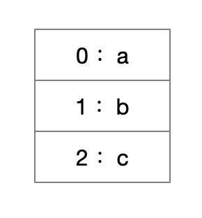

i = i - 1;
为什么要修正下标的值呢？
因为刚开始元素的下标是这样的：

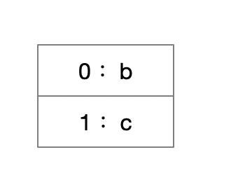

第1次循环将元素"a"删除后，元素的下标变成了下面这样：

第2次循环时i的值为1，也就是取到了元素”b“，这样就导致元素"c"被跳过检查了，所以删除完元素后，我们要修正下下标，这也是上面代码中i = i - 1;的用途。

3. 使用for循环倒序遍历
使用for循环倒序遍历的实现方式如下所示：

```java
public static void main(String[] args) {
    List<String> platformList = new ArrayList<>();
    platformList.add("a");
    platformList.add("b");
    platformList.add("c");

    for (int i = platformList.size() - 1; i >= 0; i--) {
        String item = platformList.get(i);

        if (item.equals("c")) {
            platformList.remove(i);
        }
    }

    System.out.println(platformList);
}
```

这种实现方式和使用for循环正序遍历类似，不过不用再修正下标，因为刚开始元素的下标是这样的：
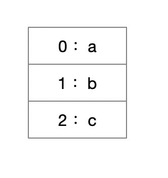

第1次循环将元素"c"删除后，元素的下标变成了下面这样：

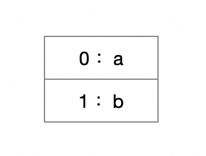

第2次循环时i的值为1，也就是取到了元素”b“，不会导致跳过元素，所以不需要修正下标。

## Share

多多交流，说比不说更好
