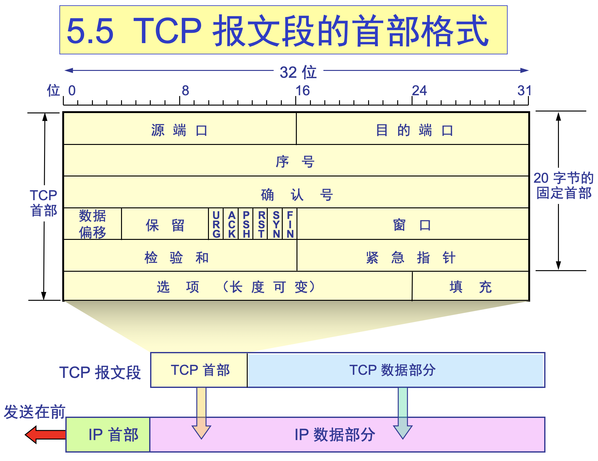

## Algorithm

[94. Binary Tree Inorder Traversal](https://leetcode.com/problems/binary-tree-inorder-traversal/)

### Description

Given a binary tree, return the inorder traversal of its nodes' values.

Example:
```
Input: [1,null,2,3]
   1
    \
     2
    /
   3
```
Output: [1,3,2]

Follow up: Recursive solution is trivial, could you do it iteratively?

### Solution

#### 递归：
```Java
/**
 * Definition for a binary tree node.
 * public class TreeNode {
 *     int val;
 *     TreeNode left;
 *     TreeNode right;
 *     TreeNode() {}
 *     TreeNode(int val) { this.val = val; }
 *     TreeNode(int val, TreeNode left, TreeNode right) {
 *         this.val = val;
 *         this.left = left;
 *         this.right = right;
 *     }
 * }
 */
class Solution {
    private List<Integer> list = new ArrayList<>();
    public List<Integer> inorderTraversal(TreeNode root) {
        if(root==null){
            return list;
        }
        inOrder(root);
        return list;
    }
    private void inOrder(TreeNode root){
       if(root.left!=null){
          inOrder(root.left);
       }
       list.add(root.val);
       if(root.right!=null){
          inOrder(root.right);
       }
       return;
    }
}
```

#### 非递归：
```Java
/**
 * Definition for a binary tree node.
 * public class TreeNode {
 *     int val;
 *     TreeNode left;
 *     TreeNode right;
 *     TreeNode() {}
 *     TreeNode(int val) { this.val = val; }
 *     TreeNode(int val, TreeNode left, TreeNode right) {
 *         this.val = val;
 *         this.left = left;
 *         this.right = right;
 *     }
 * }
 */
class Solution {
    public List<Integer> inorderTraversal(TreeNode root) {
      List<Integer> list = new ArrayList<Integer>();
      Stack<TreeNode> stack = new Stack<TreeNode>();
      while(root!=null || !stack.empty()){
         while(root!=null){
            stack.push(root);
            root = root.left;
         }
         root = stack.pop();
         list.add(root.val);
         root = root.right;
      }
      return list;
    }
}
```

### Discuss

主要思想是：先找到左侧根节点，然后根节点，最后右节点

## Review


## Tip

### TCP报文首部格式



序列号seq：占4个字节，用来标记数据段的顺序，TCP把连接中发送的所有数据字节都编上一个序号，第一个字节的编号由本地随机产生；给字节编上序号后，就给每一个报文段指派一个序号；序列号seq就是这个报文段中的第一个字节的数据编号。

- 确认号ack：占4个字节，期待收到对方下一个报文段的第一个数据字节的序号；序列号表示报文段携带数据的第一个字节的编号；而确认号指的是期望接收到下一个字节的编号；因此当前报文段最后一个字节的编号+1即为确认号。

- 确认ACK：占1位，仅当ACK=1时，确认号字段才有效。ACK=0时，确认号无效

- 同步SYN：连接建立时用于同步序号。当SYN=1，ACK=0时表示：这是一个连接请求报文段。若同意连接，则在响应报文段中使得SYN=1，ACK=1。因此，SYN=1表示这是一个连接请求，或连接接受报文。SYN这个标志位只有在TCP建产连接时才会被置1，握手完成后SYN标志位被置0。

- 终止FIN：用来释放一个连接。FIN=1表示：此报文段的发送方的数据已经发送完毕，并要求释放运输连接

- PS：ACK、SYN和FIN这些大写的单词表示标志位，其值要么是1，要么是0；ack、seq小写的单词表示序号。

|字段|含义|
|:---:|:---|
|URG	|紧急指针是否有效。1表示某一位需要被优先处理|
|ACK	|确认号是否有效，一般置为1。|
|PSH  |提示接收端应用程序立即从TCP缓冲区把数据读走。|
|RST	|对方要求重新建立连接，复位。|
|SYN	|请求建立连接，并在其序列号的字段进行序列号的初始值设定。建立连接，设置为1|
|FIN  |希望断开连接。|


## Share
