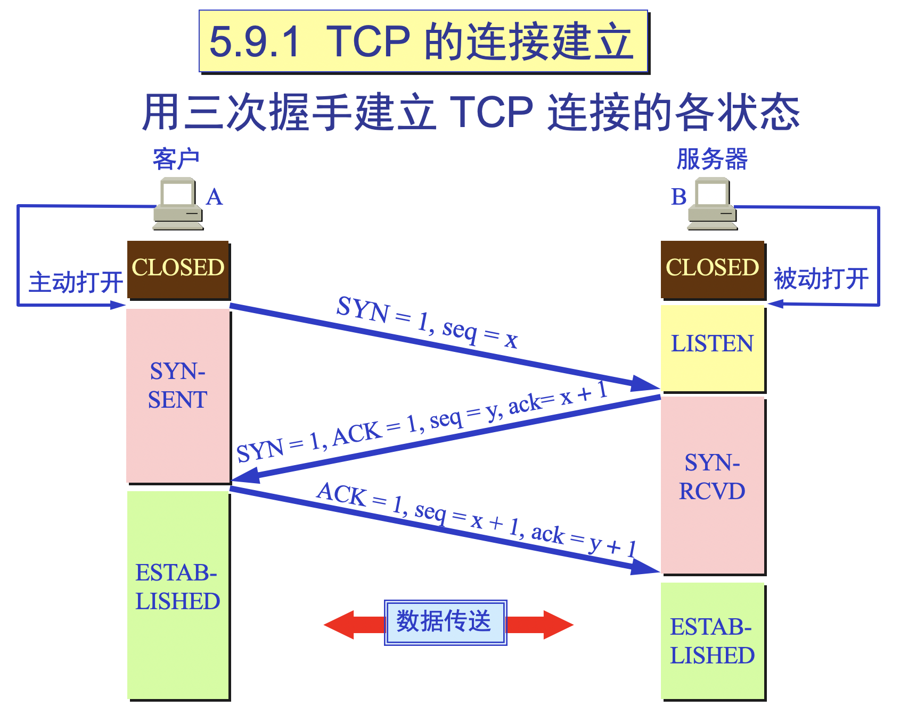

## Algorithm

[4. Median of Two Sorted Arrays](https://leetcode.com/problems/median-of-two-sorted-arrays/)

### Description

There are two sorted arrays nums1 and nums2 of size m and n respectively.

Find the median of the two sorted arrays. The overall run time complexity should be O(log (m+n)).

You may assume nums1 and nums2 cannot be both empty.

Example 1:
```
nums1 = [1, 3]
nums2 = [2]

The median is 2.0
```

Example 2:
```
nums1 = [1, 2]
nums2 = [3, 4]

The median is (2 + 3)/2 = 2.5
```

### Solution

```java
class Solution {
    public double findMedianSortedArrays(int[] nums1, int[] nums2) {
        int m = nums1.length, n = nums2.length;
        int l = (m+n+1)/2;
        int r = (m+n+2)/2;
        return (getKth(nums1,0,nums2,0,l)+getKth(nums1,0,nums2,0,r))/2.0;
    }
    public double getKth(int[] A, int aStart, int[] B, int bStart, int k){
        if(aStart>A.length-1){
            return B[bStart+k-1];
        }
        if(bStart>B.length-1){
            return A[aStart+k-1];
        }
        if(k==1){
            return Math.min(A[aStart],B[bStart]);
        }
        int aMid = Integer.MAX_VALUE, bMid = Integer.MAX_VALUE;
        if(aStart+k/2-1<A.length){
            aMid = A[aStart+k/2-1];
        }
        if(bStart+k/2-1<B.length){
            bMid = B[bStart+k/2-1];   
        }
        if(aMid<bMid){
            return getKth(A, aStart+k/2,B,bStart,k-k/2);
        }else{
            return getKth(A,aStart,B,bStart+k/2, k-k/2);
        }
    }
}
```


### Discuss

首先假设数组A和B的元素个数都大于k/2，我们比较A[k/2-1]和B[k/2-1]两个元素，这两个元素分别表示A的第k/2小的元素和B的第k/2小的元素。这两个元素比较共有三种情况：>、<和=。如果A[k/2-1]<B[k/2-1]，这表示A[0]到A[k/2-1]的元素都在A和B合并之后的前k小的元素中。换句话说，A[k/2-1]不可能大于两数组合并之后的第k小值，所以我们可以将其抛弃。

证明也很简单，可以采用反证法。假设A[k/2-1]大于合并之后的第k小值，我们不妨假定其为第（k+1）小值。由于A[k/2-1]小于B[k/2-1]，所以B[k/2-1]至少是第（k+2）小值。但实际上，在A中至多存在k/2-1个元素小于A[k/2-1]，B中也至多存在k/2-1个元素小于A[k/2-1]，所以小于A[k/2-1]的元素个数至多有k/2+ k/2-2，小于k，这与A[k/2-1]是第（k+1）的数矛盾。

当A[k/2-1]>B[k/2-1]时存在类似的结论。

当A[k/2-1]=B[k/2-1]时，我们已经找到了第k小的数，也即这个相等的元素，我们将其记为m。由于在A和B中分别有k/2-1个元素小于m，所以m即是第k小的数。(这里可能有人会有疑问，如果k为奇数，则m不是中位数。这里是进行了理想化考虑，在实际代码中略有不同，是先求k/2，然后利用k-k/2获得另一个数。)

通过上面的分析，我们即可以采用递归的方式实现寻找第k小的数。此外我们还需要考虑几个边界条件：

如果A或者B为空，则直接返回B[k-1]或者A[k-1]；
如果k为1，我们只需要返回A[0]和B[0]中的较小值；
如果A[k/2-1]=B[k/2-1]，返回其中一个；

## Review


## Tip

### 三次握手四次挥手（上）

#### 三次握手



第一次握手：建立连接时，客户端发送syn包（syn=x）到服务器，并进入SYN_SENT状态，等待服务器确认；SYN：同步序列编号（Synchronize Sequence Numbers）。

第二次握手：服务器收到syn包，必须确认客户的SYN（ack=x+1），同时自己也发送一个SYN包（syn=y），即SYN+ACK包，此时服务器进入SYN_RECV状态；

第三次握手：客户端收到服务器的SYN+ACK包，向服务器发送确认包ACK(ack=y+1），此包发送完毕，客户端和服务器进入ESTABLISHED（TCP连接成功）状态，完成三次握手。

#### 四次挥手


1）客户端进程发出连接释放报文，并且停止发送数据。释放数据报文首部，FIN=1，其序列号为seq=u（等于前面已经传送过来的数据的最后一个字节的序号加1），此时，客户端进入FIN-WAIT-1（终止等待1）状态。 TCP规定，FIN报文段即使不携带数据，也要消耗一个序号。
2）服务器收到连接释放报文，发出确认报文，ACK=1，ack=u+1，并且带上自己的序列号seq=v，此时，服务端就进入了CLOSE-WAIT（关闭等待）状态。TCP服务器通知高层的应用进程，客户端向服务器的方向就释放了，这时候处于半关闭状态，即客户端已经没有数据要发送了，但是服务器若发送数据，客户端依然要接受。这个状态还要持续一段时间，也就是整个CLOSE-WAIT状态持续的时间。
3）客户端收到服务器的确认请求后，此时，客户端就进入FIN-WAIT-2（终止等待2）状态，等待服务器发送连接释放报文（在这之前还需要接受服务器发送的最后的数据）。
4）服务器将最后的数据发送完毕后，就向客户端发送连接释放报文，FIN=1，ack=u+1，由于在半关闭状态，服务器很可能又发送了一些数据，假定此时的序列号为seq=w，此时，服务器就进入了LAST-ACK（最后确认）状态，等待客户端的确认。
5）客户端收到服务器的连接释放报文后，必须发出确认，ACK=1，ack=w+1，而自己的序列号是seq=u+1，此时，客户端就进入了TIME-WAIT（时间等待）状态。注意此时TCP连接还没有释放，必须经过2∗∗MSL（最长报文段寿命）的时间后，当客户端撤销相应的TCB后，才进入CLOSED状态。
6）服务器只要收到了客户端发出的确认，立即进入CLOSED状态。同样，撤销TCB后，就结束了这次的TCP连接。可以看到，服务器结束TCP连接的时间要比客户端早一些。

## Share

[SpringBoot_CORS](https://github.com/guangxush/SpringBoot_CORS)
