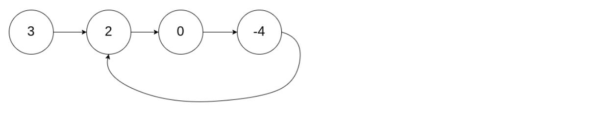
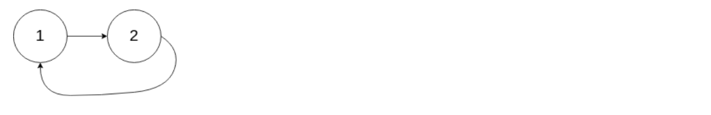

## Algorithm

### Description

Given a linked list, return the node where the cycle begins. If there is no cycle, return null.

To represent a cycle in the given linked list, we use an integer pos which represents the position (0-indexed) in the linked list where tail connects to. If pos is -1, then there is no cycle in the linked list.

Note: Do not modify the linked list.

Example 1:
```
Input: head = [3,2,0,-4], pos = 1
Output: tail connects to node index 1
Explanation: There is a cycle in the linked list, where tail connects to the second node.
```


Example 2:
```
Input: head = [1,2], pos = 0
Output: tail connects to node index 0
Explanation: There is a cycle in the linked list, where tail connects to the first node.
```


Example 3:
```
Input: head = [1], pos = -1
Output: no cycle
Explanation: There is no cycle in the linked list.
```


Follow-up:
Can you solve it without using extra space?


### Solution

```java
/**
 * Definition for singly-linked list.
 * class ListNode {
 *     int val;
 *     ListNode next;
 *     ListNode(int x) {
 *         val = x;
 *         next = null;
 *     }
 * }
 */
public class Solution {
    public ListNode detectCycle(ListNode head) {
        if(head==null || head.next==null){
          return null;
        }
        //假设环的起点是第m个节点，总长度是n
        ListNode fast = head;
        ListNode slow = head;
        while(fast!=null && fast.next!=null){
           fast = fast.next.next;
           slow = slow.next;
           if(fast == slow){
             break;
           }
        }
        if(fast==null || fast.next ==null){
          return null;
        }
        //第一次相遇在k节点,此时慢指针只需走n-k到达开头
        //此时快指针已经走了m+k步
        fast = head;
        while(fast!=slow){
          slow = slow.next;
          fast = fast.next;
        }
        return slow;
    }
}
```

### Discuss

## Review


## Tip


## Share
