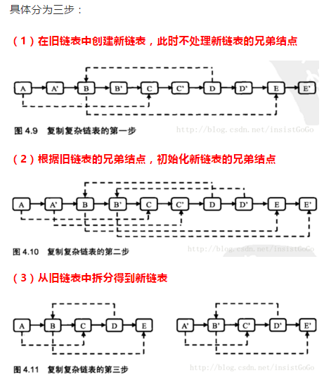

## Algorithm

[剑指offer-复杂链表的复制](https://www.nowcoder.com/practice/f836b2c43afc4b35ad6adc41ec941dba?tpId=13&tags=&title=&diffculty=0&judgeStatus=0&rp=1)

### Description
输入一个复杂链表（每个节点中有节点值，以及两个指针，一个指向下一个节点，另一个特殊指针random指向一个随机节点），请对此链表进行深拷贝，并返回拷贝后的头结点。（注意，输出结果中请不要返回参数中的节点引用，否则判题程序会直接返回空）

### Solution

```java
/*
public class RandomListNode {
    int label;
    RandomListNode next = null;
    RandomListNode random = null;

    RandomListNode(int label) {
        this.label = label;
    }
}
*/
public class Solution {
    public RandomListNode Clone(RandomListNode pHead)
    {
        if(pHead == null) {
            return null;
        }

        RandomListNode currentNode = pHead;
        //1、复制每个结点，如复制结点A得到A1，将结点A1插到结点A后面；
        while(currentNode != null){
            RandomListNode cloneNode = new RandomListNode(currentNode.label);
            RandomListNode nextNode = currentNode.next;
            currentNode.next = cloneNode;
            cloneNode.next = nextNode;
            currentNode = nextNode;
        }

        currentNode = pHead;
        //2、重新遍历链表，复制老结点的随机指针给新结点，如A1.random = A.random.next;
        while(currentNode != null) {
            currentNode.next.random = currentNode.random==null?null:currentNode.random.next;
            currentNode = currentNode.next.next;
        }

        //3、拆分链表，将链表拆分为原链表和复制后的链表
        currentNode = pHead;
        RandomListNode pCloneHead = pHead.next;
        while(currentNode != null) {
            RandomListNode cloneNode = currentNode.next;
            currentNode.next = cloneNode.next;
            cloneNode.next = cloneNode.next==null?null:cloneNode.next.next;
            currentNode = currentNode.next;
        }

        return pCloneHead;

    }
}
```

### Discuss



解题思路：

1、遍历链表，复制每个结点，如复制结点A得到A1，将结点A1插到结点A后面；

2、重新遍历链表，复制老结点的随机指针给新结点，如A1.random = A.random.next;

3、拆分链表，将链表拆分为原链表和复制后的链表


## Review


## Tip


## Share
