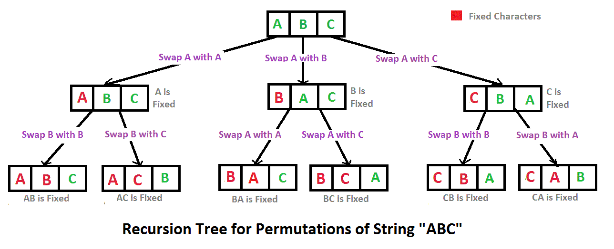

## Algorithm

[剑指offer-字符串的排列](https://www.nowcoder.com/practice/fe6b651b66ae47d7acce78ffdd9a96c7?tpId=13&tags=&title=&diffculty=0&judgeStatus=0&rp=1)

### Description

题目描述:

输入一个字符串,按字典序打印出该字符串中字符的所有排列。例如输入字符串abc,则按字典序打印出由字符a,b,c所能排列出来的所有字符串abc,acb,bac,bca,cab和cba。

输入描述:

输入一个字符串,长度不超过9(可能有字符重复),字符只包括大小写字母。

### Solution

```java
import java.util.ArrayList;
import java.util.TreeSet;
import java.util.Arrays;

public class Solution {
    public ArrayList<String> Permutation(String str) {
       ArrayList<String> res = new ArrayList<String>();
        if(str==null || str.length() < 1) return res;
        TreeSet<String> set = new TreeSet<>();csfchcch
        char[] chs = str.toCharArray();
        change(chs,0,set);
        res.addAll(set);
        return res;
    }
    public void change(char[] chs,int start,TreeSet<String> set){
        if(start == chs.length -1)
            set.add(Arrays.toString(chs));
        for(int i=start;i<chs.length;i++){
            swap(chs,start,i);
            change(chs,start+1,set);
            swap(chs,start,i);
        }
    }
    public void swap(char[] chs,int i,int j){
        char tmp = chs[i];
        chs[i]= chs[j];
        chs[j] = tmp;
    }
}
```

### Discuss

基于回溯法的思想



## Review


## Tip


## Share
