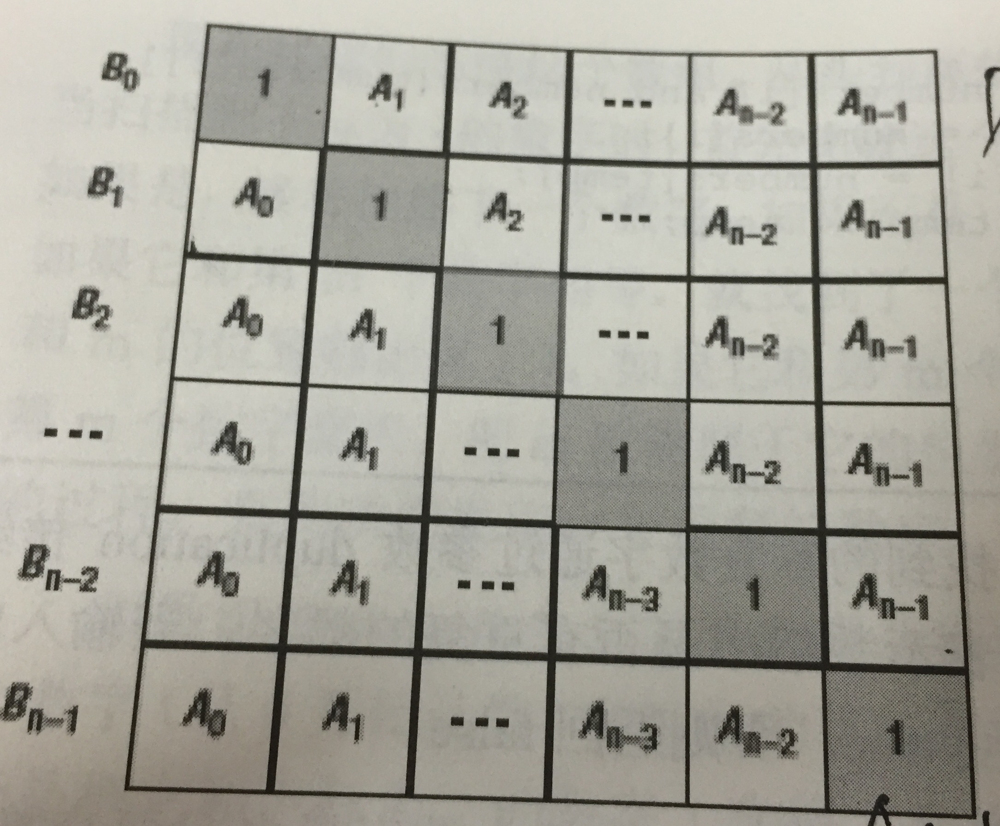

## Algorithm

[剑指offer-构建乘积数组](https://www.nowcoder.com/practice/94a4d381a68b47b7a8bed86f2975db46?tpId=13&tags=&title=&diffculty=0&judgeStatus=0&rp=1)

### Description

题目描述:

给定一个数组A[0,1,...,n-1],请构建一个数组B[0,1,...,n-1],其中B中的元素B[i]=A[0]*A[1]*...*A[i-1]*A[i+1]*...*A[n-1]。不能使用除法。（注意：规定B[0] = A[1] * A[2] * ... * A[n-1]，B[n-1] = A[0] * A[1] * ... * A[n-2];）
对于A长度为1的情况，B无意义，故而无法构建，因此该情况不会存在。


### Solution

```java
import java.util.ArrayList;
public class Solution {
    public int[] multiply(int[] A) {
        int length = A.length;
        int[] B = new int[length];
        if(length>0){
             B[0] = 1;
             //计算下三角连乘
            for(int i=1;i<length;i++){
                B[i] = B[i-1]*A[i-1];
            }
            int temp = 1;
            //计算上三角
            for(int j=length-2;j>=0;j--){
                temp *= A[j+1];
                B[j] *= temp;
            }
        }
        return B;
    }
}
```

### Discuss

B[i]的值可以看作下图的矩阵中每行的乘积。



下三角用连乘可以很容求得，上三角，从下向上也是连乘。

因此我们的思路就很清晰了，先算下三角中的连乘，即我们先算出B[i]中的一部分，然后倒过来按上三角中的分布规律，把另一部分也乘进去。

## Review


## Tip


## Share
