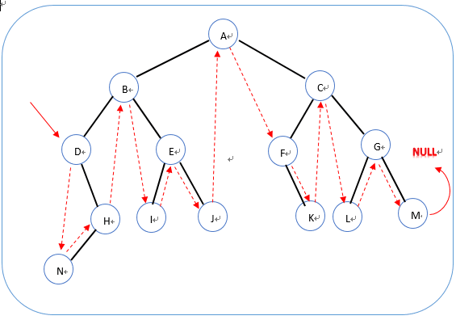

## Algorithm

[剑指offer-二叉树的下一个节点](https://www.nowcoder.com/practice/9023a0c988684a53960365b889ceaf5e?tpId=13&tags=&title=&diffculty=0&judgeStatus=0&rp=1)

### Description

题目描述
给定一个二叉树和其中的一个结点，请找出中序遍历顺序的下一个结点并且返回。注意，树中的结点不仅包含左右子结点，同时包含指向父结点的指针。

### Solution

```java
/*
public class TreeLinkNode {
    int val;
    TreeLinkNode left = null;
    TreeLinkNode right = null;
    TreeLinkNode next = null;

    TreeLinkNode(int val) {
        this.val = val;
    }
}
*/
public class Solution {
    public TreeLinkNode GetNext(TreeLinkNode node)
    {
        if(node == null){
            return null;
        }
        //如果有右子树，找到右子树的最左节点
        if(node.right!=null){
            node = node.right;
            while(node.left!=null){
                node = node.left;
            }
            return node;
        }
        //没有右子树，找到第一个当前节点是父节点左孩子的节点
        while(node.next!=null){
            if(node.next.left==node){
                return node.next;
            }
            node = node.next;
        }
        //退到根节点也没有找到，返回null
        return null;
    }
}
```

### Discuss



结合图，我们可发现分成两大类：1、有右子树的，那么下个结点就是右子树最左边的点；（eg：D，B，E，A，C，G） 2、没有右子树的，也可以分成两类，a)是父节点左孩子（eg：N，I，L） ，那么父节点就是下一个节点 ； b)是父节点的右孩子（eg：H，J，K，M）找他的父节点的父节点的父节点...直到当前结点是其父节点的左孩子位置。如果没有eg：M，那么他就是尾节点。

## Review


## Tip


## Share
