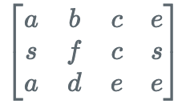

## Algorithm

[剑指offer-矩阵中的路径](https://www.nowcoder.com/practice/c61c6999eecb4b8f88a98f66b273a3cc?tpId=13&tags=&title=&diffculty=0&judgeStatus=0&rp=1)

### Description

题目描述
请设计一个函数，用来判断在一个矩阵中是否存在一条包含某字符串所有字符的路径。路径可以从矩阵中的任意一个格子开始，每一步可以在矩阵中向左，向右，向上，向下移动一个格子。如果一条路径经过了矩阵中的某一个格子，则该路径不能再进入该格子。 例如
​
矩阵中包含一条字符串"bcced"的路径，但是矩阵中不包含"abcb"路径，因为字符串的第一个字符b占据了矩阵中的第一行第二个格子之后，路径不能再次进入该格子。

### Solution

```java
public class Solution {
    public boolean hasPath(char[] matrix, int rows, int cols, char[] str)
    {
        //标志位，初始化为false
        boolean[] flag = new boolean[matrix.length];
        for(int i=0;i<rows;i++){
            for(int j=0;j<cols;j++){
                 //循环遍历二维数组，找到起点等于str第一个元素的值，再递归判断四周是否有符合条件的----回溯法
                 if(judge(matrix,i,j,rows,cols,flag,str,0)){
                     return true;
                 }
            }
        }
        return false;
    }

    //judge(初始矩阵，索引行坐标i，索引纵坐标j，矩阵行数，矩阵列数，待判断的字符串，字符串索引初始为0即先判断字符串的第一位)
    private boolean judge(char[] matrix,int i,int j,int rows,int cols,boolean[] flag,char[] str,int k){
        //先根据i和j计算匹配的第一个元素转为一维数组的位置
        int index = i*cols+j;
        //递归终止条件
        if(i<0 || j<0 || i>=rows || j>=cols || matrix[index] != str[k] || flag[index] == true)
            return false;
        //若k已经到达str末尾了，说明之前的都已经匹配成功了，直接返回true即可
        if(k == str.length-1)
            return true;
        //要走的第一个位置置为true，表示已经走过了
        flag[index] = true;

        //回溯，递归寻找，每次找到了就给k加一，找不到，还原
        if(judge(matrix,i-1,j,rows,cols,flag,str,k+1) ||
           judge(matrix,i+1,j,rows,cols,flag,str,k+1) ||
           judge(matrix,i,j-1,rows,cols,flag,str,k+1) ||
           judge(matrix,i,j+1,rows,cols,flag,str,k+1)  )
        {
            return true;
        }
        //走到这，说明这一条路不通，还原，再试其他的路径
        flag[index] = false;
        return false;
    }

}
```

### Discuss

回溯
基本思想：
0.根据给定数组，初始化一个标志位数组，初始化为false，表示未走过，true表示已经走过，不能走第二次
1.根据行数和列数，遍历数组，先找到一个与str字符串的第一个元素相匹配的矩阵元素，进入judge
2.根据i和j先确定一维数组的位置，因为给定的matrix是一个一维数组
3.确定递归终止条件：越界，当前找到的矩阵值不等于数组对应位置的值，已经走过的，这三类情况，都直接false，说明这条路不通
4.若k，就是待判定的字符串str的索引已经判断到了最后一位，此时说明是匹配成功的
5.下面就是本题的精髓，递归不断地寻找周围四个格子是否符合条件，只要有一个格子符合条件，就继续再找这个符合条件的格子的四周是否存在符合条件的格子，直到k到达末尾或者不满足递归条件就停止。
6.走到这一步，说明本次是不成功的，我们要还原一下标志位数组index处的标志位，进入下一轮的判断。

## Review


## Tip


## Share
