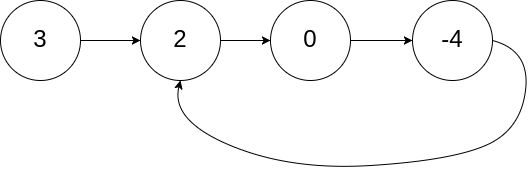

## Algorithm

[142. Linked List Cycle II](https://leetcode.com/problems/linked-list-cycle-ii/)

### Description

Given a linked list, return the node where the cycle begins. If there is no cycle, return null.

There is a cycle in a linked list if there is some node in the list that can be reached again by continuously following the next pointer. Internally, pos is used to denote the index of the node that tail's next pointer is connected to. Note that pos is not passed as a parameter.

Notice that you should not modify the linked list.

Follow up:

Can you solve it using O(1) (i.e. constant) memory?


Example 1:



```
Input: head = [3,2,0,-4], pos = 1
Output: tail connects to node index 1
Explanation: There is a cycle in the linked list, where tail connects to the second node.
```

Example 2:


```
Input: head = [1,2], pos = 0
Output: tail connects to node index 0
Explanation: There is a cycle in the linked list, where tail connects to the first node.
```

Example 3:


```
Input: head = [1], pos = -1
Output: no cycle
Explanation: There is no cycle in the linked list.
```

Constraints:

- The number of the nodes in the list is in the range [0, 104].
- -105 <= Node.val <= 105
- pos is -1 or a valid index in the linked-list.

### Solution

```java
/**
 * Definition for singly-linked list.
 * class ListNode {
 *     int val;
 *     ListNode next;
 *     ListNode(int x) {
 *         val = x;
 *         next = null;
 *     }
 * }
 */
public class Solution {
    public ListNode detectCycle(ListNode head) {
        if(head==null||head.next==null){
            return null;
        }
        ListNode fast = head;
        ListNode slow = head;
        while(fast!=null && fast.next!=null){
            fast = fast.next.next;
            slow = slow.next;
            if(fast == slow){
                break;
            }
        }
        if(fast==null || fast.next ==null){
          return null;
        }
        fast = head;
        while(fast!=slow){
            fast = fast.next;
            slow = slow.next;
        }
        return fast;
    }
}
```

### Discuss
1. 先判断head和head.next是不是null
2. fast每次走2步, slow每次走1步，直到2者相遇
3. 再判断fast和fast.next是不是null
4. fast=head，然后都开始走一步，直到二者相等的时候为交点

## Review


## Tip


## Share
