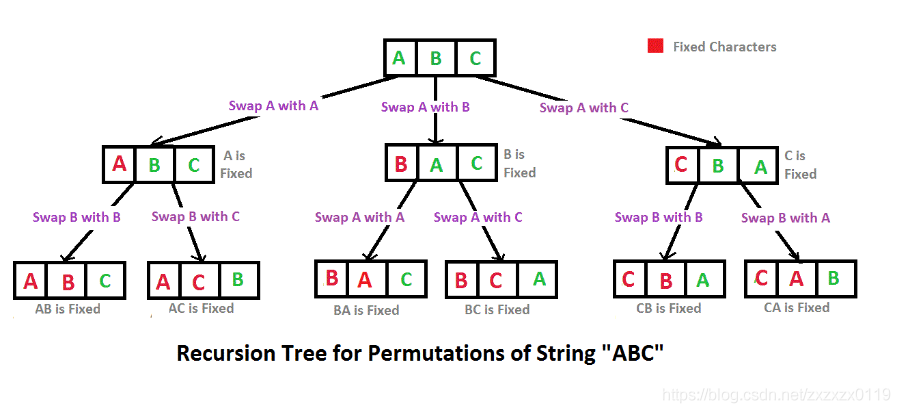

## Algorithm

[46. Permutations](https://leetcode.com/problems/permutations/)

### Description

Given a collection of distinct integers, return all possible permutations.

Example:
```
Input: [1,2,3]
Output:
[
  [1,2,3],
  [1,3,2],
  [2,1,3],
  [2,3,1],
  [3,1,2],
  [3,2,1]
]
```

### Solution

```java
class Solution {
    public List<List<Integer>> permute(int[] nums) {
        // 传入lists便于保存最后的结果
        List<List<Integer>> lists = new ArrayList<List<Integer>>();
        helper(nums, 0, lists);
        return lists;
    }
    private void helper(int[] nums, int start, List<List<Integer>> lists){
        if(start==nums.length){
            //如果start到结尾了，说明前面的数字都完成排列了，这时候输出即可
            List<Integer> temp = new ArrayList<>();
            for(int num:nums){
                temp.add(num);
            }
            lists.add(temp);
        }else{
            // 还没有到结尾的，执行递归交换顺序
            for(int i=start;i<nums.length;i++){
                // 首先将第i个和start交换，后面的使用helper方法递归执行
                // 这里第i=start的目的是为了让ABC存在，保持不变
                swap(nums, i, start);
                helper(nums, start+1, lists);
                // 再把第i个和第start个交换回来，保持原来的数组顺序不变
                swap(nums, i, start);
            }
        }
    }
    // 交换函数
    public static void swap(int[] nums, int start, int end){
        int temp = nums[start];
        nums[start] = nums[end];
        nums[end] = temp;
    }
}
```


### Discuss



看下这个图就全明白了


## Review


排序专题-冒泡排序

```java
public class Sort {
    public static void main(String[] args) {
        Sort sort = new Sort();
        System.out.println("sort:");
        int[] a = new int[]{1, 8, 2, 9, 6, 7, 5, 0, 4, 3};
        sort.bubbleSort(a);
        System.out.println(Arrays.toString(a));
    }

    private void bubbleSort(int[] a){
        int n = a.length;
        for(int j=0;j<n;j++){
            for(int i=0;i<n-1-j;i++){
                // 每次当前的跟后面的做比较，如果比后面的小，就交换顺序
                if(a[i]<a[i+1]){
                    int temp = a[i];
                    a[i] = a[i+1];
                    a[i+1] = temp;
                }
                // 每次冒泡结束后，都保证最后一个k是最小的值，前k-1个重复执行上述过程，直到k=0
            }
        }
    }
}
```

冒泡排序最简单最经典的排序


## Tip


## Share
