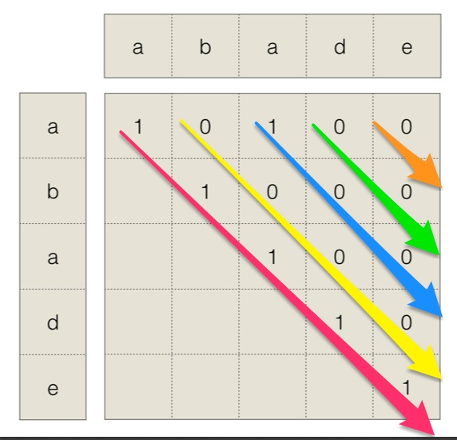

## Algorithm

[5. Longest Palindromic Substring](https://leetcode.com/problems/longest-palindromic-substring/)

### Description

Given a string s, return the longest palindromic substring in s.


Example 1:
```
Input: s = "babad"
Output: "bab"
Note: "aba" is also a valid answer.
```
Example 2:
```
Input: s = "cbbd"
Output: "bb"
```
Example 3:
```
Input: s = "a"
Output: "a"
```
Example 4:
```
Input: s = "ac"
Output: "a"
```

Constraints:

- 1 <= s.length <= 1000
- s consist of only digits and English letters (lower-case and/or upper-case),

### Solution

```java
class Solution {
    public String longestPalindrome(String s) {
        if(s==null||s.length()==0)
            return "";
        int len = s.length();
        String ans = "";
        int max = 0;
        boolean[][] dp = new boolean[len][len];
        for(int j=0;j<len;j++){
           for(int i=0;i<=j;i++){
               boolean judge = s.charAt(i)==s.charAt(j);
               dp[i][j] = j-i>2 ? dp[i+1][j-1] && judge : judge;
               if(dp[i][j]&&j-i+1>max){
                   max = j-i+1;
                   ans = s.substring(i, j+1);
               }
           }
        }
        return ans;
    }
}
```

### Discuss

时间复杂度O(n2)

空间复杂度O(n2)
首先写出动态转移方程：P[ i, j ] ← ( P[ i+1, j-1 ] and Si = Sj ) 显然，如果一个子串是回文串，并且如果从它的左右两侧分别向外扩展的一位也相等，那么这个子串就可以从左右两侧分别向外扩展一位。

其中的base case是

P[ i, i ] ← true
P[ i, i+1 ] ← ( Si = Si+1 )

假设有个字符串是adade，现在要找到其中的最长回文子串。使用上面的动态转移方程，有如下的过程:




按照红箭头->黄箭头->蓝箭头->绿箭头->橙箭头的顺序依次填入矩阵，通过这个矩阵记录从i到j是否是一个回文串。

## Review


## Tip


## Share
