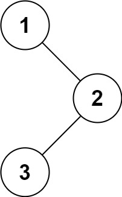

## Algorithm

[94. Binary Tree Inorder Traversal](https://leetcode.com/problems/binary-tree-inorder-traversal/)

### Description

Given the root of a binary tree, return the inorder traversal of its nodes' values.


Example 1:


```
Input: root = [1,null,2,3]
Output: [1,3,2]
```
Example 2:
```
Input: root = []
Output: []
```
Example 3:
```
Input: root = [1]
Output: [1]
```
Example 4:


```
Input: root = [1,2]
Output: [2,1]
```
Example 5:


```
Input: root = [1,null,2]
Output: [1,2]
```

Constraints:

- The number of nodes in the tree is in the range [0, 100].
- -100 <= Node.val <= 100


Follow up:

- Recursive solution is trivial, could you do it iteratively?

### Solution

递归操作1：帮助理解dfs

```java
class Solution {
    List<Integer>res=new LinkedList<Integer>();

    private void dfs(TreeNode root){
        if(root!=null){
            dfs(root.left);
            res.add(root.val);
            dfs(root.right);
        }
    }

    public List<Integer> inorderTraversal(TreeNode root) {
        dfs(root);
        return res;
    }
}
```

递归操作2:

```java
/**
 * Definition for a binary tree node.
 * public class TreeNode {
 *     int val;
 *     TreeNode left;
 *     TreeNode right;
 *     TreeNode() {}
 *     TreeNode(int val) { this.val = val; }
 *     TreeNode(int val, TreeNode left, TreeNode right) {
 *         this.val = val;
 *         this.left = left;
 *         this.right = right;
 *     }
 * }
 */
class Solution {
    List<Integer> result = new ArrayList<>();
    public List<Integer> inorderTraversal(TreeNode root) {
        if(root!=null){
            inorderTraversal(root.left);
            result.add(root.val);
            inorderTraversal(root.right);
        }
        return result;
    }
}
```

非递归操作
```java
/**
 * Definition for a binary tree node.
 * public class TreeNode {
 *     int val;
 *     TreeNode left;
 *     TreeNode right;
 *     TreeNode() {}
 *     TreeNode(int val) { this.val = val; }
 *     TreeNode(int val, TreeNode left, TreeNode right) {
 *         this.val = val;
 *         this.left = left;
 *         this.right = right;
 *     }
 * }
 */
class Solution {
    public List<Integer> inorderTraversal(TreeNode root) {
      List<Integer> list = new ArrayList<Integer>();
      Stack<TreeNode> stack = new Stack<TreeNode>();
      while(root!=null || !stack.empty()){
         while(root!=null){
            stack.push(root);
            root = root.left;
         }
         root = stack.pop();
         list.add(root.val);
         root = root.right;
      }
      return list;
    }
}
```

### Discuss

## Review


## Tip


## Share
