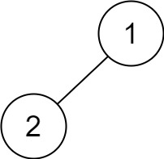
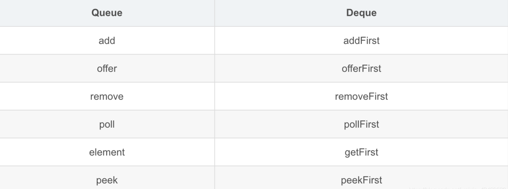

## Algorithm

[145. Binary Tree Postorder Traversal](https://leetcode.com/problems/binary-tree-postorder-traversal/)

### Description

Given the root of a binary tree, return the postorder traversal of its nodes' values.

Example 1:


```
Input: root = [1,null,2,3]
Output: [3,2,1]
```
Example 2:
```
Input: root = []
Output: []
```
Example 3:
```
Input: root = [1]
Output: [1]
```
Example 4:


```
Input: root = [1,2]
Output: [2,1]
```
Example 5:


```
Input: root = [1,null,2]
Output: [2,1]
```

Constraints:

- The number of the nodes in the tree is in the range [0, 100].
- -100 <= Node.val <= 100


Follow up:

- Recursive solution is trivial, could you do it iteratively?

### Solution

递归实现：

```java
/**
 * Definition for a binary tree node.
 * public class TreeNode {
 *     int val;
 *     TreeNode left;
 *     TreeNode right;
 *     TreeNode() {}
 *     TreeNode(int val) { this.val = val; }
 *     TreeNode(int val, TreeNode left, TreeNode right) {
 *         this.val = val;
 *         this.left = left;
 *         this.right = right;
 *     }
 * }
 */
class Solution {
    List<Integer> result = new ArrayList<>();
    public List<Integer> postorderTraversal(TreeNode root) {
        if(root!=null){
            postorderTraversal(root.left);
            postorderTraversal(root.right);
            result.add(root.val);
        }
        return result;
    }
}
```

非递归实现：使用队列

```java
class Solution {
    public List<Integer> postorderTraversal(TreeNode root) {
        Deque<Integer> deque = new LinkedList<>();
        Stack<TreeNode> stack = new Stack<>();
        if(root != null) {
            stack.push(root);
        }
        while(!stack.isEmpty()) {
            TreeNode node = stack.pop();
            deque.offerFirst(node.val);
            if(node.left != null) {
                stack.push(node.left);
            }
            if(node.right != null) {
                stack.push(node.right);
            }
        }
        return new ArrayList<Integer>(deque);
    }
}
```

另一种实现方式：

```java
class Solution {
    public List<Integer> postorderTraversal(TreeNode root) {
        List<Integer> result = new LinkedList<>();
        Stack<TreeNode> stack = new Stack<>();
        if(root==null){
            return new ArrayList<>();
        }
        stack.push(root);
        while(!stack.isEmpty()){
            TreeNode node = stack.pop();
            result.add(0, node.val);
            if(node.left != null){
                stack.push(node.left);
            }
            if(node.right != null){
                stack.push(node.right);
            }
        }
        return new ArrayList<Integer>(result);
    }
}
```

### Discuss

## Review

【Java】Queue和Deque的区别？

对比
Queue是队列，Deque是双端队列。

```java
public interface Deque<E> extends Queue<E> {}
```



add会抛出NullPointException异常，而offer会返回null。

队列:

队列(queue)是一种常用的数据结构，可以将队列看做是一种特殊的线性表，该结构遵循的先进先出原则。Java中，LinkedList实现了Queue接口,因为LinkedList进行插入、删除操作效率较高
相关常用方法：
- boolean offer(E e): 将元素追加到队列末尾,若添加成功则返回true。
- E poll(): 从队首删除并返回该元素。
- E peek(): 返回队首元素，但是不删除

```java
public class Queue1 {
	public static void main(String [] args) {
        Queue<String> queue = new LinkedList<String>();
        //追加元素
        queue.offer("one");
        queue.offer("two");
        queue.offer("three");
        queue.offer("four");
        System.out.println(queue);//[one, two, three, four]
        //从队首取出元素并删除
        String poll = queue.poll();
        System.out.println(poll);//one
        System.out.println(queue);//[two, three, four]
        //从队首取出元素但是不删除
        String peek = queue.peek();
        System.out.println(peek);//two
        System.out.println(queue);//[two, three, four]
        //遍历队列，这里要注意，每次取完元素后都会删除，整个
        //队列会变短，所以只需要判断队列的大小即可
        while(queue.size() > 0) {
            System.out.println(queue.poll());//two、  three、  four
        }
    }
}
```
双向队列

(Deque),是Queue的一个子接口，双向队列是指该队列两端的元素既能入队(offer)也能出队(poll),如果将Deque限制为只能从一端入队和出队，则可实现栈的数据结构。对于栈而言，有入栈(push)和出栈(pop)，遵循先进后出原则

常用方法如下：
- void push(E e): 将给定元素”压入”栈中。存入的元素会在栈首。即:栈的第一个元素
- E pop(): 将栈首元素删除并返回。

```java
public class Deque2 {
	public static void main(String[] args) {
        Deque<String> deque = new LinkedList<String>();
        deque.push("a");
        deque.push("b");
        deque.push("c");
        System.out.println(deque);//[c, b, a]
        //获取栈首元素后，元素不会出栈
        String str = deque.peek();
        System.out.println(str);//c
        System.out.println(deque);//[c, b, a]
        while(deque.size() > 0) {
            //获取栈首元素后，元素将会出栈
            System.out.println(deque.pop());//c b a
        }
        System.out.println(deque);//[]
    }
}
```

## Tip


## Share
