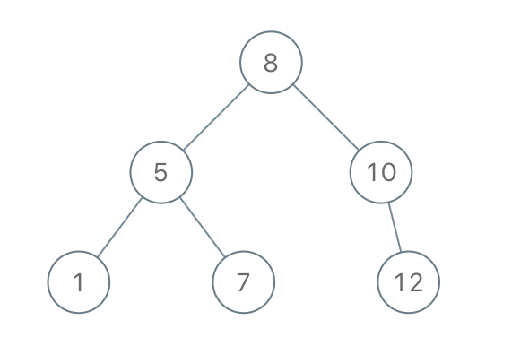
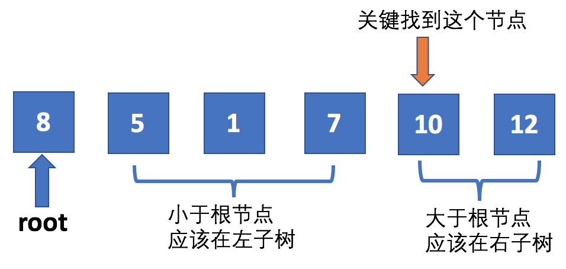

## Algorithm

[1008. Construct Binary Search Tree from Preorder Traversal](https://leetcode.com/problems/construct-binary-search-tree-from-preorder-traversal/)

### Description

Return the root node of a binary search tree that matches the given preorder traversal.

(Recall that a binary search tree is a binary tree where for every node, any descendant of node.left has a value < node.val, and any descendant of node.right has a value > node.val.  Also recall that a preorder traversal displays the value of the node first, then traverses node.left, then traverses node.right.)

It's guaranteed that for the given test cases there is always possible to find a binary search tree with the given requirements.

Example 1:

```
Input: [8,5,1,7,10,12]
Output: [8,5,10,1,7,null,12]
```


Constraints:

- 1 <= preorder.length <= 100
- 1 <= preorder[i] <= 10^8
- The values of preorder are distinct.

### Solution

```java
/**
 * Definition for a binary tree node.
 * public class TreeNode {
 *     int val;
 *     TreeNode left;
 *     TreeNode right;
 *     TreeNode() {}
 *     TreeNode(int val) { this.val = val; }
 *     TreeNode(int val, TreeNode left, TreeNode right) {
 *         this.val = val;
 *         this.left = left;
 *         this.right = right;
 *     }
 * }
 */
 class Solution {
     public TreeNode bstFromPreorder ( int[] preorder){
         if (preorder == null || preorder.length <= 0) return null;
         return bstFromPreorder(preorder, 0, preorder.length - 1);
     }
     public TreeNode bstFromPreorder ( int[] preorder, int left, int right){
         // 如果左侧节点索引大于右侧节点索引，说明已经遍历结束
         if (left > right) {
             return null;
         }
         // 定义一个根结点，赋值为最左侧节点
         TreeNode node = new TreeNode(preorder[left]);
         // 从左侧节点下一个节点开始查找
         int i = left + 1;
         for (; i <= right; i++) {
             // 如果当前节点大于根结点，说明节点左侧在左子树，右侧在右子树
             if (preorder[i] > preorder[left]){
                break;
             }
         }
         // 递归遍历，左侧节点为left+1 到 i-1
         node.left = bstFromPreorder(preorder, left + 1, i - 1);
         // 右侧节点是大于当前节点的值
         node.right = bstFromPreorder(preorder, i, right);
         return node;
     }  
 }
```

### Discuss

给定的输入数组是二叉搜索树按照先序遍历得到的

二叉搜索树：根的值比所有左子树节点值都大，比所有右子树节点值都小

先序遍历：先访问根，然后左节点，最后右节点

根据二叉搜索树和先序遍历的特点，由下图可知，关键是找到第一个大于根节点值的下标，左侧为根节点左子树（5，1，7），右侧（包括其）为根节点右子树（10，12）



因为其为先序遍历，所有左子树的根为左侧第一个节点（5），右子树的根为右侧第一个节点（10）

依次进行，得到最终的树

## Review


## Tip


## Share
