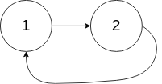

## Algorithm

[142. Linked List Cycle II](https://leetcode.com/problems/linked-list-cycle-ii/)

### Description

Given a linked list, return the node where the cycle begins. If there is no cycle, return null.

There is a cycle in a linked list if there is some node in the list that can be reached again by continuously following the next pointer. Internally, pos is used to denote the index of the node that tail's next pointer is connected to. Note that pos is not passed as a parameter.

Notice that you should not modify the linked list.


Example 1:


```
Input: head = [3,2,0,-4], pos = 1
Output: tail connects to node index 1
Explanation: There is a cycle in the linked list, where tail connects to the second node.
```
Example 2:


```
Input: head = [1,2], pos = 0
Output: tail connects to node index 0
Explanation: There is a cycle in the linked list, where tail connects to the first node.
```
Example 3:


```
Input: head = [1], pos = -1
Output: no cycle
Explanation: There is no cycle in the linked list.
```

Constraints:
- The number of the nodes in the list is in the range [0, 104].
- -105 <= Node.val <= 105
- pos is -1 or a valid index in the linked-list.


### Solution

```java
/**
 * Definition for singly-linked list.
 * class ListNode {
 *     int val;
 *     ListNode next;
 *     ListNode(int x) {
 *         val = x;
 *         next = null;
 *     }
 * }
 */
public class Solution {
    public ListNode detectCycle(ListNode head) {
        if(head==null||head.next==null){
            return null;
        }
        ListNode fast = head;
        ListNode slow = head;
        while(fast!=null && fast.next!=null){
            fast = fast.next.next;
            slow = slow.next;
            if(fast == slow){
                break;
            }
        }
        if(fast==null || fast.next ==null){
          return null;
        }
        fast = head;
        while(fast!=slow){
            fast = fast.next;
            slow = slow.next;
        }
        return fast;
    }
}
```

### Discuss

先摆出结论：
  1. 快慢指针从链表头开始走，相遇的那点，记为 M；
  2. 再用 2 个指针，一个从头开始走，一个从 M 开始走，相遇点即为 cycle 的起点。
我们先看抽象出来的图：
假设快慢指针在 M 点第一次相遇，
这里我们设 3 个变量来表示这个链表里的几个重要长度：
-  X：从链表头到环的起点的长度；
-  Y：从环的起点到 M 点的长度；
-  Z：从 M 点到环的起点的长度。
注意：因为环是有方向的，所以 Y 并不是 Z。
那其实我们唯一知道的关系就是：快慢指针在 M 点第一次相遇。这也是我们最初假设的关系。
而快慢指针有一个永远不变的真理：快指针走的长度永远是慢指针走的长度的 2 倍。
相遇时快慢指针分别走了多少的长度呢？
-  快指针：X+ Y + 假设走了 k 圈
-  慢指针：X + Y
那么我们就可以用这个 2 倍的关系，列出下列等式：
2 * (X + Y) = X + Y + kL
所以 X + Y = kL
而我们注意到：Y + Z = L，那么就能得出 X = Z。
所以当两个指针，一个从头开始走，一个从 M 点开始走时，相遇那点就是环的起点，证毕。

## Review


## Tip


## Share
