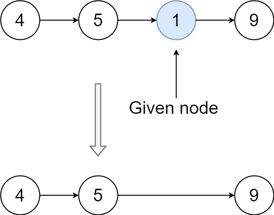

## Algorithm

[237. Delete Node in a Linked List](https://leetcode.com/problems/delete-node-in-a-linked-list/)

### Description

Write a function to delete a node in a singly-linked list. You will not be given access to the head of the list, instead you will be given access to the node to be deleted directly.

It is guaranteed that the node to be deleted is not a tail node in the list.

Example 1:


```
Input: head = [4,5,1,9], node = 5
Output: [4,1,9]
Explanation: You are given the second node with value 5, the linked list should become 4 -> 1 -> 9 after calling your function.
```

Example 2:



```
Input: head = [4,5,1,9], node = 1
Output: [4,5,9]
Explanation: You are given the third node with value 1, the linked list should become 4 -> 5 -> 9 after calling your function.
```

Example 3:

```
Input: head = [1,2,3,4], node = 3
Output: [1,2,4]
```

Example 4:

```
Input: head = [0,1], node = 0
Output: [1]
```

Example 5:

```
Input: head = [-3,5,-99], node = -3
Output: [5,-99]
```

Constraints:

- The number of the nodes in the given list is in the range [2, 1000].
- -1000 <= Node.val <= 1000
- The value of each node in the list is unique.
- The node to be deleted is in the list and is not a tail node

### Solution

```java
/**
 * Definition for singly-linked list.
 * public class ListNode {
 *     int val;
 *     ListNode next;
 *     ListNode(int x) { val = x; }
 * }
 */
 class Solution {
   public void deleteNode(ListNode node) {
      ListNode curr = node;
      ListNode nxt = node.next;
      if(nxt != null){
          curr.val = nxt.val;
          curr.next = nxt.next;
       }        
   }
 }
```

### Discuss

这道题完全没有给除了目标节点以外的任何参数，必须通过修改val的值来实现删除节点。

1. 把node.next的值赋给node

2. 把node.next指向node.next.next

其实相当于删除node.next


## Review


## Tip


## Share
