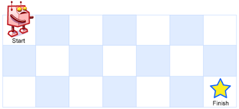

## Algorithm

[62. Unique Paths](https://leetcode.com/problems/unique-paths/)

### Description

A robot is located at the top-left corner of a m x n grid (marked 'Start' in the diagram below).

The robot can only move either down or right at any point in time. The robot is trying to reach the bottom-right corner of the grid (marked 'Finish' in the diagram below).

How many possible unique paths are there?



Example 1:

```
Input: m = 3, n = 7
Output: 28
```

Example 2:

Input: m = 3, n = 2
Output: 3
Explanation:
From the top-left corner, there are a total of 3 ways to reach the bottom-right corner:
- 1. Right -> Down -> Down
- 2. Down -> Down -> Right
- 3. Down -> Right -> Down


Example 3:

Input: m = 7, n = 3
Output: 28
Example 4:

Input: m = 3, n = 3
Output: 6

Constraints:

- 1 <= m, n <= 100
- It's guaranteed that the answer will be less than or equal to 2 * 109.

### Solution

```java
class Solution {
    public int uniquePaths(int m, int n) {
        int[][] dp = new  int[m+1][n+1];
        dp[1][1] = 1;
        for(int j=2;j<=n;j++){
            dp[1][j] = dp[1][j-1];
        }
        for(int i=2;i<=m;i++){
            dp[i][1] = dp[i-1][1];
        }
        for(int i=2;i<=m;i++){
            for(int j=2;j<=n;j++){
                dp[i][j] = dp[i][j-1]+dp[i-1][j];
            }
        }
        return dp[m][n];
    }
}
```

### Discuss

## Review


## Tip


## Share
