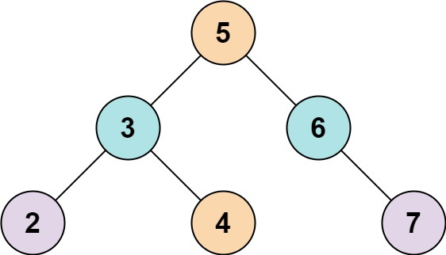
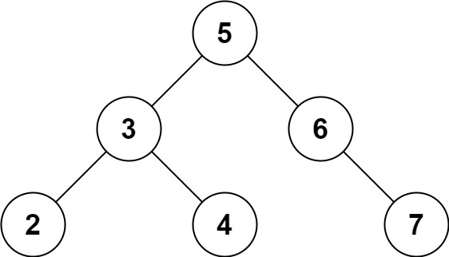

## Algorithm

[653. Two Sum IV - Input is a BST](https://leetcode.com/problems/two-sum-iv-input-is-a-bst/)

### Description

Given the root of a Binary Search Tree and a target number k, return true if there exist two elements in the BST such that their sum is equal to the given target.


Example 1:



```
Input: root = [5,3,6,2,4,null,7], k = 9
Output: true
```

Example 2:



```
Input: root = [5,3,6,2,4,null,7], k = 28
Output: false
```

Example 3:

```
Input: root = [2,1,3], k = 4
Output: true
```

Example 4:

```
Input: root = [2,1,3], k = 1
Output: false
```

Example 5:

```
Input: root = [2,1,3], k = 3
Output: true
```

Constraints:

- The number of nodes in the tree is in the range [1, 104].
- -104 <= Node.val <= 104
- root is guaranteed to be a valid binary search tree.
- -105 <= k <= 105

### Solution

```java
/**
 * Definition for a binary tree node.
 * public class TreeNode {
 *     int val;
 *     TreeNode left;
 *     TreeNode right;
 *     TreeNode() {}
 *     TreeNode(int val) { this.val = val; }
 *     TreeNode(int val, TreeNode left, TreeNode right) {
 *         this.val = val;
 *         this.left = left;
 *         this.right = right;
 *     }
 * }
 */
class Solution {
    public boolean findTarget(TreeNode root, int k) {
        List<Integer> list = new ArrayList<>();
        Stack<TreeNode> stack = new Stack<>();
        stack.add(root);
        while(!stack.isEmpty()){
            TreeNode temp = stack.pop();
            if(temp!=null){
                list.add(temp.val);
                stack.push(temp.left);
                stack.push(temp.right);
            }
        }
        Collections.sort(list);
        int right = list.size() - 1;
        int left = 0;
        while(left<right){
            if (list.get(left) + list.get(right) > k){
                right --;
            }else if(list.get(left) + list.get(right) < k){
                left ++;
            }else{
                return true;
            }
        }
        return false;
    }
}
```

### Discuss

广度优先遍历加入数组中

数组排序

二分查找累加求和

## Review


## Tip


## Share
