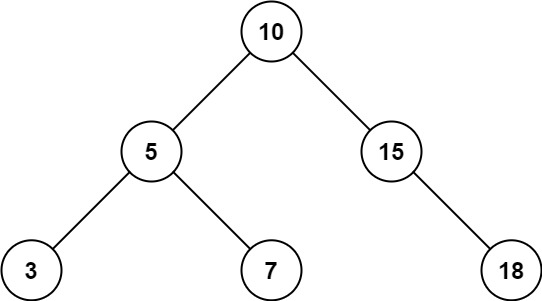
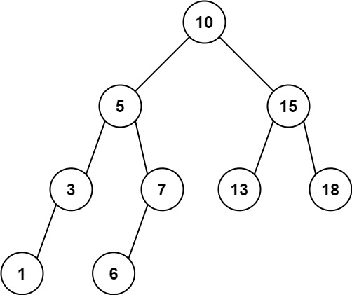

## Algorithm

[938. Range Sum of BST](https://leetcode.com/problems/range-sum-of-bst/)

### Description

Given the root node of a binary search tree, return the sum of values of all nodes with a value in the range [low, high].


Example 1:



```
Input: root = [10,5,15,3,7,null,18], low = 7, high = 15
Output: 32
```

Example 2:



```
Input: root = [10,5,15,3,7,13,18,1,null,6], low = 6, high = 10
Output: 23
```

Constraints:

- The number of nodes in the tree is in the range [1, 2 * 104].
- 1 <= Node.val <= 105
- 1 <= low <= high <= 105
- All Node.val are unique.

### Solution

```java
/**
 * Definition for a binary tree node.
 * public class TreeNode {
 *     int val;
 *     TreeNode left;
 *     TreeNode right;
 *     TreeNode() {}
 *     TreeNode(int val) { this.val = val; }
 *     TreeNode(int val, TreeNode left, TreeNode right) {
 *         this.val = val;
 *         this.left = left;
 *         this.right = right;
 *     }
 * }
 */
class Solution {
    int sum;
    public int rangeSumBST(TreeNode root, int low, int high) {
        sum = 0;
        inOrder(root, low, high);
        return sum;
    }

    public void inOrder(TreeNode root, int low, int high) {
        if(root == null) return;
        inOrder(root.left,low, high);
        if(root.val >= low && root.val <= high) {
            sum += root.val;
        }
        inOrder(root.right,low, high);
    }
}
```

```java
/**
 * Definition for a binary tree node.
 * public class TreeNode {
 *     int val;
 *     TreeNode left;
 *     TreeNode right;
 *     TreeNode() {}
 *     TreeNode(int val) { this.val = val; }
 *     TreeNode(int val, TreeNode left, TreeNode right) {
 *         this.val = val;
 *         this.left = left;
 *         this.right = right;
 *     }
 * }
 */
class Solution {
     public int rangeSumBST(TreeNode root, int low, int high) {
         int sum = 0;
         if(root==null){
             return sum;
         }
         if(root.val<=high && root.val>=low){
             sum += root.val;
         }
         if (root.val <= high) {
             sum += rangeSumBST(root.right, low, high);
         }
         if(root.val >= low){
             sum += rangeSumBST(root.left, low, high);
         }
         return sum;
     }
}
```

### Discuss

## Review


## Tip


## Share
