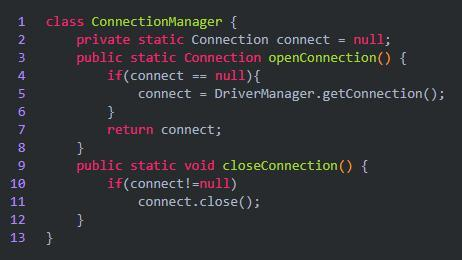
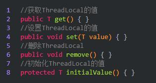
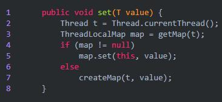
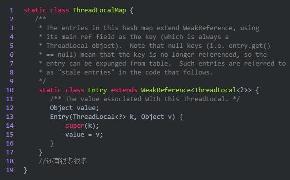
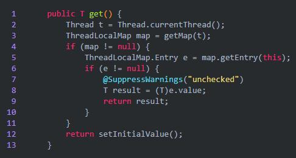
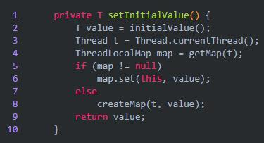
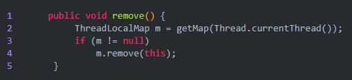
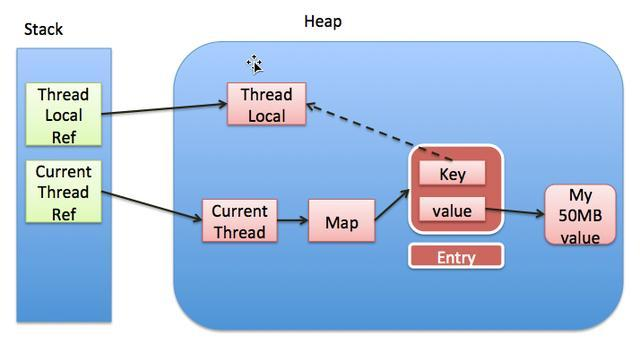

## Algorithm

### Description

### Solution

```java

```

### Discuss

## Review


## Tip

在java的多线程模块中，ThreadLocal是经常被提问到的一个知识点，提问的方式有很多种，可能是循序渐进也可能是就像我的题目那样，因此只有理解透彻了，不管怎么问，都能游刃有余。

这篇文章主要从以下几个角度来分析理解

1、ThreadLocal是什么

2、ThreadLocal怎么用

3、ThreadLocal源码分析

4、ThreadLocal内存泄漏问题

下面我们带着这些问题，一点一点揭开ThreadLocal的面纱。若有不正之处请多多谅解，并欢迎批评指正。以下源码均基于jdk1.8。

一、ThreadLocal是什么

从名字我们就可以看到ThreadLocal叫做线程变量，意思是ThreadLocal中填充的变量属于当前线程，该变量对其他线程而言是隔离的。ThreadLocal为变量在每个线程中都创建了一个副本，那么每个线程可以访问自己内部的副本变量。

从字面意思来看非常容易理解，但是从实际使用的角度来看，就没那么容易了，作为一个面试常问的点，使用场景那也是相当的丰富：

1、在进行对象跨层传递的时候，使用ThreadLocal可以避免多次传递，打破层次间的约束。

2、线程间数据隔离

3、进行事务操作，用于存储线程事务信息。

4、数据库连接，Session会话管理。

现在相信你已经对ThreadLocal有一个大致的认识了，下面我们看看如何用？

二、ThreadLocal怎么用

既然ThreadLocal的作用是每一个线程创建一个副本，我们使用一个例子来验证一下：


从结果我们可以看到，每一个线程都有各自的local值，我们设置了一个休眠时间，就是为了另外一个线程也能够及时的读取当前的local值。

这就是TheadLocal的基本使用，是不是非常的简单。那么为什么会在数据库连接的时候使用的比较多呢？



上面是一个数据库连接的管理类，我们使用数据库的时候首先就是建立数据库连接，然后用完了之后关闭就好了，这样做有一个很严重的问题，如果有1个客户端频繁的使用数据库，那么就需要建立多次链接和关闭，我们的服务器可能会吃不消，怎么办呢？如果有一万个客户端，那么服务器压力更大。

这时候最好ThreadLocal，因为ThreadLocal在每个线程中对连接会创建一个副本，且在线程内部任何地方都可以使用，线程之间互不影响，这样一来就不存在线程安全问题，也不会严重影响程序执行性能。是不是很好用。

以上主要是讲解了一个基本的案例，然后还分析了为什么在数据库连接的时候会使用ThreadLocal。下面我们从源码的角度来分析一下，ThreadLocal的工作原理。

三、ThreadLocal源码分析



在最开始的例子中，只给出了两个方法也就是get和set方法，其实还有几个需要我们注意。


方法这么多，我们主要来看set，然后就能认识到整体的ThreadLocal了：

1、set方法



从set方法我们可以看到，首先获取到了当前线程t，然后调用getMap获取ThreadLocalMap，如果map存在，则将当前线程对象t作为key，要存储的对象作为value存到map里面去。如果该Map不存在，则初始化一个。

OK，到这一步了，相信你会有几个疑惑了，ThreadLocalMap是什么，getMap方法又是如何实现的。带着这些问题，继续往下看。先来看ThreadLocalMap。



我们可以看到ThreadLocalMap其实就是ThreadLocal的一个静态内部类，里面定义了一个Entry来保存数据，而且还是继承的弱引用。在Entry内部使用ThreadLocal作为key，使用我们设置的value作为value。

还有一个getMap

ThreadLocalMap getMap(Thread t) {

return t.threadLocals;

}

调用当期线程t，返回当前线程t中的成员变量threadLocals。而threadLocals其实就是ThreadLocalMap。

2、get方法



通过上面ThreadLocal的介绍相信你对这个方法能够很好的理解了，首先获取当前线程，然后调用getMap方法获取一个ThreadLocalMap，如果map不为null，那就使用当前线程作为ThreadLocalMap的Entry的键，然后值就作为相应的的值，如果没有那就设置一个初始值。

如何设置一个初始值呢？



原理很简单

3、remove方法



从我们的map移除即可。

OK，其实内部源码很简单，现在我们总结一波

（1）每个Thread维护着一个ThreadLocalMap的引用

（2）ThreadLocalMap是ThreadLocal的内部类，用Entry来进行存储

（3）ThreadLocal创建的副本是存储在自己的threadLocals中的，也就是自己的ThreadLocalMap。

（4）ThreadLocalMap的键值为ThreadLocal对象，而且可以有多个threadLocal变量，因此保存在map中

（5）在进行get之前，必须先set，否则会报空指针异常，当然也可以初始化一个，但是必须重写initialValue()方法。

（6）ThreadLocal本身并不存储值，它只是作为一个key来让线程从ThreadLocalMap获取value。

OK，现在从源码的角度上不知道你能理解不，对于ThreadLocal来说关键就是内部的ThreadLocalMap。

四、ThreadLocal其他几个注意的点

只要是介绍ThreadLocal的文章都会帮大家认识一个点，那就是内存泄漏问题。我们先来看下面这张图。



上面这张图详细的揭示了ThreadLocal和Thread以及ThreadLocalMap三者的关系。

1、Thread中有一个map，就是ThreadLocalMap

2、ThreadLocalMap的key是ThreadLocal，值是我们自己设定的。

3、ThreadLocal是一个弱引用，当为null时，会被当成垃圾回收

4、重点来了，突然我们ThreadLocal是null了，也就是要被垃圾回收器回收了，但是此时我们的ThreadLocalMap生命周期和Thread的一样，它不会回收，这时候就出现了一个现象。那就是ThreadLocalMap的key没了，但是value还在，这就造成了内存泄漏。

解决办法：使用完ThreadLocal后，执行remove操作，避免出现内存溢出情况。


## Share
