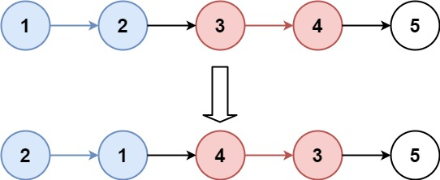
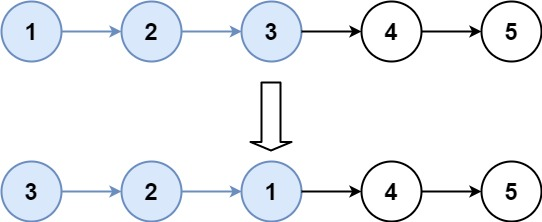

## Algorithm

[25. Reverse Nodes in k-Group](https://leetcode.com/problems/reverse-nodes-in-k-group/)

### Description

Given a linked list, reverse the nodes of a linked list k at a time and return its modified list.

k is a positive integer and is less than or equal to the length of the linked list. If the number of nodes is not a multiple of k then left-out nodes, in the end, should remain as it is.

Follow up:

Could you solve the problem in O(1) extra memory space?
You may not alter the values in the list's nodes, only nodes itself may be changed.

Example 1:



```
Input: head = [1,2,3,4,5], k = 2
Output: [2,1,4,3,5]
```

Example 2:



```
Input: head = [1,2,3,4,5], k = 3
Output: [3,2,1,4,5]
```


Example 3:

```
Input: head = [1,2,3,4,5], k = 1
Output: [1,2,3,4,5]
```

Example 4:

```
Input: head = [1], k = 1
Output: [1]
```

Constraints:

- The number of nodes in the list is in the range sz.
- 1 <= sz <= 5000
- 0 <= Node.val <= 1000
- 1 <= k <= sz

### Solution

```java
/**
 * Definition for singly-linked list.
 * public class ListNode {
 *     int val;
 *     ListNode next;
 *     ListNode() {}
 *     ListNode(int val) { this.val = val; }
 *     ListNode(int val, ListNode next) { this.val = val; this.next = next; }
 * }
 */
class Solution {
    public ListNode reverseKGroup(ListNode head, int k) {
        if(k==1||head==null){
            return head;
        }
        ListNode ff_prev = null,ff=head,ss_prev=head,ss=null;
        while(true){
            int z = ss==null ? k-1 :k;
            while(ss_prev!=null && z-->0){
                ss_prev = ss_prev.next;
            }
            if(ss_prev==null)
                break;
            ss=ss_prev.next;
			      ss_prev.next = null;
            ListNode[] arr = reverse(ff);
            if(ff_prev==null){
                head=arr[0];
            }else{
                ff_prev.next  = arr[0];
            }
            ff.next = ss;
        		ss_prev = arr[1];
        		ff_prev = ss_prev;
        		ff=ss;
        }
        return head;
      }
      
      private ListNode[] reverse(ListNode head){
        ListNode pre = head;
        ListNode now = head;
        while(now!=null){
            ListNode next = now.next;
            now.next = pre;
            pre = now;
            now = next;
        }
        return new ListNode[]{pre, head};
    }
}
```


```java
class Solution {
    public ListNode reverseKGroup(ListNode head, int k) {

        //checking size
        ListNode sizeNode = head;
        int size = 0;
        while(sizeNode!=null){
            sizeNode= sizeNode.next;
            size++;
        }

        if(head==null || head.next == null || size<k )
            return head;

        ListNode curr = head;
        ListNode prev= null;
        ListNode nextNode ;
        int count = 0;

        while(curr!=null && count < k) {
            nextNode= curr.next;
            curr.next = prev;
            prev = curr;
            curr = nextNode;
            count++;
        }

        ListNode temp = prev;
        while(temp.next!=null){
            temp = temp.next;
        }
        temp.next = reverseKGroup(curr,k);
        return prev;

    }
}
```

### Discuss

## Review


## Tip


## Share
