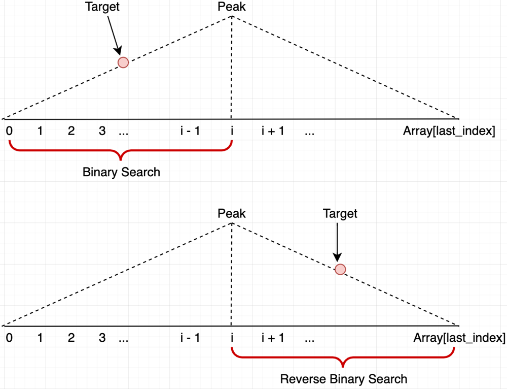

## Algorithm

[1095. Find in Mountain Array](https://leetcode.com/problems/find-in-mountain-array/)

### Description

(This problem is an interactive problem.)

You may recall that an array A is a mountain array if and only if:

- A.length >= 3
- There exists some i with 0 < i < A.length - 1 such that:

```
A[0] < A[1] < ... A[i-1] < A[i]
A[i] > A[i+1] > ... > A[A.length - 1]
```

Given a mountain array mountainArr, return the minimum index such that mountainArr.get(index) == target.  If such an index doesn't exist, return -1.

You can't access the mountain array directly.  You may only access the array using a MountainArray interface:

- MountainArray.get(k) returns the element of the array at index k (0-indexed).
- MountainArray.length() returns the length of the array.
- Submissions making more than 100 calls to MountainArray.get will be judged Wrong Answer.  Also, any solutions that attempt to circumvent the judge will result in disqualification.


Example 1:

```
Input: array = [1,2,3,4,5,3,1], target = 3
Output: 2
Explanation: 3 exists in the array, at index=2 and index=5. Return the minimum index, which is 2.
```

Example 2:

```
Input: array = [0,1,2,4,2,1], target = 3
Output: -1
Explanation: 3 does not exist in the array, so we return -1.
```

Constraints:

- 3 <= mountain_arr.length() <= 10000
- 0 <= target <= 10^9
- 0 <= mountain_arr.get(index) <= 10^9

### Solution

```java
/**
 * // This is MountainArray's API interface.
 * // You should not implement it, or speculate about its implementation
 * interface MountainArray {
 *     public int get(int index) {}
 *     public int length() {}
 * }
 */

class Solution {
    public int findInMountainArray(int target, MountainArray mountainArr) {
        int l = 0;
        int length = mountainArr.length() - 1;
        int r = length;
        int mid = 0;

        //find mountain peak
        //if peak is target return peak
        //because peak is unique
        while(r>l){
            mid = (r + l) / 2;
            int mider = mountainArr.get(mid);
            int higher = mountainArr.get(mid + 1);
            int lower = mountainArr.get(mid - 1);
            if(mider > higher && mider > lower) {
                if(mider == target) {
                    return mid;
                }
                break;
            }
            if(mider<lower){
                r = mid;
            }
            if(mider<higher){
                l = mid + 1;
            }
        }

        //check left side
        l = 0;
        int r1 = mid;
        while(r1 > l){
            int mid1 = (r1 + l) / 2;
            int mider = mountainArr.get(mid1);

            if(mider == target) {
                return mid1;
            }

            if(mider > target) {
                r1 = mid1;                
            }

            if(mider < target) {
                l = mid1 + 1;                
            }
        }

        //check right side
        int l2 = mid + 1;
        int r2 = length;
        while (l2 <= r2) {
            int mid2 = (l2 + r2)  / 2;
            int mider = mountainArr.get(mid2);

            if (mider == target){
                return mid2;
            }

            if (mider < target){
                r2 = mid2 - 1;    
            }else{
                l2 = mid2 + 1;
            }
        }

        return -1;
    }
}
```

### Discuss



1. 查找中间数字
2. 查找左边
3. 查找右边


## Review


## Tip


## Share
