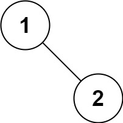

## Algorithm

[94. Binary Tree Inorder Traversal](https://leetcode.com/problems/binary-tree-inorder-traversal/)

### Description

Given the root of a binary tree, return the inorder traversal of its nodes' values.

Example 1:


```
Input: root = [1,null,2,3]
Output: [1,3,2]
```

Example 2:

```
Input: root = []
Output: []
```

Example 3:

```
Input: root = [1]
Output: [1]
```

Example 4:


```
Input: root = [1,2]
Output: [2,1]
```

Example 5:



```
Input: root = [1,null,2]
Output: [1,2]
```

Constraints:

- The number of nodes in the tree is in the range [0, 100].
- -100 <= Node.val <= 100


Follow up:

Recursive solution is trivial, could you do it iteratively?

### Solution

非递归方法

```java
/**
 * Definition for a binary tree node.
 * public class TreeNode {
 *     int val;
 *     TreeNode left;
 *     TreeNode right;
 *     TreeNode() {}
 *     TreeNode(int val) { this.val = val; }
 *     TreeNode(int val, TreeNode left, TreeNode right) {
 *         this.val = val;
 *         this.left = left;
 *         this.right = right;
 *     }
 * }
 */
class Solution {
    public List<Integer> inorderTraversal(TreeNode root) {
        List<Integer> list = new ArrayList<Integer>();
        Stack<TreeNode> stack = new Stack<TreeNode>();
        while(root!=null || !stack.isEmpty()){
            while(root!=null){
                stack.push(root);
                root = root.left;
            }
            root = stack.pop();
            list.add(root.val);
            root = root.right;
        }
        return list;
    }
}
```

递归方法

```JAVA
private List<Integer> list = new ArrayList<>();
public List<Integer> inorderTraversal(TreeNode root) {
    if(root==null){
        return list;
    }
    inOrder(root);
    return list;
}
private void inOrder(TreeNode root){
   if(root.left!=null){
      inOrder(root.left);
   }
   list.add(root.val);
   if(root.right!=null){
      inOrder(root.right);
   }
   return;
}
```

### Discuss

## Review


## Tip


## Share
