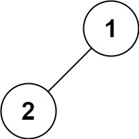

## Algorithm

[144. Binary Tree Preorder Traversal](https://leetcode.com/problems/binary-tree-preorder-traversal/)

### Description

Given the root of a binary tree, return the preorder traversal of its nodes' values.


Example 1:


Input: root = [1,null,2,3]
Output: [1,2,3]
Example 2:

Input: root = []
Output: []


Example 3:

Input: root = [1]
Output: [1]

Example 4:



Input: root = [1,2]
Output: [1,2]


Example 5:


Input: root = [1,null,2]
Output: [1,2]

Constraints:

- The number of nodes in the tree is in the range [0, 100].
- -100 <= Node.val <= 100

Follow up: Recursive solution is trivial, could you do it iteratively?

### Solution

非递归

```java
/**
 * Definition for a binary tree node.
 * public class TreeNode {
 *     int val;
 *     TreeNode left;
 *     TreeNode right;
 *     TreeNode() {}
 *     TreeNode(int val) { this.val = val; }
 *     TreeNode(int val, TreeNode left, TreeNode right) {
 *         this.val = val;
 *         this.left = left;
 *         this.right = right;
 *     }
 * }
 */
class Solution {
    public List<Integer> preorderTraversal(TreeNode root) {
        Stack<TreeNode> stack = new Stack<>();
        List<Integer> list = new ArrayList<>();
        if (root == null){
            return list;
        }
        stack.push(root);
        while(!stack.isEmpty()){
            TreeNode temp = stack.pop();
            list.add(temp.val);
            if(temp.right!=null){
                stack.add(temp.right);
            }
            if(temp.left!=null){
                stack.add(temp.left);
            }
        }
        return list;
    }
}
```

递归

```Java
/**
 * Definition for a binary tree node.
 * public class TreeNode {
 *     int val;
 *     TreeNode left;
 *     TreeNode right;
 *     TreeNode() {}
 *     TreeNode(int val) { this.val = val; }
 *     TreeNode(int val, TreeNode left, TreeNode right) {
 *         this.val = val;
 *         this.left = left;
 *         this.right = right;
 *     }
 * }
 */
class Solution {
    private List<Integer> list = new ArrayList<>();
    public List<Integer> preorderTraversal(TreeNode root) {
        if(root==null){
            return list;
        }
        preOrder(root);
        return list;
    }
    public void preOrder(TreeNode root){
        list.add(root.val);
        if(root.left!=null){
            preOrder(root.left);
        }
        if(root.right!=null){
            preOrder(root.right);
        }
    }
}
```

### Discuss

## Review


## Tip


## Share
