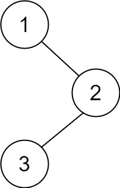
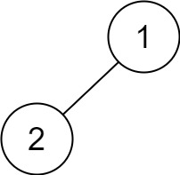
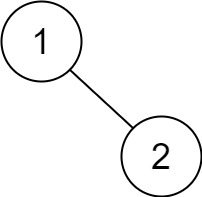

## Algorithm

[145. Binary Tree Postorder Traversal](https://leetcode.com/problems/binary-tree-postorder-traversal/)


### Description

Given the root of a binary tree, return the postorder traversal of its nodes' values.


Example 1:



```
Input: root = [1,null,2,3]
Output: [3,2,1]
```


Example 2:

```
Input: root = []
Output: []
```


Example 3:

```
Input: root = [1]
Output: [1]
```


Example 4:



```
Input: root = [1,2]
Output: [2,1]
```


Example 5:



```
Input: root = [1,null,2]
Output: [2,1]
```

Constraints:

- The number of the nodes in the tree is in the range [0, 100].
- -100 <= Node.val <= 100


Follow up:

- Recursive solution is trivial, could you do it iteratively?

### Solution


非递归


```java
/**
 * Definition for a binary tree node.
 * public class TreeNode {
 *     int val;
 *     TreeNode left;
 *     TreeNode right;
 *     TreeNode() {}
 *     TreeNode(int val) { this.val = val; }
 *     TreeNode(int val, TreeNode left, TreeNode right) {
 *         this.val = val;
 *         this.left = left;
 *         this.right = right;
 *     }
 * }
 */
class Solution {
    public List<Integer> postorderTraversal(TreeNode root) {
        List<Integer> list = new LinkedList<>();
        Stack<TreeNode> stack = new Stack<>();
        if(root==null){
            return new ArrayList<>();
        }
        stack.push(root);
        while(!stack.isEmpty()){
            TreeNode node = stack.pop();
            list.add(0, node.val);
            if(node.left!=null){
                stack.push(node.left);
            }
            if(node.right!=null){
                stack.push(node.right);
            }
        }
        return list;
    }
}
```

递归

```JAVA
/**
 * Definition for a binary tree node.
 * public class TreeNode {
 *     int val;
 *     TreeNode left;
 *     TreeNode right;
 *     TreeNode() {}
 *     TreeNode(int val) { this.val = val; }
 *     TreeNode(int val, TreeNode left, TreeNode right) {
 *         this.val = val;
 *         this.left = left;
 *         this.right = right;
 *     }
 * }
 */
class Solution {
    private List<Integer> list = new ArrayList<>();
    public List<Integer> postorderTraversal(TreeNode root) {
        if(root==null){
            return list;
        }
        postOrder(root);
        return list;
    }

    private void postOrder(TreeNode root){
        if(root.left!=null){
            postOrder(root.left);
        }
        if(root.right!=null){
            postOrder(root.right);
        }
        list.add(root.val);
    }
}
```

### Discuss

## Review


## Tip


## Share
