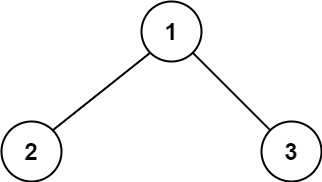
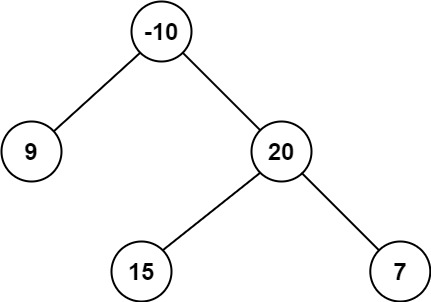

## Algorithm

[124. Binary Tree Maximum Path Sum](https://leetcode.com/problems/binary-tree-maximum-path-sum/)

### Description

A path in a binary tree is a sequence of nodes where each pair of adjacent nodes in the sequence has an edge connecting them. A node can only appear in the sequence at most once. Note that the path does not need to pass through the root.

The path sum of a path is the sum of the node's values in the path.

Given the root of a binary tree, return the maximum path sum of any path.


Example 1:



```
Input: root = [1,2,3]
Output: 6
Explanation: The optimal path is 2 -> 1 -> 3 with a path sum of 2 + 1 + 3 = 6.
```

Example 2:



```
Input: root = [-10,9,20,null,null,15,7]
Output: 42
Explanation: The optimal path is 15 -> 20 -> 7 with a path sum of 15 + 20 + 7 = 42.
```

Constraints:

- The number of nodes in the tree is in the range [1, 3 * 104].
- -1000 <= Node.val <= 1000

### Solution

```java
/**
 * Definition for a binary tree node.
 * public class TreeNode {
 *     int val;
 *     TreeNode left;
 *     TreeNode right;
 *     TreeNode() {}
 *     TreeNode(int val) { this.val = val; }
 *     TreeNode(int val, TreeNode left, TreeNode right) {
 *         this.val = val;
 *         this.left = left;
 *         this.right = right;
 *     }
 * }
 */
class Solution {

    int maxLeafToLeaf = Integer.MIN_VALUE;

    public int maxPathSum(TreeNode root) {
        if(root.left==null&&root.right==null){
            return root.val;
        }
        maxPathSumHelper(root);
        return maxLeafToLeaf;
    }

    private int maxPathSumHelper(TreeNode root){
        if(root == null){
            return 0;
        }
        int leftNodeToLeafMaxSum = maxPathSumHelper(root.left);
        int rightNodeToLeafMaxSum = maxPathSumHelper(root.right);
        // 1和2求最大值
        // 1. maxLeafToLeaf, max(leftMax, rightMax)+root.val 当前的值， 左右节点最大值+根结点的值
        // 2. leftMax+root.val+rightMax, root.val 左右根全部加起来的值， 根结点的值 进行比较
        maxLeafToLeaf = Math.max(Math.max(maxLeafToLeaf, Math.max(leftNodeToLeafMaxSum, rightNodeToLeafMaxSum) + root.val), Math.max(leftNodeToLeafMaxSum + root.val + rightNodeToLeafMaxSum, root.val));

        // 3. 根结点值+左右节点最大值中的值，根结点的值
        return Math.max(Math.max(leftNodeToLeafMaxSum, rightNodeToLeafMaxSum) + root.val,root.val);
    }

}
```

### Discuss

## Review


## Tip


## Share
