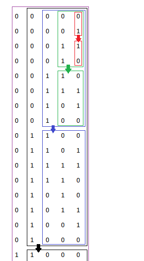

## Algorithm

[89. Gray Code](https://leetcode.com/problems/gray-code/)

### Description

The gray code is a binary numeral system where two successive values differ in only one bit.

Given an integer n representing the total number of bits in the code, return any sequence of gray code.

A gray code sequence must begin with 0.


Example 1:

```
Input: n = 2
Output: [0,1,3,2]
Explanation:
00 - 0
01 - 1
11 - 3
10 - 2
[0,2,3,1] is also a valid gray code sequence.
00 - 0
10 - 2
11 - 3
01 - 1
```

Example 2:

```
Input: n = 1
Output: [0,1]
```

Constraints:

- 1 <= n <= 16

### Solution


```java
class Solution {
    public List<Integer> grayCode(int n) {
        Integer[] r = new Integer[1<<n];
        r[0] = 0;
        int N = 1;
        for(int iN = 0; iN < n; iN++) {
            for(int i = N - 1, pos = N; i >= 0; i--, pos++) {
                r[pos] = N | r[i];
            }
            N <<= 1;
        }
        return Arrays.asList(r);
    }
}
```

### Discuss




## Review


## Tip


## Share
