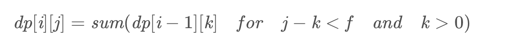

## Algorithm

[1155. Number of Dice Rolls With Target Sum](https://leetcode.com/problems/number-of-dice-rolls-with-target-sum/)

### Description

You have d dice, and each die has f faces numbered 1, 2, ..., f.

Return the number of possible ways (out of fd total ways) modulo 10^9 + 7 to roll the dice so the sum of the face up numbers equals target.

Example 1:

```
Input: d = 1, f = 6, target = 3
Output: 1
Explanation:
You throw one die with 6 faces.  There is only one way to get a sum of 3.
```


Example 2:

```
Input: d = 2, f = 6, target = 7
Output: 6
Explanation:
You throw two dice, each with 6 faces.  There are 6 ways to get a sum of 7:
1+6, 2+5, 3+4, 4+3, 5+2, 6+1.
```

Example 3:

```
Input: d = 2, f = 5, target = 10
Output: 1
Explanation:
You throw two dice, each with 5 faces.  There is only one way to get a sum of 10: 5+5.
```


Example 4:

```
Input: d = 1, f = 2, target = 3
Output: 0
Explanation:
You throw one die with 2 faces.  There is no way to get a sum of 3.
```


Example 5:

```
Input: d = 30, f = 30, target = 500
Output: 222616187
Explanation:
The answer must be returned modulo 10^9 + 7.
```

Constraints:

- 1 <= d, f <= 30
- 1 <= target <= 1000

### Solution

```java
class Solution {
    final int MOD = 1000000007;
    public int numRollsToTarget(int d, int f, int target) {
        int[][] dp = new int[d + 1][target + 1];
        dp[0][0] = 1;
        for(int i = 1; i <= d; i++){
            for(int j = 1; j <= target; j++){
                int ans = 0;
                for(int k = 1; k <= f && j - k >= 0; k++){
                    ans = (ans + dp[i - 1][j - k]) % MOD;
                }
                dp[i][j] = ans;
            }
        }
        return dp[d][target];
    }
}
```

### Discuss

这道题也是一道十分典型的动态规划的题目，我们可以将d个骰子看作一个骰子投掷了d次，那么，每投掷一次，都会和之前的投掷结果相关联。所以，我们可以定义一个二维数组dp，行表示投掷的次数，列表示投掷的数目之和，dp[i][j]表示一共投掷i次骰子时候所有数字之和为j的可能组合的数目。由于一个骰子只有f个面，因此需要求dp[i][j], 我们只需要遍历j前面的f个数据即可。



## Review


## Tip


## Share
