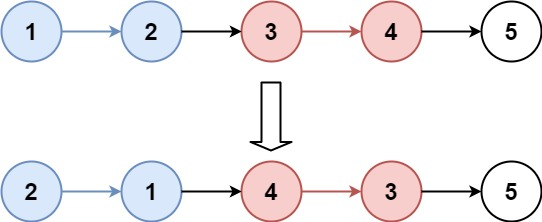
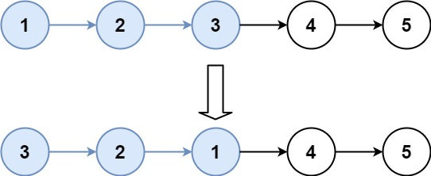

## Algorithm

[25. Reverse Nodes in k-Group](https://leetcode.com/problems/reverse-nodes-in-k-group/)

### Description

Given a linked list, reverse the nodes of a linked list k at a time and return its modified list.

k is a positive integer and is less than or equal to the length of the linked list. If the number of nodes is not a multiple of k then left-out nodes, in the end, should remain as it is.

Follow up:

Could you solve the problem in O(1) extra memory space?
You may not alter the values in the list's nodes, only nodes itself may be changed.

Example 1:



```
Input: head = [1,2,3,4,5], k = 2
Output: [2,1,4,3,5]
```

Example 2:



```
Input: head = [1,2,3,4,5], k = 3
Output: [3,2,1,4,5]
```

Example 3:

```
Input: head = [1,2,3,4,5], k = 1
Output: [1,2,3,4,5]
```

Example 4:

```
Input: head = [1], k = 1
Output: [1]
```

Constraints:

- The number of nodes in the list is in the range sz.
- 1 <= sz <= 5000
- 0 <= Node.val <= 1000
- 1 <= k <= sz

### Solution

```java
 /**
  * Definition for singly-linked list.
  * public class ListNode {
  *     int val;
  *     ListNode next;
  *     ListNode() {}
  *     ListNode(int val) { this.val = val; }
  *     ListNode(int val, ListNode next) { this.val = val; this.next = next; }
  * }
  */
 class Solution {
     public ListNode reverseKGroup(ListNode head, int k) {
         if(head==null || head.next==null){
             return head;
         }
         int count = 0;
         // 定义一个虚假节点，用于保存head的值，便于后续返回
         ListNode dummy = new ListNode(0);
         dummy.next = head;
         // pre指向虚假节点
         ListNode pre = dummy;
         // 当前节点指向head节点
         ListNode cur = head;
         // 如果当前节点不为null，继续遍历
         while(cur!=null){
             // 定义next节点
             ListNode next = cur.next;
             // 每次遍历count需要+1
             count++;
             if(count==k){
                 // 累计k个节点进行一次反转
                 pre = reverse(pre, next);
                 // 反转完成之后把count设置为0
                 count=0;
             }
             // 把当前节点指向next节点，下一轮继续遍历
             cur = next;
         }
         // 返回虚假节点的next节点是最终的结果
         return dummy.next;
     }

     // 类似于单链表反转
     private ListNode reverse(ListNode pre, ListNode end){
         // pre节点为空或者只有一个元素直接返回即可
         if(pre == null||pre.next ==null){
             return pre;
         }
         // head节点指向pre.next
         ListNode head = pre.next;
         // 当前节点指向pre.next.next
         ListNode cur = pre.next.next;
         // 如果cur不为end说明没有反转完成，继续遍历
         while(cur != end){
             // 先临时保存next节点
             ListNode next = cur.next;
             // 当前节点的next指向pre.next
             cur.next = pre.next;
             // pre.next指向cur
             pre.next = cur;
             cur = next;
         }
         //end其实是下一个要反转的头结点
         head.next = end;
         return head;
     }
 }
```

### Discuss

## Review


## Tip


## Share
