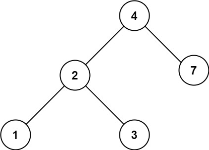

## Algorithm

[700. Search in a Binary Search Tree](https://leetcode.com/problems/search-in-a-binary-search-tree/)

### Description

You are given the root of a binary search tree (BST) and an integer val.

Find the node in the BST that the node's value equals val and return the subtree rooted with that node. If such a node does not exist, return null.

Example 1:


```
Input: root = [4,2,7,1,3], val = 2
Output: [2,1,3]
```

Example 2:



```
Input: root = [4,2,7,1,3], val = 5
Output: []
```

### Solution

```java
/**
 * Definition for a binary tree node.
 * public class TreeNode {
 *     int val;
 *     TreeNode left;
 *     TreeNode right;
 *     TreeNode() {}
 *     TreeNode(int val) { this.val = val; }
 *     TreeNode(int val, TreeNode left, TreeNode right) {
 *         this.val = val;
 *         this.left = left;
 *         this.right = right;
 *     }
 * }
 */
class Solution {
    public TreeNode searchBST(TreeNode root, int val) {
        if(root==null){
            return root;
        }
        if(root.val == val){
            return root;
        }
        return val<root.val?searchBST(root.left, val):searchBST(root.right, val);
    }
}
```

```java
/**
 * Definition for a binary tree node.
 * public class TreeNode {
 *     int val;
 *     TreeNode left;
 *     TreeNode right;
 *     TreeNode() {}
 *     TreeNode(int val) { this.val = val; }
 *     TreeNode(int val, TreeNode left, TreeNode right) {
 *         this.val = val;
 *         this.left = left;
 *         this.right = right;
 *     }
 * }
 */
class Solution {
    public TreeNode searchBST(TreeNode root, int val) {
        while(root!=null && root.val!=val){
           root = val<root.val?root.left:root.right;
        }
        return root;
    }
}
```

### Discuss

## Review


## Tip


## Share
