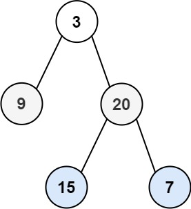

## Algorithm

[103. Binary Tree Zigzag Level Order Traversal](https://leetcode.com/problems/binary-tree-zigzag-level-order-traversal/)

### Description

Given the root of a binary tree, return the zigzag level order traversal of its nodes' values. (i.e., from left to right, then right to left for the next level and alternate between).

Example 1:



```
Input: root = [3,9,20,null,null,15,7]
Output: [[3],[20,9],[15,7]]
```

Example 2:

```
Input: root = [1]
Output: [[1]]
```

Example 3:

```
Input: root = []
Output: []
```

Constraints:

- The number of nodes in the tree is in the range [0, 2000].
- -100 <= Node.val <= 100

### Solution

```java
/**
 * Definition for a binary tree node.
 * public class TreeNode {
 *     int val;
 *     TreeNode left;
 *     TreeNode right;
 *     TreeNode(int x) { val = x; }
 * }
 */
class Solution {
    public List<List<Integer>> zigzagLevelOrder(TreeNode root) {
        List<List<Integer>> listNode = new LinkedList<>();
        Stack<TreeNode> stack1 = new Stack<>();
        Stack<TreeNode> stack2 = new Stack<>();
        if(root == null){
            return listNode;
        }
        int flag = 0;
        stack1.push(root);
        while(!stack1.isEmpty()||!stack2.isEmpty()){
            List<Integer> subList = new LinkedList<>();
            if(flag%2==0){
                while(!stack1.isEmpty()){
                    TreeNode temp = stack1.pop();
                    if(temp!=null){
                        subList.add(temp.val);
                        stack2.push(temp.left);
                        stack2.push(temp.right);
                    }
                }
            }else{
                while(!stack2.isEmpty()){
                    TreeNode temp = stack2.pop();
                    if(temp!=null){
                        subList.add(temp.val);
                        stack1.push(temp.right);
                        stack1.push(temp.left);
                    }
                }
            }
            if(!subList.isEmpty()){
                listNode.add(subList);
            }
            flag++;
        }
        return listNode;
    }
}
```

### Discuss

## Review


## Tip


## Share
