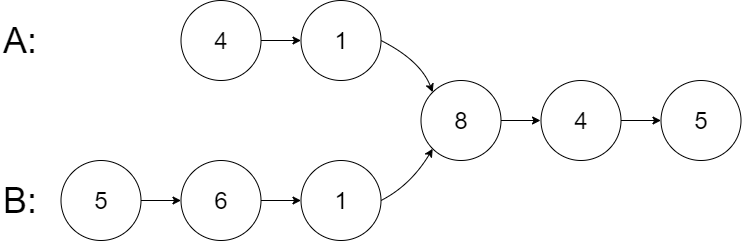
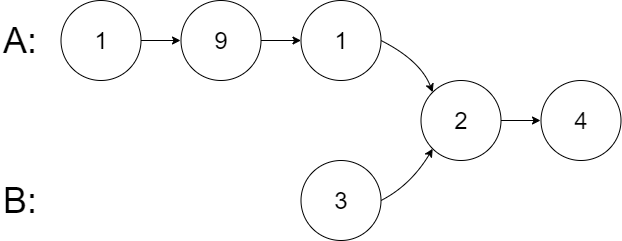
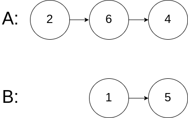

## Algorithm

[160. Intersection of Two Linked Lists](https://leetcode.com/problems/intersection-of-two-linked-lists/)

### Description

Given the heads of two singly linked-lists headA and headB, return the node at which the two lists intersect. If the two linked lists have no intersection at all, return null.

For example, the following two linked lists begin to intersect at node c1:


It is guaranteed that there are no cycles anywhere in the entire linked structure.

Note that the linked lists must retain their original structure after the function returns.


Example 1:




```
Input: intersectVal = 8, listA = [4,1,8,4,5], listB = [5,6,1,8,4,5], skipA = 2, skipB = 3
Output: Intersected at '8'
Explanation: The intersected node's value is 8 (note that this must not be 0 if the two lists intersect).
From the head of A, it reads as [4,1,8,4,5]. From the head of B, it reads as [5,6,1,8,4,5]. There are 2 nodes before the intersected node in A; There are 3 nodes before the intersected node in B.
```


Example 2:





```
Input: intersectVal = 2, listA = [1,9,1,2,4], listB = [3,2,4], skipA = 3, skipB = 1
Output: Intersected at '2'
Explanation: The intersected node's value is 2 (note that this must not be 0 if the two lists intersect).
From the head of A, it reads as [1,9,1,2,4]. From the head of B, it reads as [3,2,4]. There are 3 nodes before the intersected node in A; There are 1 node before the intersected node in B.
```


Example 3:




```
Input: intersectVal = 0, listA = [2,6,4], listB = [1,5], skipA = 3, skipB = 2
Output: No intersection
Explanation: From the head of A, it reads as [2,6,4]. From the head of B, it reads as [1,5]. Since the two lists do not intersect, intersectVal must be 0, while skipA and skipB can be arbitrary values.
Explanation: The two lists do not intersect, so return null.
```

Constraints:

- The number of nodes of listA is in the m.
- The number of nodes of listB is in the n.
- 0 <= m, n <= 3 * 104
- 1 <= Node.val <= 105
- 0 <= skipA <= m
- 0 <= skipB <= n
- intersectVal is 0 if listA and listB do not intersect.
- intersectVal == listA[skipA + 1] == listB[skipB + 1] if listA and listB intersect.

Follow up: Could you write a solution that runs in O(n) time and use only O(1) memory?

### Solution

```java
/**
 * Definition for singly-linked list.
 * public class ListNode {
 *     int val;
 *     ListNode next;
 *     ListNode(int x) {
 *         val = x;
 *         next = null;
 *     }
 * }
 */
public class Solution {
    public ListNode getIntersectionNode(ListNode headA, ListNode headB) {
        if(headA == null || headB == null){
            return null;
        }
        ListNode curA = headA, curB = headB;
        while( curA!=curB){
            curA = curA!=null?curA.next:headB;
            curB = curB!=null?curB.next:headA;
        }
        return curA;
    }
}
```

```java
/**
 * Definition for singly-linked list.
 * public class ListNode {
 *     int val;
 *     ListNode next;
 *     ListNode(int x) {
 *         val = x;
 *         next = null;
 *     }
 * }
 */
public class Solution {
    public ListNode getIntersectionNode(ListNode headA, ListNode headB) {
        if(headA == null || headB == null){
            return null;
        }
        int lenA = 0, lenB = 0;
        ListNode nodeA = headA;
        ListNode nodeB = headB;
        while(nodeA!=null){
            nodeA = nodeA.next;
            lenA++;
        }
        while(nodeB!=null){
            nodeB = nodeB.next;
            lenB++;
        }
        int diff = lenA-lenB;
        if(diff>0){
            while(diff>0){
                headA = headA.next;
                diff--;
            }
        }else{
            while(diff<0){
                headB = headB.next;
                diff++;
            }
        }
        while(headA!=null && headB!=null){
            if(headA==headB){
                return headA;
            }
            headA=headA.next;
            headB=headB.next;
        }
        return null;
    }
}
```

### Discuss

## Review


## Tip


## Share
