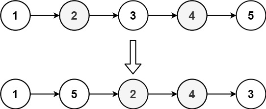

## Algorithm

[143. Reorder List](https://leetcode.com/problems/reorder-list/)

### Description

You are given the head of a singly linked-list. The list can be represented as:

L0 → L1 → … → Ln - 1 → Ln
Reorder the list to be on the following form:

L0 → Ln → L1 → Ln - 1 → L2 → Ln - 2 → …
You may not modify the values in the list's nodes. Only nodes themselves may be changed.


Example 1:


```
Input: head = [1,2,3,4]
Output: [1,4,2,3]
```


Example 2:



```
Input: head = [1,2,3,4,5]
Output: [1,5,2,4,3]
```

Constraints:

- The number of nodes in the list is in the range [1, 5 * 104].
- 1 <= Node.val <= 1000

### Solution

```java
/**
 * Definition for singly-linked list.
 * public class ListNode {
 *     int val;
 *     ListNode next;
 *     ListNode() {}
 *     ListNode(int val) { this.val = val; }
 *     ListNode(int val, ListNode next) { this.val = val; this.next = next; }
 * }
 */
class Solution {
    public void reorderList(ListNode head) {
        if(head==null||head.next==null){
            return;
        }

        //Find the middle of the list
        ListNode p1=head;
        ListNode p2=head;
        while(p1!=null && p1.next!=null){
            p1=p1.next.next;
            p2=p2.next;
        }

        //Reverse the half after middle  1->2->3->4->5->6 to 1->2->3->6->5->4
        ListNode preMiddle=p1;
        ListNode preCurrent=p1.next;
        while(preCurrent.next!=null){
            ListNode current=preCurrent.next;
            preCurrent.next=current.next;
            current.next=preMiddle.next;
            preMiddle.next=current;
        }

        //Start reorder one by one  1->2->3->6->5->4 to 1->6->2->5->3->4
        p1=head;
        p2=preMiddle.next;
        while(p1!=preMiddle){
            preMiddle.next=p2.next;
            p2.next=p1.next;
            p1.next=p2;
            p1=p2.next;
            p2=preMiddle.next;
        }
    }
}
```

### Discuss

## Review


## Tip


## Share
