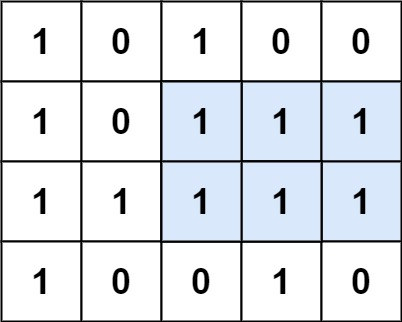

## Algorithm

[85. Maximal Rectangle](https://leetcode.com/problems/maximal-rectangle/)

### Description

Given a rows x cols binary matrix filled with 0's and 1's, find the largest rectangle containing only 1's and return its area.

Example 1:



```
Input: matrix = [["1","0","1","0","0"],["1","0","1","1","1"],["1","1","1","1","1"],["1","0","0","1","0"]]
Output: 6
Explanation: The maximal rectangle is shown in the above picture.
```


Example 2:

```
Input: matrix = []
Output: 0
```

Example 3:

```
Input: matrix = [["0"]]
Output: 0
```

Example 4:

```
Input: matrix = [["1"]]
Output: 1
```

Example 5:

```
Input: matrix = [["0","0"]]
Output: 0
```

Constraints:

- rows == matrix.length
- cols == matrix[i].length
- 0 <= row, cols <= 200
- matrix[i][j] is '0' or '1'.

### Solution

```java
class Solution {
    public int maximalRectangle(char[][] matrix) {
       if (matrix == null || matrix.length == 0) {
            return 0;
        }
        int m = matrix.length;
        int n = matrix[0].length;
        int maxA = 0;
        int[] right = new int[n];
        int[] left = new int[n];
        int[] heights = new int[n];
        Arrays.fill(right, n);
        for (int i = 0; i < m; i++) {
            int curleft = 0, curright = n;
            for (int j = 0; j < n; j++) {
                if (matrix[i][j] == '1') {
                    heights[j]++;
                } else {
                    heights[j] = 0;
                }
            }
            for (int j = 0; j < n; j++) {
                if (matrix[i][j] == '1') {
                    // each i has own left[], each will renew
                    left[j] = Math.max(curleft, left[j]);
                } else {
                    // most next position to zero
                    left[j] = 0;
                    curleft = j + 1;
                }
            }
            for (int j = n - 1; j >= 0; j--) {
                if (matrix[i][j] == '1') {
                    right[j] = Math.min(curright, right[j]);
                } else {
                    // remain at last zero position
                    right[j] = n;
                    curright = j;
                }
            }
            for (int j = 0; j < n; j++) {
                maxA = Math.max(maxA, (right[j] - left[j]) * heights[j]);
            }
        }
        return maxA;
    }
}
```

### Discuss

## Review


## Tip


## Share
