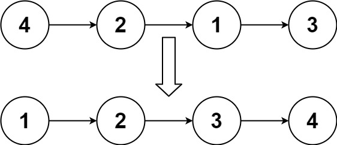

## Algorithm

[148. Sort List](https://leetcode.com/problems/sort-list/)

### Description

Given the head of a linked list, return the list after sorting it in ascending order.

Follow up: Can you sort the linked list in O(n logn) time and O(1) memory (i.e. constant space)?


Example 1:



```
Input: head = [4,2,1,3]
Output: [1,2,3,4]
```

Example 2:


```
Input: head = [-1,5,3,4,0]
Output: [-1,0,3,4,5]
```

Example 3:

```
Input: head = []
Output: []
```

Constraints:

- The number of nodes in the list is in the range [0, 5 * 104].
- -105 <= Node.val <= 105

### Solution

```java
/**
 * Definition for singly-linked list.
 * public class ListNode {
 *     int val;
 *     ListNode next;
 *     ListNode() {}
 *     ListNode(int val) { this.val = val; }
 *     ListNode(int val, ListNode next) { this.val = val; this.next = next; }
 * }
 */
import java.util.Collections;

class Solution {
    public ListNode sortList(ListNode head) {
        ListNode sorted = null;
        ListNode sRef = null;
        List<ListNode> list = new ArrayList<>();
        while(head!=null){
            list.add(new ListNode(head.val));
            head = head.next;
        }

        Collections.sort(list, new Comparator<ListNode>(){
            @Override
            public int compare(ListNode o1, ListNode o2){
                return o1.val-o2.val;
            }
        });

        for(ListNode node:list){
            if(sorted==null){
                sorted = node;
                sRef = sorted;
            }else{
                sRef.next = node;
                sRef = sRef.next;
            }
        }
        return sorted;
    }
}
```

### Discuss

## Review


## Tip


## Share
