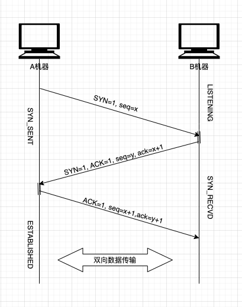

## Algorithm

[470. Implement Rand10 Using Rand7](https://leetcode.com/problems/implement-rand10-using-rand7/)

### Description

Given the API rand7() that generates a uniform random integer in the range [1, 7], write a function rand10() that generates a uniform random integer in the range [1, 10]. You can only call the API rand7(), and you shouldn't call any other API. Please do not use a language's built-in random API.

Each test case will have one internal argument n, the number of times that your implemented function rand10() will be called while testing. Note that this is not an argument passed to rand10().

Follow up:

What is the expected value for the number of calls to rand7() function?
Could you minimize the number of calls to rand7()?


Example 1:

```
Input: n = 1
Output: [2]
```

Example 2:

```
Input: n = 2
Output: [2,8]
```

Example 3:

```
Input: n = 3
Output: [3,8,10]
```

Constraints:

- 1 <= n <= 105

### Solution

```java
/**
 * The rand7() API is already defined in the parent class SolBase.
 * public int rand7();
 * @return a random integer in the range 1 to 7
 */
class Solution extends SolBase {
    public int rand10() {
        int result = 40;
        while (result >= 40) {
            result = 7 * (rand7() - 1) + (rand7() - 1);
        }
        return result % 10 + 1;
    }
}
```

### Discuss

Idea: rand7() -> rand49() -> rand40() -> rand10()

Time Complexity
The total number of iterations follows geometric distribution. For each iteration in the while loop, the probabilty of exiting the loop is p = 40/49. So the average time complexity T(n) = O(1/p) = O(49/40) = O(1).

Correctness
Note that rand49() generates a uniform random integer in [1, 49], so any number in this range has the same probability to be generated. Suppose k is an integer in range [1, 40], P(rand49() = k) = 1/49.

```
   P(result = k)
= P(rand49() = k in the 1st iteration) +
   P(rand49() > 40 in the 1st iteration) * P(rand49() = k in the 2nd iteration) +
   P(rand49() > 40 in the 1st iteration) * P(rand49() > 40 in the 2nd iteration) * P(rand49() = k in the 3rd iteration) +
   P(rand49() > 40 in the 1st iteration) * P(rand49() > 40 in the 2nd iteration) * P(rand49() > 40 in the 3rd iteration) * P(rand49() = k in the 4th iteration) +
   ...
= (1/49) + (9/49) * (1/49) + (9/49)^2 * (1/49) + (9/49)^3 * (1/49) + ...
= (1/49) * [1 + (9/49) + (9/49)^2 + (9/49)^3 + ... ]
= (1/49) * [1/(1-9/49)]
= (1/49) * (49/40)
= 1/40
```

Generalization
Implement randM() using randN() when M > N:
Step 1: Use randN() to generate randX(), where X >= M. In this problem, I use 7 * (rand7() - 1) + (rand7() - 1) to generate rand49() - 1.
Step 2: Use randX() to generate randM(). In this problem, I use rand49() to generate rand40() then generate rand10.

Note: N^b * (randN() - 1) + N^(b - 1) * (randN() - 1) + N^(b - 2) * (randN() - 1) + ... + N^0 * (randN() - 1) generates randX() - 1, where X = N^(b + 1).

## Review


## Tip


## Share

首先介绍下TCP中FLAG主要有ACK，SYN，FIN，URG，PSH，RST组成，设置为1表示有效，0表示无效。
其中SYN(Synchronize Sequence Numbers)表示需要建立同步信号，ACK(Acknowledgement)用于对收到的数据进行确认，
并且发送seq=x的确认序号，FIN(Finish)表示后面没有数据需要发送，建立的链接可以关闭。



通过上图可以看到机器A和机器B建立连接的三个步骤。

1. 首先A机器发出SYN=1,表示希望建立连接，序号这里设置为x;
2. 机器B接收到A的数据包以后，通过SYN得知这是一个建立连接的请求，于是发送了一个响应的包，并将ACK和SYN都设置为1。并发送为y的序列号，同时也要对A发出的x进行确认，这时候确认号是x+1, 表示收到了A发过来的SYN;
3. A收到B的响应包之后，需要继续进行确认，确认包中ACK设置为1，同时seq继续+1设置为x+1, 确认序号同时+1设置为y+1;


为什么设置为三次握手而不是两次握手，主要是保证信息对称和防止超时。

信息对称主要是确认A机器和B机器是否都具有发报文能力和接收报文的能力，如果有一个能力是无法确认的，那么就无法建立连接

同时防止超时，可以举个例子：假设A有一个建立连接的请求延迟到达B的话。这时候A会等到B没有确认继续重发，重发的消息建立了连接，但是超时的消息后面也到达，这时候就会建立两次连接，所以有了三次握手之后，延迟到达的脏连接会给A发送确认，这时候A机器此时已经不是SYN_SENT状态，会把这个延迟的连接丢弃，B长时间没有收到二次确认也会自动关闭，导致最终的超时连接建立失败，

网络的不可靠性，导致很多分布式系统需要做额外的操作才能保证数据一致性，比如XTS事务一致性中的空回滚操作，以及事务型消息里面的重试和回查机制。

TCP协议层层面支持Keep Alive功能，隔段时间会给对方发送心跳信息，表示连接处于健康状态，一旦心跳出现异常，可以回收和释放相关的资源，供其他服务器利用，减少因为单机长时间故障导致更大的损失，这一点在ZooKeeper等分布式中间件中有广泛的使用。
