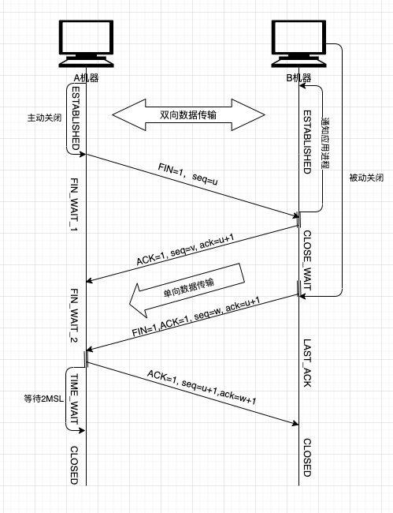

## Algorithm

[198. House Robber](https://leetcode.com/problems/house-robber/)

### Description

You are a professional robber planning to rob houses along a street. Each house has a certain amount of money stashed, the only constraint stopping you from robbing each of them is that adjacent houses have security systems connected and it will automatically contact the police if two adjacent houses were broken into on the same night.

Given an integer array nums representing the amount of money of each house, return the maximum amount of money you can rob tonight without alerting the police.

Example 1:

```
Input: nums = [1,2,3,1]
Output: 4
Explanation: Rob house 1 (money = 1) and then rob house 3 (money = 3).
Total amount you can rob = 1 + 3 = 4.
```

Example 2:

```
Input: nums = [2,7,9,3,1]
Output: 12
Explanation: Rob house 1 (money = 2), rob house 3 (money = 9) and rob house 5 (money = 1).
Total amount you can rob = 2 + 9 + 1 = 12.
```

Constraints:

- 1 <= nums.length <= 100
- 0 <= nums[i] <= 400

### Solution

```java
class Solution {
    public int rob(int[] nums) {
        if(nums==null || nums.length==0){
            return 0;
        }
        int[] dp = new int[nums.length+1];
        dp[0] = 0;
        dp[1] = nums[0];
        for(int i=1;i<nums.length;i++){
            dp[i+1] = Math.max(dp[i-1]+nums[i], dp[i]);
        }
        return dp[nums.length];
    }
}
```

### Discuss

## Review


## Tip


## Share


上一篇提到了三次握手，本篇主要讲一下TCP断开连接的操作。



如图所示：

1. A机器待本方数据发送完成之后，主动发起关闭请求，传输FIN=1给B机器；
2. B机器收到FIN信号时候，给A机器做出ACK=1的应答，告诉A机器可以断开，但是不会立即断开，因为对A机器请求的处理可能还在队列中没有完成，这时候要等B机器完成A机器的处理请求之后，主动给A机器发送FIN信号，表示数据处理完成，可以关闭；
3. 这时A机器处于FIN_WAIT_2状态，表示半关闭状态(只接收不发送)，这时候A不能继续给B机器发送新的处理请求，此时是B机器单向数据传输，要注意seq是在变化的，但是ack始终为u+1,因为ack是对A机器最近一次请求的确认，而A机器最后一次发送的seq为u，所以B机器在这段时间内的ack=u+1，B机器处于半关闭状态；
4. B机器在对A机器发送FIN之后，也处于半关闭状态，此时A机器回复B机器的FIN=1确认，并进入TIME_WAIT等待状态，等待2MSL(Maximum Segment Lifetime)之后，如果没有收到B的报文，就认为B已经接收到了A的ACK确认，这时候TCP连接正式释放；


为什么不直接关闭而是等待2MSL？

1. 如果A机器的最后一个ACK请求由于网络原因没有到达B机器，那么处于LAST_ACK状态的B机器认为A没有接收到最后的FIN+ACK信息，这时候会重发，A机器收到第二次重发的FIN+ACK请求之后，也会重发一次ACK，并再次进入倒计时。如果A机器不等待而是直接进入CLOSED状态，此时B机器无法保证收到A机器的ACK请求，可能无法进入最终的CLOSED状态，会浪费一个请求处理线程。

2. 除了上述原因之外，还为了防止失效请求，如果在A关闭连接之后，立刻又与B建立了新的连接，那么最后这次ACK确认由于网络问题延迟到达了，这时候会与A正常请求包混淆而发生异常。

优化改进建议

1. TIME_WAIT状态的服务器不会真正释放句柄，Socket端口不能继续使用，所以对于高并发服务器而言要控制好TIME_WAIT的时间，减少Socket有效创建数量的浪费，成为性能瓶颈
2. TIME_WAIT1状态下如果同时收到了ACK和FIN标示的报文,即A机器的请求被B机器同步处理完毕，则可以直接进入TIME_WAIT状态，而无需经过TIME_WAIT_2
3. B机器在收到对方的FIN报文时，在第一次应答ACK的时候，可以进入CLOSE_WAIT状态，等待关闭，并通知应用程序发送数据，关闭回收相关资源。
