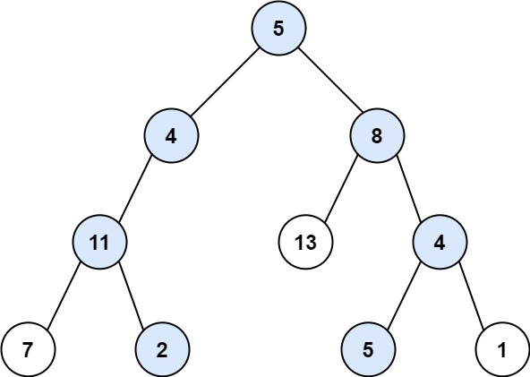

## Algorithm

[113. Path Sum II](https://leetcode.com/problems/path-sum-ii/)

### Description

Given the root of a binary tree and an integer targetSum, return all root-to-leaf paths where each path's sum equals targetSum.

A leaf is a node with no children.

Example 1:



```
Input: root = [5,4,8,11,null,13,4,7,2,null,null,5,1], targetSum = 22
Output: [[5,4,11,2],[5,8,4,5]]
```

Example 2:


```
Input: root = [1,2,3], targetSum = 5
Output: []
```

Example 3:

```
Input: root = [1,2], targetSum = 0
Output: []
```

Constraints:

- The number of nodes in the tree is in the range [0, 5000].
- -1000 <= Node.val <= 1000
- -1000 <= targetSum <= 1000


### Solution

```java
/**
 * Definition for a binary tree node.
 * public class TreeNode {
 *     int val;
 *     TreeNode left;
 *     TreeNode right;
 *     TreeNode(int x) { val = x; }
 * }
 */
class Solution {

    public List<List<Integer>> pathSum(TreeNode root, int sum) {
        List<List<Integer>> result  = new LinkedList<List<Integer>>();
	    List<Integer> currentResult  = new LinkedList<Integer>();
        pathSum(root,sum,currentResult,result);
	    return result;
    }
    
    private void pathSum(TreeNode root, int sum, List<Integer> currentResult, List<List<Integer>> result) {
        if(root == null){
            return;
        }
        currentResult.add(new Integer(root.val));
        if (root.left == null && root.right == null && sum == root.val) {
		    result.add(new LinkedList(currentResult));
		    currentResult.remove(currentResult.size() - 1);//don't forget to remove the last integer
		    return;
        }else{
            pathSum(root.left, sum - root.val, currentResult, result);
		    pathSum(root.right, sum - root.val, currentResult, result);
        }
        urrentResult.remove(currentResult.size() - 1);
    }
}
```

### Discuss

## Review


## Tip


## Share
