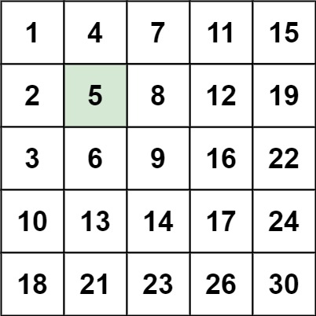
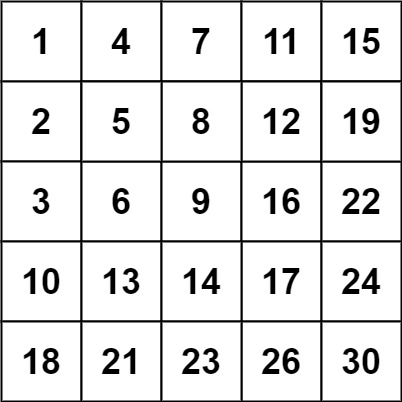

## Algorithm

[240. Search a 2D Matrix II](https://leetcode.com/problems/search-a-2d-matrix-ii/)

### Description

Write an efficient algorithm that searches for a target value in an m x n integer matrix. The matrix has the following properties:

- Integers in each row are sorted in ascending from left to right.
- Integers in each column are sorted in ascending from top to bottom.

Example 1:



```
Input: matrix = [[1,4,7,11,15],[2,5,8,12,19],[3,6,9,16,22],[10,13,14,17,24],[18,21,23,26,30]], target = 5
Output: true
```

Example 2:



```
Input: matrix = [[1,4,7,11,15],[2,5,8,12,19],[3,6,9,16,22],[10,13,14,17,24],[18,21,23,26,30]], target = 20
Output: false
```

Constraints:

- m == matrix.length
- n == matrix[i].length
- 1 <= n, m <= 300
- -109 <= matix[i][j] <= 109
- All the integers in each row are sorted in ascending order.
- All the integers in each column are sorted in ascending order.
- -109 <= target <= 109

### Solution

```java
class Solution {
    public boolean searchMatrix(int[][] matrix, int target) {
        if(matrix == null || matrix.length == 0){
            return false;
        }
        int left = 0;
        int right = matrix[0].length - 1;
        while(left< matrix.length && right >= 0){
            if(matrix[left][right] == target){
                return true;
            }else if(matrix[left][right] < target){
                left++;
            }else{
                right--;
            }
        }
        return false;
    }
}
```

### Discuss

## Review


## Tip


## Share
