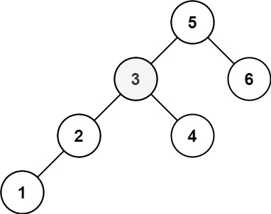

## Algorithm

[230. Kth Smallest Element in a BST](https://leetcode.com/problems/kth-smallest-element-in-a-bst/)

### Description

Given the root of a binary search tree, and an integer k, return the kth (1-indexed) smallest element in the tree.

Example 1:


```
Input: root = [3,1,4,null,2], k = 1
Output: 1
```

Example 2:



```
Input: root = [5,3,6,2,4,null,null,1], k = 3
Output: 3
```

Constraints:

- The number of nodes in the tree is n.
- 1 <= k <= n <= 104
- 0 <= Node.val <= 104

Follow up: If the BST is modified often (i.e., we can do insert and delete operations) and you need to find the kth smallest frequently, how would you optimize?


### Solution

```java
/**
 * Definition for a binary tree node.
 * public class TreeNode {
 *     int val;
 *     TreeNode left;
 *     TreeNode right;
 *     TreeNode() {}
 *     TreeNode(int val) { this.val = val; }
 *     TreeNode(int val, TreeNode left, TreeNode right) {
 *         this.val = val;
 *         this.left = left;
 *         this.right = right;
 *     }
 * }
 */
class Solution {
    public int kthSmallest(TreeNode root, int k) {
        Stack<TreeNode> stack = new Stack<TreeNode>();
        while(true){
            while(root!=null){
                stack.push(root);
                root=root.left;
            }
            if(stack.isEmpty()){
                break;
            }
            root = stack.pop();
            if(--k==0){
                return root.val;
            }
            root = root.right;
        }
        return 0;
    }
}
```

### Discuss

## Review


## Tip


## Share
