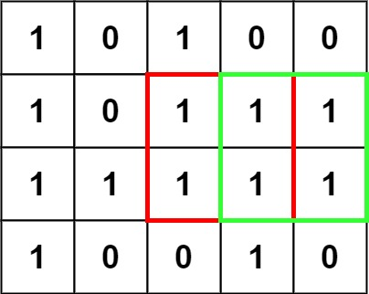
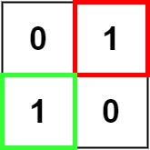

## Algorithm

[221. Maximal Square](https://leetcode.com/problems/maximal-square/)

### Description

Given an m x n binary matrix filled with 0's and 1's, find the largest square containing only 1's and return its area.


Example 1:



```
Input: matrix = [["1","0","1","0","0"],["1","0","1","1","1"],["1","1","1","1","1"],["1","0","0","1","0"]]
Output: 4
```

Example 2:




```
Input: matrix = [["0","1"],["1","0"]]
Output: 1
```

Example 3:

```
Input: matrix = [["0"]]
Output: 0
```

Constraints:

- m == matrix.length
- n == matrix[i].length
- 1 <= m, n <= 300
- matrix[i][j] is '0' or '1'.

### Solution

```java
class Solution {
    public int maximalSquare(char[][] matrix) {
        if(matrix == null || matrix.length == 0 || matrix[0].length == 0){
            return 0;
        }
        int max = 0, n = matrix.length, m = matrix[0].length;
        // dp(i, j) represents the length of the square
        // whose lower-right corner is located at (i, j)
        // dp(i, j) = min{ dp(i-1, j-1), dp(i-1, j), dp(i, j-1) }
        int[][] dp = new int[n + 1][m + 1];
        for (int i = 1; i <= n; i++) {
            for (int j = 1; j <= m; j++) {
                if (matrix[i - 1][j - 1] == '1') {
                    dp[i][j] = Math.min(dp[i - 1][j - 1], Math.min(dp[i - 1][j], dp[i][j - 1])) + 1;
                    max = Math.max(max, dp[i][j]);
                }
            }
        }
        // return the area
        return max * max;
    }
}
```

### Discuss

## Review


## Tip


## Share
