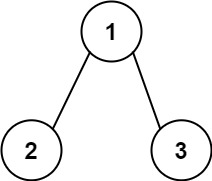

## Algorithm

[112. Path Sum](https://leetcode.com/problems/path-sum/)

### Description

Given the root of a binary tree and an integer targetSum, return true if the tree has a root-to-leaf path such that adding up all the values along the path equals targetSum.

A leaf is a node with no children.

Example 1:


```
Input: root = [5,4,8,11,null,13,4,7,2,null,null,null,1], targetSum = 22
Output: true
```

Example 2:



```
Input: root = [1,2,3], targetSum = 5
Output: false
```

Example 3:

```
Input: root = [1,2], targetSum = 0
Output: false
```

Constraints:

- The number of nodes in the tree is in the range [0, 5000].
- -1000 <= Node.val <= 1000
- -1000 <= targetSum <= 1000

### Solution

```java
/**
 * Definition for a binary tree node.
 * public class TreeNode {
 *     int val;
 *     TreeNode left;
 *     TreeNode right;
 *     TreeNode(int x) { val = x; }
 * }
 */
class Solution {
    public boolean hasPathSum(TreeNode root, int sum) {
        if(root==null){
            return false;
        }
        if(root.left==null&&root.right==null){
            return root.val==sum;
        }
        return hasPathSum(root.left,sum-root.val)||hasPathSum(root.right,sum-root.val);
    }
}
```

### Discuss

## Review


## Tip


## Share
