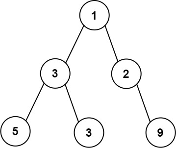
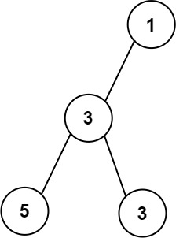
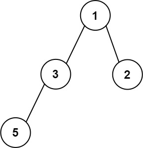
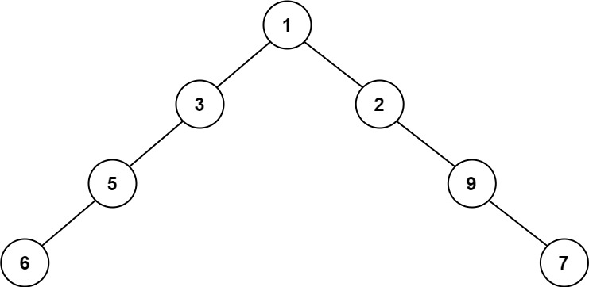

## Algorithm

[662. Maximum Width of Binary Tree](https://leetcode.com/problems/maximum-width-of-binary-tree/)

### Description

Given the root of a binary tree, return the maximum width of the given tree.

The maximum width of a tree is the maximum width among all levels.

The width of one level is defined as the length between the end-nodes (the leftmost and rightmost non-null nodes), where the null nodes between the end-nodes are also counted into the length calculation.

It is guaranteed that the answer will in the range of 32-bit signed integer.

Example 1:



```
Input: root = [1,3,2,5,3,null,9]
Output: 4
Explanation: The maximum width existing in the third level with the length 4 (5,3,null,9).
```

Example 2:



```
Input: root = [1,3,null,5,3]
Output: 2
Explanation: The maximum width existing in the third level with the length 2 (5,3).
```

Example 3:



```
Input: root = [1,3,2,5]
Output: 2
Explanation: The maximum width existing in the second level with the length 2 (3,2).
```

Example 4:



```
Input: root = [1,3,2,5,null,null,9,6,null,null,7]
Output: 8
Explanation: The maximum width existing in the fourth level with the length 8 (6,null,null,null,null,null,null,7).
```

Constraints:

- The number of nodes in the tree is in the range [1, 3000].
- -100 <= Node.val <= 100

### Solution

```java
/**
 * Definition for a binary tree node.
 * public class TreeNode {
 *     int val;
 *     TreeNode left;
 *     TreeNode right;
 *     TreeNode() {}
 *     TreeNode(int val) { this.val = val; }
 *     TreeNode(int val, TreeNode left, TreeNode right) {
 *         this.val = val;
 *         this.left = left;
 *         this.right = right;
 *     }
 * }
 */
class Solution {
    public int widthOfBinaryTree(TreeNode root) {
        return dfs(root, 0, 1, new ArrayList<Integer>(), new ArrayList<Integer>());
    }

    public int dfs(TreeNode root, int level, int order, List<Integer> start, List<Integer> end){
        if(root == null){
            return 0;
        }
        if(start.size() == level){
            start.add(order);
            end.add(order);
        }else{
            end.set(level, order);
        }
        int cur = end.get(level) - start.get(level) + 1;
        int left = dfs(root.left, level + 1, 2*order, start, end);
        int right = dfs(root.right, level + 1, 2*order + 1, start, end);
        return Math.max(cur, Math.max(left, right));
    }
}
```

### Discuss

## Review


## Tip


## Share
