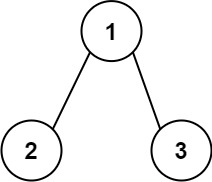
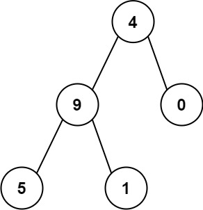

## Algorithm

[129. Sum Root to Leaf Numbers](https://leetcode.com/problems/sum-root-to-leaf-numbers/)

### Description

You are given the root of a binary tree containing digits from 0 to 9 only.

Each root-to-leaf path in the tree represents a number.

- For example, the root-to-leaf path 1 -> 2 -> 3 represents the number 123.
Return the total sum of all root-to-leaf numbers. Test cases are generated so that the answer will fit in a 32-bit integer.

A leaf node is a node with no children.


Example 1:



```
Input: root = [1,2,3]
Output: 25
Explanation:
The root-to-leaf path 1->2 represents the number 12.
The root-to-leaf path 1->3 represents the number 13.
Therefore, sum = 12 + 13 = 25.
```

Example 2:



```
Input: root = [4,9,0,5,1]
Output: 1026
Explanation:
The root-to-leaf path 4->9->5 represents the number 495.
The root-to-leaf path 4->9->1 represents the number 491.
The root-to-leaf path 4->0 represents the number 40.
Therefore, sum = 495 + 491 + 40 = 1026.
```

Constraints:

- The number of nodes in the tree is in the range [1, 1000].
- 0 <= Node.val <= 9
- The depth of the tree will not exceed 10.


### Solution

```java
/**
 * Definition for a binary tree node.
 * public class TreeNode {
 *     int val;
 *     TreeNode left;
 *     TreeNode right;
 *     TreeNode(int x) { val = x; }
 * }
 */
class Solution {
    public int sumNumbers(TreeNode root) {
        return sum(root, 0);
    }
    public int sum(TreeNode root, int s){
        if(root==null){
            return 0;
        }
        if(root.left==null&&root.right==null){
            return 10*s+root.val;
        }
        return sum(root.left, 10*s+root.val)+sum(root.right, 10*s+root.val);
    }
}
```

### Discuss

## Review


## Tip


## Share
