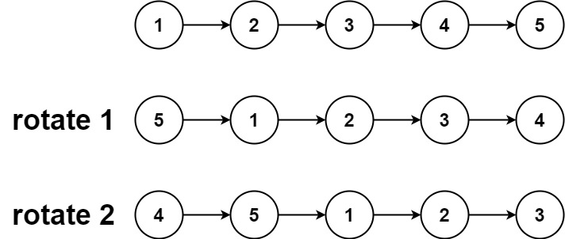
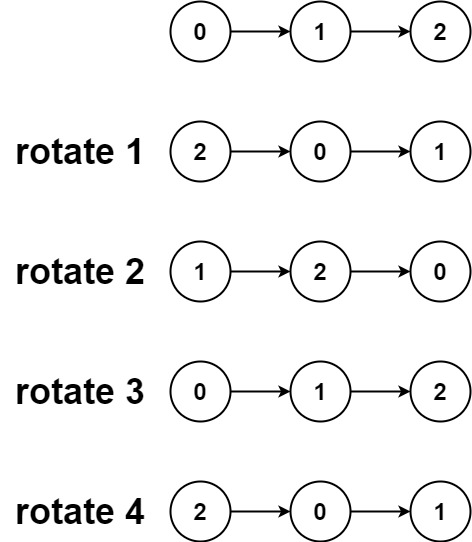

## Algorithm

[61. Rotate List](https://leetcode.com/problems/rotate-list/)

### Description

Given the head of a linked list, rotate the list to the right by k places.


Example 1:



```
Input: head = [1,2,3,4,5], k = 2
Output: [4,5,1,2,3]
```

Example 2:



```
Input: head = [0,1,2], k = 4
Output: [2,0,1]
```

Constraints:

- The number of nodes in the list is in the range [0, 500].
- -100 <= Node.val <= 100
- 0 <= k <= 2 * 109

### Solution

```java
public ListNode rotateRight(ListNode head, int n) {
    if (head==null||head.next==null) {
       return head;
    }
    ListNode dummy=new ListNode(0);
    dummy.next=head;
    ListNode fast=dummy, slow=dummy;

    int i;
    for (i=0;fast.next!=null;i++)//Get the total length
    	fast=fast.next;

    for (int j=i-n%i;j>0;j--) //Get the i-n%i th node
    	slow=slow.next;

    fast.next=dummy.next; //Do the rotation
    dummy.next=slow.next;
    slow.next=null;

    return dummy.next;
}
```

### Discuss

## Review


## Tip


## Share
